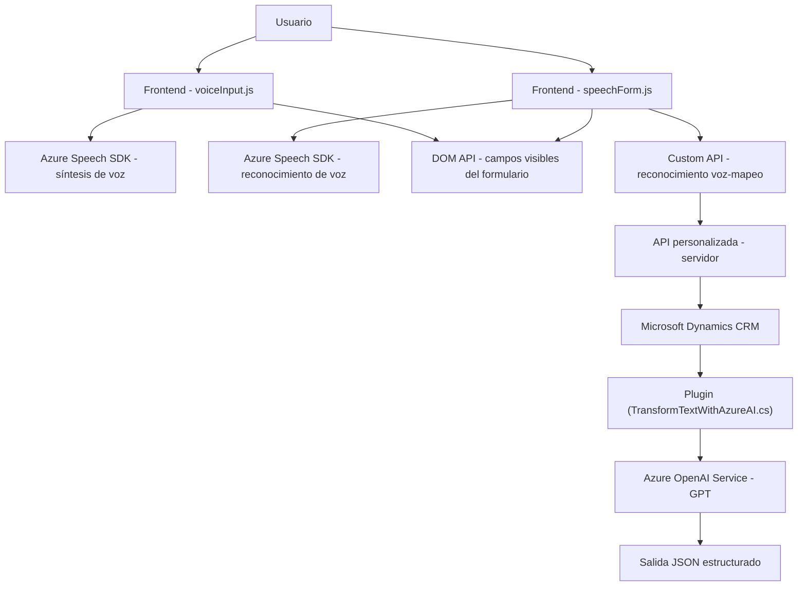

### Breve resumen técnico:

- La solución parece ser un **aplicativo multifunción** que combina **Funciones del lado del cliente (Frontend)** y **Plugins del lado del servidor**. Esta bifurcación facilita la interacción con formularios mediante **entrada/salida de voz** y el procesamiento de **datos mediante Azure AI** para convertir texto en JSON estructurado.
- Se utiliza el **SDK de Azure Speech** para funciones de síntesis y reconocimiento de voz, y el **Azure OpenAI** para procesamiento inteligente de texto basado en GPT.

---

### Descripción de arquitectura:

1. **Frontend**:
   - Componente modular que implementa reconocimiento de voz y síntesis de voz para interactuar con un formulario en la interfaz del usuario.
   - **Patrones de capas**: Usa funciones organizadas para iniciar grabación, transcribir voz a texto, sintetizar texto a voz y mapear los datos al formulario dinámicamente.
   - **Comunicación directa desde la interfaz** con servicios de voz de Azure Speech SDK y APIs personalizadas.

2. **Plugins (Backend para Microsoft Dynamics CRM)**:
   - Arquitectura basada en **Plugins** que interactúan con Dynamics CRM para ejecutar lógica asociada a la transformación de datos.
   - Uso de **patrones de integración externos**, como la comunicación vía API con Azure OpenAI para convertir texto en JSON estructurado.

3. **Arquitectura global**:
   - Predominancia de **capas** en el frontend para modularidad del reconocimiento/mapeo.
   - En el backend, los plugins se adhieren a una arquitectura **orientada a eventos** que desencadena la entrada y salida de parámetros con Dynamics CRM.
   - Dependencia de servicios SaaS (Azure Speech, Azure OpenAI).

---

### Tecnologías usadas:

1. **Frontend**:
   - **Azure Speech SDK**: Para síntesis de texto a voz y reconocimiento (grabación de audio y conversión a texto).
   - **JavaScript**: Para manejar las funciones de frontend con interacción dinámica con el DOM.
   - **Microsoft Dynamics CRM API** (Xrm Web API): Manipulación de datos dentro de formularios web.

2. **Backend Plugin**:
   - **Azure OpenAI Service** (GPT): Para analizar y transformar datos en la lógica servidora.
   - **.NET Framework/C#:** Implementación del plugin de Dynamics CRM en lenguajes típicos de Microsoft.
   - **Microsoft XRM SDK**: Librerías para interacción con los servicios y contexto del CRM.

---

### Diagrama Mermaid:

---

### Conclusión final:

La solución utiliza una **arquitectura híbrida** que integra un frontend basado en interacción por voz con servicios basados en Azure y un backend orientado a eventos que extiende las capacidades de Dynamics CRM mediante un plugin. La arquitectura está diseñada para facilitar tanto la entrada de datos en formularios a través de voz como la transformación inteligente de textos en formato útil mediante modelos de lenguaje avanzados como Azure OpenAI GPT. Esto demuestra una aplicación robusta y orientada a la experiencia del usuario, con integración avanzada de SaaS y servicios basados en la nube.