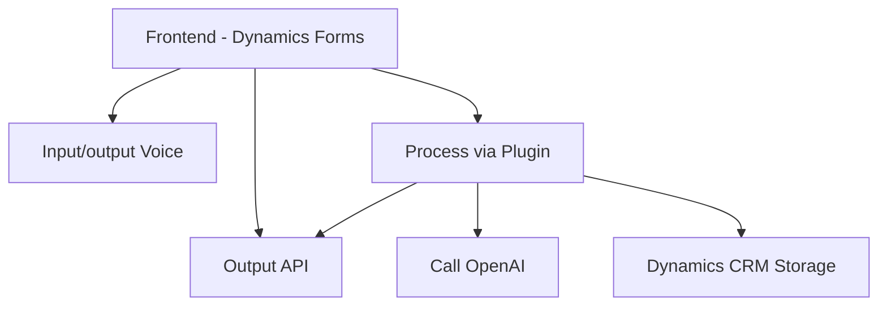

## Breve resumen técnico

El repositorio parece estar destinado a un sistema que implementa interacción avanzada entre usuarios y formularios de Microsoft Dynamics 365. Utiliza **Azure Speech SDK** para entrada por voz y síntesis de texto en voz, además de **Azure OpenAI** para transformación de texto en JSON estructurado. Todo el sistema está orientado a mejorar la interacción y funcionalidad mediante comandos en lenguaje natural y procesamiento basado en inteligencia artificial.

---

## Descripción de arquitectura

### Arquitectura:
1. **Estilo:** 
   - Modular, distribuido en tres partes principales: lógica cliente (frontend), lógica del plugin en backend (Dynamics CRM), y servicios externos (Azure Speech & OpenAI).
2. **Patrón:** N-capas (frontend, backend plugin, APIs).
3. **Acoplamiento:** 
   - **Loose coupling** entre el cliente y los servicios externos (Azure Speech SDK).
   - **Tight coupling** entre el plugin y Dynamics CRM debido a la dependencia en su estructura y datos específicos.

### Detalles:
- El frontend implementa modularidad mediante componentes separados. Cada archivo tiene funciones para ejecutar tareas como entrada de voz, síntesis de texto, carga dinámica del SDK y manipulación de datos.
- Se usa un plugin basado en la interfaz `IPlugin` para integrar Custom API y Azure OpenAI en Dynamics CRM.
- Las operaciones entre cliente y servidor están organizadas bajo el modelo cliente-servidor y hacen uso de APIs externas y llamadas HTTP.

---

## Tecnologías usadas

### Cliente (Frontend/JS):
1. **Lenguaje:** JavaScript.
2. **Frameworks/SDKs:** 
   - **Azure Speech SDK**: Para reconocimiento y síntesis de voz.
   - **Fetch API/HTTP Requests**: Para integración con APIs y servicios personalizados.
3. **Plataforma:** Microsoft Dynamics 365 Forms.
4. **Diseño estructural:** Modular, orientado a funciones.

### Servidor (Plugins/TransformTextWithAzureAI.cs):
1. **Lenguaje:** C#.
2. **Frameworks/Libs:** 
   - **Microsoft Dynamics SDK (CRM-specific)**: Interacción con formularios y datos.
   - **Azure OpenAI SDK/API**: Procesamiento externo de texto.
   - **System.Net.Http / System.Text.Json / Newtonsoft.Json**: Llamadas HTTP y manejo avanzado de JSON.
3. **Patrón:** Plugin dinámico para Dynamics CRM.

### Servicios Externos:
1. **Azure Speech SDK:** Funciones de entrada por voz, síntesis de audio.
2. **Azure OpenAI Service:** Procesamiento avanzado con inteligencia artificial.

---

## Diagrama Mermaid válido para GitHub Markdown

---

## Conclusión final

Esta solución sigue una arquitectura distribuida modular basada en n-capas, diseñada para integrar **Microsoft Dynamics 365** con servicios de **Azure Speech SDK** y **Azure OpenAI**. La modularidad del repositorio es clara, con separación entre la lógica de frontend, backend (plugin en Dynamics), y actividades de integración con APIs externas. La implementación de patrones como cargas dinámicas y desacoplamiento mediante llamadas REST refuerza una estructura eficiente y adaptable.

Para optimización, el uso de microservicios sería una evolución posible para desacoplar más las partes de la solución, especialmente del plugin en Dynamics CRM. El código está orientado a tareas específicas, pero podría beneficiarse de una estructura más orientada a objetos o basada en módulos. En general, es una integración sólida que se presta para entornos empresariales con necesidad de interfaces de voz y procesamiento inteligente del lenguaje natural para automatización.