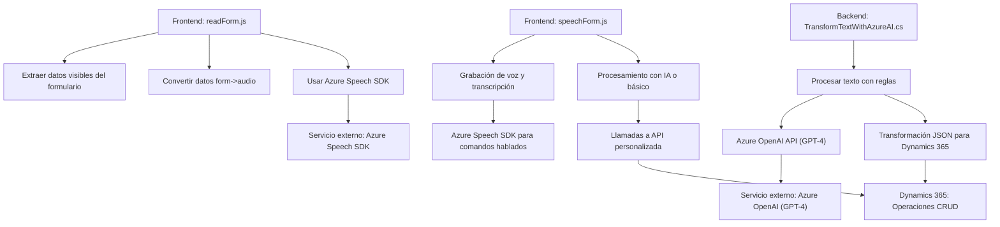

### Breve Resumen Técnico:
Los archivos analizados forman parte de una solución que integra accesibilidad y procesamiento de datos en formularios interactivos mediante voz. Este sistema utiliza **Azure Speech SDK** para síntesis y transcripción de voz y aprovecha **Azure OpenAI (GPT-4)** para transformar texto en una estructura JSON en un plugin de Dynamics CRM. La estructura de la solución sugiere integración con las plataformas Dynamics 365 y Azure.

---

### Descripción de Arquitectura:
La solución puede clasificarse como una **arquitectura n-capas**:
1. **Capa de presentación**:
   - El `frontend` utiliza archivos JavaScript (`readForm.js` y `speechForm.js`) que interactúan con formularios en Dynamics 365.
   - Integración con Azure Speech SDK como recurso externo para interactuar con el usuario vía voz.
   - Modularización de funciones y controladores para extraer, procesar y actualizar datos en los formularios.

2. **Capa de aplicación y lógica**:
   - En el backend (`TransformTextWithAzureAI.cs`), se desarrolla un plugin con el modelo de arquitectura de **IPlugin** de Dynamics CRM.
   - Este plugin realiza solicitudes HTTP hacia la **API de Azure OpenAI** (GPT-4) para transformar texto basado en reglas específicas.

3. **Capa de datos**:
   - Integración con **Dynamics 365 WebApi** para manipular y realizar operaciones CRUD en los formularios y sus campos.
   - Procesamiento de datos obtenidos desde los formularios como texto o estructuras JSON mediante funciones personalizadas.

---

### Tecnologías Usadas:
1. **Frontend**:
   - Lenguaje y Framework: **JavaScript**.
   - Servicio externo: **Azure Speech SDK** (síntesis y transcripción de voz).
   - Plataforma: **Dynamics 365** (formularios CRM).
2. **Backend**:
   - Lenguaje: **C#**.
   - Framework: **Dynamics CRM SDK** (Microsoft.Xrm.Sdk para plugins y operaciones).
   - Servicio de IA: **Azure OpenAI**, incluyendo modelos como GPT-4.
   - Librerías de manejo de datos: `System.Text.Json` y `Newtonsoft.Json.Linq`.
   - Arquitectura CRM orientada a eventos (plugin-based).
3. **Dependencias Externas**:
   - API de OpenAI de Azure (transformación de texto).
   - Speech SDK de Azure (para integración en frontend).

---

### Diagrama Mermaid **100% compatible con GitHub Markdown**:

---

### Conclusión Final:
La solución integra accesibilidad y procesamiento avanzado de datos mediante tecnologías de Microsoft Azure y Dynamics 365. En el frontend, se habilita la interacción por voz para formularios dinámicos, mientras que el backend transforma texto en estructuras JSON mediante inteligencia artificial, asegurando compatibilidad con las herramientas de CRM. La arquitectura n-capas y modularizada favorece la escalabilidad y el mantenimiento, con dependencia directa de servicios externos como **Azure Speech SDK** y **OpenAI API** para funcionalidades clave como síntesis, transcripciones, y procesamiento de texto avanzado.