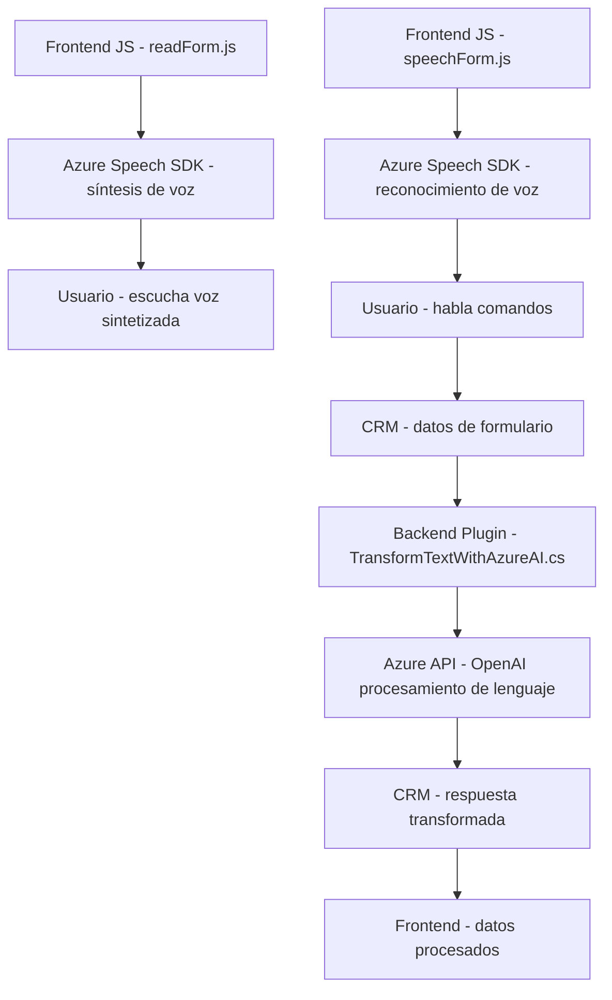

### Breve resumen técnico:
El contenido del repositorio muestra una solución centrada en la interacción entre usuarios y formularios mediante reconocimiento de voz, síntesis de texto y transformación de datos con servicios de Azure. Consta de:
1. **Frontend:** Archivos JavaScript (`readForm.js` y `speechForm.js`), que interactúan con el DOM de formularios CRM, utilizan el Azure Speech SDK para síntesis de voz y reconocimiento.
2. **Backend:** Plugin para Microsoft Dynamics CRM (`TransformTextWithAzureAI.cs`) que conecta con Azure OpenAI para transformar texto basado en reglas específicas.

---

### Descripción de arquitectura:
La arquitectura se basa en una combinación de componentes de **Microsoft Dynamics CRM** para el backend y un sistema client-side altamente modular conectado al CRM. Es una solución de **arquitectura en capas** con integración de servicios en la nube mediante Azure APIs. Los módulos de frontend procesan datos y comandos del usuario en el navegador, mientras que el backend transforma los datos con servicios de Azure OpenAI. 

El flujo general es el siguiente:
1. El frontend maneja el reconocimiento de voz y la síntesis de texto para los formularios.
2. Los datos capturados se envían al backend (CRM) para procesamiento especializado.
3. El plugin ejecuta transformaciones de texto con Azure OpenAI y responde al frontend con datos estructurados.

---

### Tecnologías usadas:
1. **Frontend:**  
   - **JavaScript:** Lógica del lado cliente.
   - **Azure Speech SDK:** Reconocimiento de voz y síntesis de texto.
   - **DOM Manipulation:** Interacción con formularios CRM.
   
2. **Backend:**
   - **Microsoft Dynamics CRM SDK:** Implementación de plugins y comunicación con servicios de CRM.
   - **Azure OpenAI:** Transformación avanzada basada en IA mediante modelos de lenguaje.
   - **HTTP Client Libraries:** Envío de solicitudes API.
   - **JSON Libraries:** Serialización/deserialización estructurada.

3. **Patrones y técnicas:**
   - Modularidad en el frontend.
   - Arquitectura en capas en el backend.
   - Integración API externa (Azure Speech SDK y Azure OpenAI).
   - Event-driven callbacks en frontend para manejar el flujo de procesos asíncronos.
   - Plugin Pattern en Dynamics CRM.

---

### Diagrama Mermaid:

---

### Conclusión final:
La solución representa una integración compleja pero eficiente entre un frontend modular y un backend especializado en Dynamics CRM con acceso a servicios de Azure. Su arquitectura basada en capas y su uso de herramientas como Azure Speech SDK y OpenAI reflejan un diseño alineado con estándares modernos. El sistema mejora la accesibilidad y productividad al permitir comandos hablados y transforming texto dinámicamente. Es ideal para gestionar entornos donde la interacción natural del usuario con datos estructurados sea clave, como en formularios CRM avanzados.