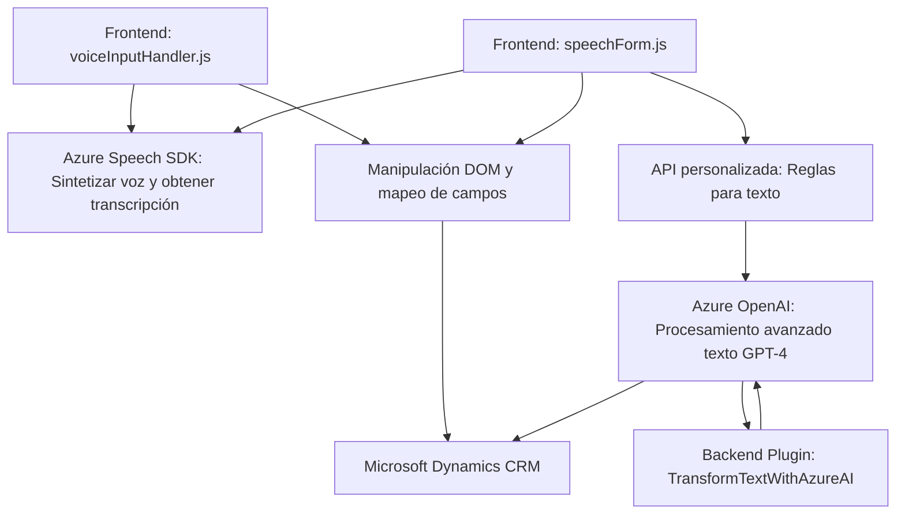

### Breve resumen técnico
El repositorio presenta una solución enfocada en la integración de funcionalidades de reconocimiento de voz, síntesis de audio y procesamiento de datos en un entorno de formularios CRM. Usa Azure Speech SDK y Azure OpenAI API para transformar interacciones humanas en datos procesables. La solución incluye:
1. Archivos en JavaScript para manejar transcripciones, síntesis de audio y manipulación de datos en el frontend del cliente.
2. Un plugin en C# para realizar transformaciones avanzadas de texto mediante Azure OpenAI para su uso en CRM.

---

### Descripción de arquitectura
La arquitectura es una combinación de "Cliente-Servidor" y "n capas", organizándose en capas claras:
1. **Frontend**: Incluye módulos para la integración con Azure Speech SDK, reconocimiento de voz y manipulación de formularios en un CRM (Dynamics).
2. **Backend**: Contiene un plugin en C# que actúa como middleware entre el CRM y Azure OpenAI API.
3. **Servicios externos**: Uso de Azure Speech SDK para reconocimiento/síntesis de voz y Azure OpenAI API con GPT-4 para transformación de texto.

El diseño también presenta elementos de **hexagonal**, con integraciones externas bien desacopladas del núcleo funcional (uso de SDK y API).

---

### Tecnologías usadas
- **Frontend (JavaScript)**:
  - Azure Speech SDK.
  - APIs de manipulación DOM y Xrm.WebApi (Dynamics CRM).
- **Backend (C#)**:
  - Microsoft Dynamics SDK.
  - Azure OpenAI API (GPT-4).
  - Dependencias: `Newtonsoft.Json`, `System.Net.Http`.
- **Patrones aplicados**:
  - Modularidad para separar funcionalidad por archivo.
  - Plugin Architecture en el backend (Dynamics CRM).
  - Callback para asegurar carga dinámica del SDK.
  - Uso de APIs para integración con servicios externos.

---

### Posibles dependencias externas y componentes
- **Azure Speech SDK**: Biblioteca para manejo de reconocimiento y síntesis de voz.
- **Azure OpenAI API**: API para procesamiento de texto avanzado.
- **Dynamics CRM SDK**: Dependencia del backend para ejecución de plugins en entorno CRM.
- **HTTP Client**: Para comunicarse con APIs y servicios externos.
- **Xrm.WebApi**: Dependencia del cliente (frontend) para manipulación de datos en Dynamics CRM.

---

### Diagrama Mermaid

---

### Conclusión final
La solución desarrolla funcionalidades avanzadas para procesar voz y texto en el contexto de formularios Dynamics CRM. Usa una arquitectura **n capas** con elementos de **hexagonal** para desacoplar servicios externos del núcleo funcional. Esta integración efectiva permite agregar capacidades de IA y reconocimiento/síntesis de voz al sistema sin comprometer la modularidad del diseño, haciéndolo escalable y mantenible.