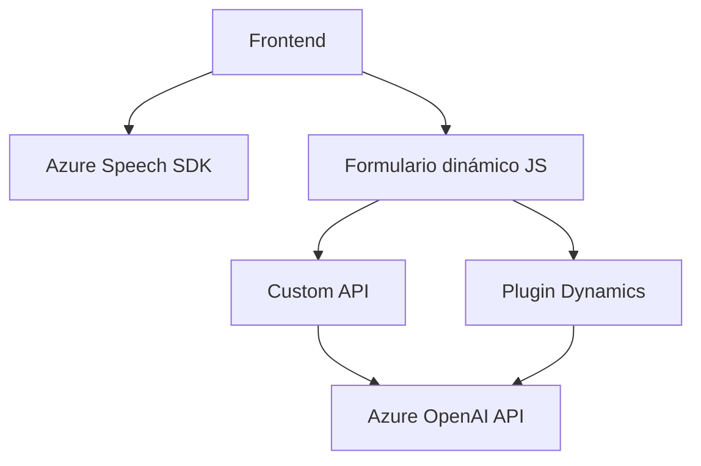

### Breve resumen técnico

El repositorio parece ser una solución que combina **frontend y backend** para mejorar la interacción entre un formulario web y un reconocimiento de voz. Utiliza el SDK de **Azure Speech** para transformar datos hablados o visibles en texto/voz, y un plugin de Dynamics 365 para gestionar el procesamiento de texto mediante la API **Azure OpenAI**. 

Hay tres componentes principales:
1. **Frontend (JS):** Procesa la entrada y salida de voz, interactúa con formularios y maneja la integración con Azure Speech SDK.
2. **Backend (Plugin .NET):** Realiza transformaciones de texto estructuradas usando servicios de Azure OpenAI, en comunicación por HTTP.
3. **Custom API:** Presente en el frontend como un servicio adicional para lógica extendida.

---

### Descripción de arquitectura

La solución representa un **arquitectura de n capas**:
1. **Capa de presentación (Frontend):** Maneja la interacción con el usuario (entrada de voz/texto y manipulación de formularios).
2. **Capa de procesamiento y lógica de negocio (Plugin y Custom API):** Dota de funcionalidades avanzadas como transformaciones de texto con IA.
3. **Capa de servicios externos (Azure Speech y OpenAI):** Integra APIs en la nube para síntesis de voz y procesamiento IA.

El componente plugin sigue un modelo **SOA** con la API OpenAI como servicio REST, mientras que el frontend usa un enfoque semi-modular, con funciones distribuidas para manejar los distintos aspectos del reconocimiento y del formulario.

---

### Tecnologías usadas

1. **Frontend:**
   - **JavaScript:** Lenguaje principal en los componentes del lado del cliente.
   - **Azure Speech SDK:** Usado para reconocimiento y síntesis de voz.
   - **Web APIs:** (DOM Manipulation, `window`, `document`) para formularios dinámicos.
   - **Custom API:** Un servicio que extiende funcionalidades usando IA.

2. **Backend (Plugin .NET):**
   - **C#.NET**: Lenguaje principal del plugin.
   - **Dynamics 365 SDK:** Para interactuar con el entorno CRM.
   - **Azure OpenAI:** Para transformar texto según reglas específicas.
   - **HTTP Client:** Para comunicación REST entre el plugin y la API.

---

### Diagrama **Mermaid** válido para GitHub

---

### Conclusión final

La solución combina integración de tecnologías modernas como **SDKs en la nube (Azure Speech)** con servicios REST externos para procesamiento IA (Azure OpenAI). Sigue una **arquitectura de n capas**, donde el frontend interactúa con APIs y el backend complementa esta funcionalidad mediante plugins extensibles en Dynamics 365. Si bien la modularidad está presente, algunos puntos podrían beneficiarse de una separación más clara de responsabilidades (ej., en el frontend).

En general, la arquitectura está diseñada para manejar altamente el reconocimiento y manipulación de voz junto con formularios, y logra una integración adecuada entre cliente, servidor y servicios externos.