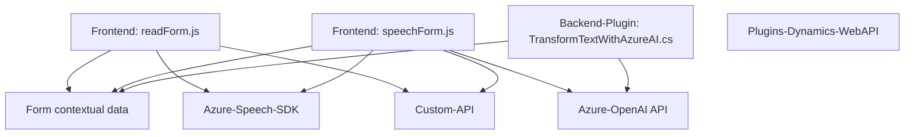

# Análisis técnico y arquitectura

### Breve resumen técnico
El repositorio consta de tres archivos principales que forman parte de una solución para integrar extensivamente el servicio Azure Speech SDK y Azure OpenAI en aplicaciones orientadas al procesamiento y manejo de formularios en entornos web y Dynamics CRM. Los componentes están estructurados para interactuar con formularios web y plugins de Dynamics CRM, permitiendo funcionalidades como síntesis y reconocimiento de voz, y transformación de texto en formatos estructurados mediante AI.

---

### Descripción de la arquitectura
La solución combina elementos de **arquitectura modular** en los componentes JavaScript del frontend y un enfoque de **arquitectura hexagonal** para el plugin en .NET (Dynamics CRM). Los archivos tienen roles específicos: unos como frontend y otros como backend integrados con servicios de Azure. El diseño desacopla cada módulo basado en su responsabilidad:
- Los scripts de JavaScript están orientados a trabajar con formularios web mediante la interacción con el DOM y los SDK de Azure Speech, además de integrarse con APIs personalizadas.
- El plugin en C# funciona como un microservicio que se activa mediante eventos en Dynamics CRM, procesando inputs del usuario y enviando solicitudes a Azure OpenAI.

#### Arquitectura a nivel de solución:
- Tipo de arquitectura global: **Orientada a servicios**, pues se integran diferentes tecnologías hacia un propósito en común.
- **Patrones utilizados**: Modularización, Facade, Delegación, y aplicaciones de SDK.

---

### Tecnologías usadas
1. **Frontend**
    - JavaScript.
    - Azure Speech SDK: Para síntesis de voz y reconocimiento de audio.
    - DOM API: Utilización para manipulación dinámica de formularios.
    - Uso de APIs personalizadas (llamadas HTTP).

2. **Back-End Plugins**
   - **C# / .NET Framework** (Microsoft Dynamics CRM Plugin):
     - Microsoft.Xrm.Sdk
   - **Azure OpenAI API**: Proporciona transformaciones mediante inteligencia artificial.
   - Framework de comunicación: HTTP Client para realizar solicitudes REST.
   - Manejo de estructuras JSON: `System.Text.Json`.

---

### Probables dependencias externas
- **Azure Speech SDK**: Clave y región configuradas en el código fuente.
- **Azure OpenAI Service**: Para el plugin en Dynamics CRM.
- **Dynamics Web API**: Para ejecutar operativas específicas como modificar atributos o ejecutar Custom APIs en el contexto del formulario.
- **Modern Browsers (DOM compatibility)**.

---

### Diagrama Mermaid

---

### Conclusión final
Este repositorio implementa una solución híbrida de **integración de servicios** para aplicaciones basadas en formularios web (frontend) y extensiones para Dynamics CRM (backend plugin). Usa tecnologías modernas como Azure Speech SDK, Azure OpenAI API y Dynamics CRM Web API para interactuar con datos, proveer funcionalidades avanzadas de voz (síntesis y transcripción), así como transformación inteligente de datos. La arquitectura se beneficia de un modelo modular con tendencia hacia hexagonal para garantizar escalabilidad, integración efectiva y mantenibilidad en un entorno empresarial.