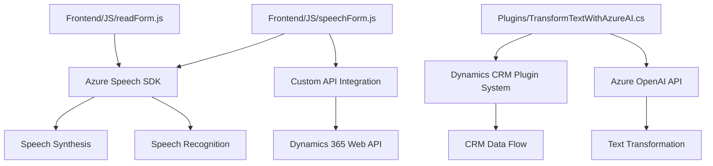

### Breve resumen técnico
Este repositorio contiene implementación de soluciones que integran funcionalidades de **Azure Speech SDK** y **Azure OpenAI API** en plataformas específicas, como formularios web (frontend) y Dynamics CRM (backend vía plugins). Proporciona capacidades de reconocimiento de voz, síntesis de voz, y transformación inteligente de texto, con enfoque en la interacción con formularios y procesamiento de datos externos.

---

### Descripción de arquitectura
1. **Frontend:**
   - Arquitectura basada en funciones individuales y modulares:
     - **Vocalización de datos de formularios:** Lectura en voz alta de campos visibles mediante Azure Speech SDK y funciones como `leerFormulario` y `getVisibleFieldData`.
     - **Reconocimiento de voz:** Transcripción y mapeo dinámico de valores reconocidos en texto a campos de formularios utilizando funciones como `processTranscriptIA` y `getFieldMap`.
   - Patrones utilizados: Modularización funcional, integración de SDK externos, *event-driven architecture*.

2. **Backend (Dynamics CRM Plugin):**
   - Plugin implementado usando **Microsoft Dynamics Extendibility Patterns**:
     - Procesa texto con un modelo GPT-4 personalizado de Azure OpenAI.
     - Sigue principios de **Service-Oriented Architecture** (SOA), con una clara separación entre lógica de negocio (transformación de texto) y servicios externos (Azure OpenAI).
     - Usa patrones como **Single Responsibility Principle** y **Plugin Architecture**.

---

### Tecnologías usadas
1. **Frontend:**
   - JavaScript (con ES6+).
   - **Azure Speech SDK** para síntesis de voz y reconocimiento de lenguaje.
   - **Dynamics 365 Web API** para manipulación de formularios y datos.

2. **Backend:**
   - C# para desarrollo del plugin.
   - **Microsoft Dynamics SDK** (`Microsoft.Xrm.Sdk`) para acceso al CRM.
   - **Azure OpenAI** (GPT-4) API para procesamiento de lenguaje.
   - **Newtonsoft.Json / System.Text.Json** para manejo de datos JSON.

3. **Comunes:**
   - **HTTP Requests** para integración con endpoints de servicios externos.

---

### Diagrama **Mermaid** válido para GitHub

---

### Conclusión final
Este repositorio implementa una **arquitectura segmentada por capas especializadas**, con enfoque en **modularidad funcional** en el frontend y **extensibilidad por plugins** en el backend. Integra servicios externos avanzados como **Azure Speech SDK** y **Azure OpenAI API** para agregar valor en funcionalidades de interacción humana, transcripción y procesamiento de datos. Aunque se maneja adecuadamente la separación de responsabilidades, la seguridad y configurabilidad del acceso a servicios externos (e.g., estáticos como keys/API en los plugins) podrían mejorarse. El diseño es eficaz para casos donde la integración de IA y voz sea relevante en la experiencia de usuario y en procesos empresariales dentro del CRM.