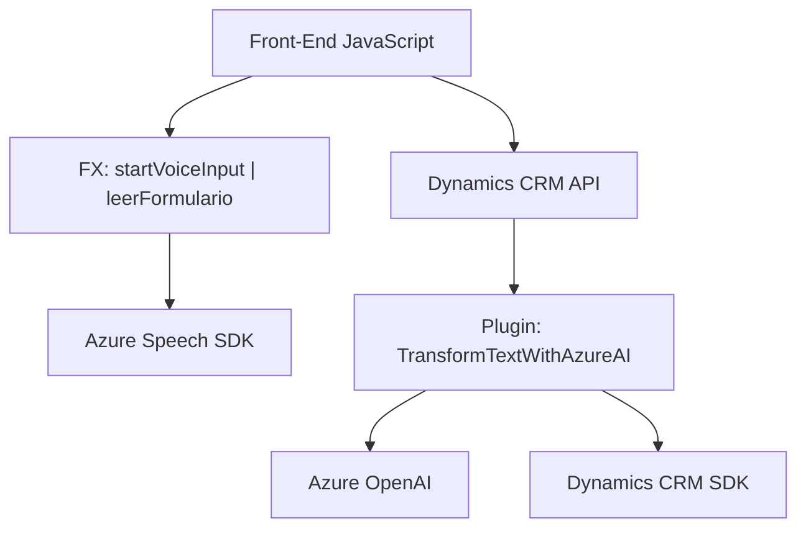

### Breve resumen técnico
El repositorio expone una solución orientada a la integración entre **Microsoft Dynamics CRM** y servicios cognitivos de **Azure**, compuesta de dos elementos principales:
- **Frontend (JavaScript)**: Extendiendo las capacidades de Dynamics CRM para realizar reconocimiento de voz, síntesis de voz, y mapeo dinámico de datos entre campos de formularios.
- **Backend (C#)**: Plugin para Dynamics CRM, que utiliza el modelo GPT-4 de **Azure OpenAI** para transformar texto en estructurados JSON o aplicar reglas específicas.

La solución combina tecnologías avanzadas de inteligencia artificial, reconocimiento y síntesis de voz con tareas de manipulación dinámica de datos en formularios de CRM.

---

### Descripción de arquitectura
La solución está basada en una arquitectura **híbrida de tres capas**:
1. **Capa de presentación**:
   - Código **JavaScript** en el frontend que interactúa con el SDK de Azure Speech para la captura de entrada/salida de voz.
   - Funciones desacopladas orientadas a la entrada dinámica y procesamiento de texto en formularios de CRM.
2. **Capa de negocio**:
   - Plugins de **C#** que integran con Dynamics CRM para aplicar lógica avanzada al texto procesado e interactuar con el servicio **Azure OpenAI**.
3. **Capa de servicios**:
   - Integración con servicios externos (**Azure Speech SDK**, **Azure OpenAI**) para la implementación de IA avanzada y reconocimiento/síntesis de voz.

La arquitectura está diseñada con patrones de modularización, facilitando una clara separación de responsabilidades:
- El frontend realiza tareas de interacción con el usuario en tiempo real.
- El backend aplica lógica de negocio y consulta servicios externos para tareas complejas como transformación de texto.

---

### Tecnologías usadas
1. **Frontend**:
   - **JavaScript**: Procesamiento de texto, interacción dinámica con formularios.
   - **Azure Speech SDK**: Reconocimiento y síntesis de voz.
   - **Dynamics CRM API (Xrm)**: Manipulación de formularios y datos del CRM.

2. **Backend**:
   - **C#**: Lenguaje para desarrollo del plugin y lógica compleja.
   - **Dynamics CRM SDK**: Extensión de lógica de negocio en plugins CRM.
   - **Azure OpenAI Service**: Uso del modelo GPT-4.
   - **Newtonsoft.Json / System.Text.Json**: Manejo de contenido JSON.
   - **HTTP REST API**: Interacción con servicios externos de Azure.

---

### Dependencias o componentes externos presentes
- **Azure Speech SDK**: Carga y ejecución dinámica para reconocimiento/síntesis de voz en el frontend.
- **Azure OpenAI Service**: Interacción RESTful en el backend para transformación del texto.
- **Dynamics CRM API/SDK**: Manipulación de datos en formularios y entidades CRM.
- **Libraries**:
  - **Newtonsoft.Json**: Parseo y manipulación de JSON.
  - **System.Net.Http**: Comunicación HTTP para integraciones externas.

---

### Diagrama Mermaid válido para GitHub

---

### Conclusión final
El repositorio implementa una solución híbrida basada en cloud services (Azure) y extensiones personalizadas para Dynamics CRM. Su arquitectura modular y desacoplada facilita la interacción en tiempo real mediante un frontend dinámico y procesamiento backend más robusto. Esta combinación logra una integración fluida entre reconocimiento de voz, inteligencia artificial (GPT) y manipulación de datos en entornos CRM.