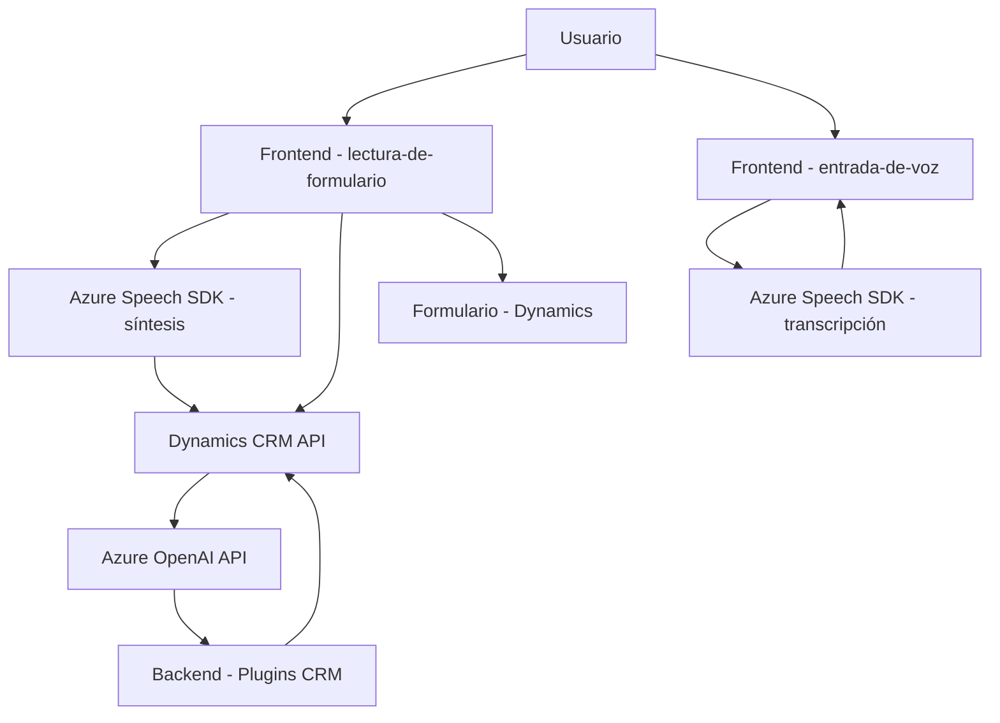

### Breve resumen técnico
El repositorio implementa una solución que mezcla tecnologías web y de servicios avanzados para gestionar interacción por voz y procesamiento de texto en un entorno Dynamics 365, utilizando Azure Speech SDK y Azure OpenAI. Se estructura en tres capas principales:
1. **Frontend:** Manejo de voz y asignación de datos en formularios mediante JavaScript.
2. **Backend:** Plugins para Dynamics 365 que interactúan con servicio web de Azure OpenAI.
3. **Integración externa:** Servicios en la nube de Azure.

---

### Descripción de arquitectura
La arquitectura general tiene un enfoque **multicapa** y distribución de responsabilidades:
1. **Frontend:** 
    - Captura de voz y generación/síntesis utilizando Azure Speech SDK.
    - Procesamiento en tiempo real de datos del formulario.
    - Asignación de valores mapeados al formulario en Dynamics 365.
2. **Backend (Plugins):**
    - Transformación de texto en JSON estructurado usando Azure OpenAI.
    - Uso de Dynamics CRM SDK para integración de servicios y entidad de datos.
3. **Servicios distribuidos:**
    - Servicios externos como Azure Speech y Azure OpenAI son integrados mediante SDKs y APIs REST.

El patrón observado más claramente es una **arquitectura modular** con integración de servicios externos (Azure). Además, la solución sigue principios de **cliente/servidor**, donde los componentes del frontend se comunican con plugins backend y servicios de terceros en la nube.

---

### Tecnologías usadas
1. **Frontend:**
   - **JavaScript (Vanilla)** para lógica dinámica en navegadores.
   - **Azure Speech SDK** para síntesis y reconocimiento de voz.
   - Manejo de DOM para carga dinámica de scripts y manipulación de formularios.
   - Dynamics 365 scripting API (`Xrm.WebApi`) para integración con web APIs.
2. **Backend:**
   - **Microsoft Dynamics CRM SDK** para desarrollo de plugins.
   - **C#** como lenguaje principal.
   - **Azure OpenAI Service** para procesamiento de texto mediante inteligencia artificial.
   - **Comunicación HTTP** vía `System.Net.Http`.
   - JSON manipulado con **System.Text.Json** y **Newtonsoft.Json**.
3. **Servicios externos:**
   - **Azure Speech SDK** para voz.
   - **Azure OpenAI Service** para IA y transformación de texto.

---

### Diagrama Mermaid válido para GitHub

---

### Conclusión final
La solución representa una arquitectura modular distribuida con integración de servicios en la nube. Está diseñada para interactuar con formularios en Dynamics 365 mediante entrada y salida de voz, ofreciendo accesibilidad avanzada. El uso de Azure Speech SDK permite la síntesis y transcripción de voz, mientras que Azure OpenAI provee capacidades de procesamiento de texto. La implementación sigue principios de separación de responsabilidades y gestión dinámica de dependencias.