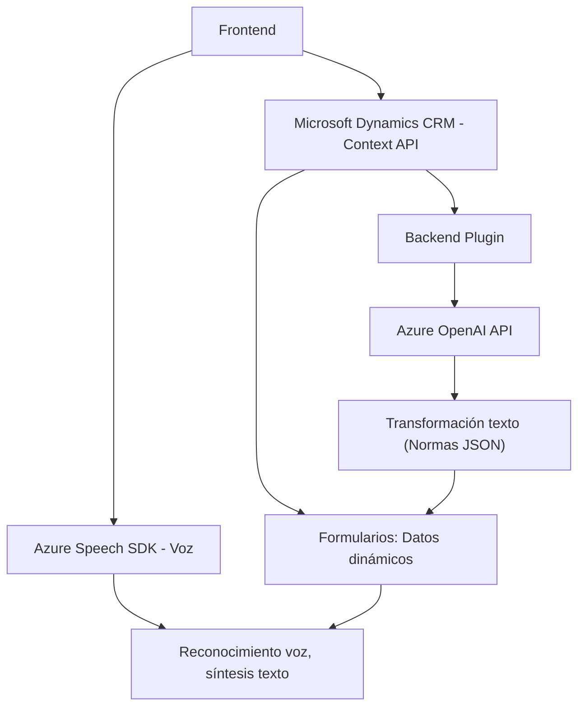

### Breve resumen técnico:
El repositorio contiene archivos relacionados con la integración de funcionalidades de voz y procesamiento de texto en aplicaciones web y Dynamics 365 CRM, utilizando Azure Speech SDK y Azure OpenAI. La solución incluye un frontend para la interacción con el usuario y un backend en forma de plugins de Dynamics CRM que ejecutan lógica de negocio y llamadas a servicios de Azure.

---

### Descripción de arquitectura:
#### Vista técnica:
La solución implementa una **arquitectura de cliente-servidor**, donde el frontend proporciona interacción directa con el usuario a través de formularios y voz, y el backend utiliza plugins de Dynamics CRM y servicios de Azure para realizar procesamiento avanzado de datos. Además, se emplea un enfoque modular con funciones claras y separación de responsabilidades.

#### Características de arquitectura:
1. **Modularización**: 
   - Los archivos de frontend (`readForm.js` y `speechForm.js`) están divididos en funciones específicas para interactuar con SDKs, APIs y contextos de formularios.
   - El plugin en backend es un módulo independiente en Dynamics CRM que interactúa con Azure OpenAI.

2. **Integración con servicios externos**:
   - Azure Speech SDK es utilizado en frontend para la síntesis y reconocimiento de voz.
   - Azure OpenAI es usado en el plugin del backend para transformar texto según reglas específicas.

3. **Arquitectura orientada a eventos**:
   - En el frontend, los eventos de formulario activan la lógica para extraer datos y manipularlos.
   - En el backend, los plugins se ejecutan basados en eventos de Dynamics CRM.

4. **Capas**:
   - Se puede considerar como una estructura de **varias capas**:
     - **Frontend**: Contiene la lógica de interacción con los usuarios.
     - **Backend (plugin)**: Implementa procesamiento avanzado mediante APIs externas.

---

### Tecnologías usadas:
1. **Frontend**:
   - JavaScript.
   - Azure Speech SDK.
   - Microsoft Dynamics CRM API (contexto del formulario y manipulación de datos).

2. **Backend**:
   - C# (Plugin).
   - Microsoft Dynamics CRM SDK (`IPlugin`).
   - Azure OpenAI API (`https://openai-netcore.openai.azure.com`).
   - Librerías auxiliares:
     - `System.Net.Http` para solicitudes HTTP.
     - `Newtonsoft.Json.Linq` y `System.Text.Json` para manipulación JSON.

3. **Servicios externos**:
   - **Azure Speech SDK** para la funcionalidad de voz en el frontend.
   - **Azure OpenAI API** para procesamiento avanzado en el plugin.

---

### Diagrama **Mermaid** válido para GitHub:

---

### Conclusión final:
La solución implementa una arquitectura modular de cliente-servidor con integración a servicios externos como Azure Speech SDK y Azure OpenAI. El frontend se encarga de la interacción del usuario y el procesamiento básico de datos desde formularios, mientras que el backend usa un plugin CRM para ejecutar lógica avanzada y consumir APIs. Esta estructura de varias capas es adecuada para soluciones empresariales que requieren comunicación fluidas y personalización basada en eventos dinámicos. Sin embargo, podrían considerarse mejoras en la seguridad (por ejemplo, gestión centralizada de claves de API).