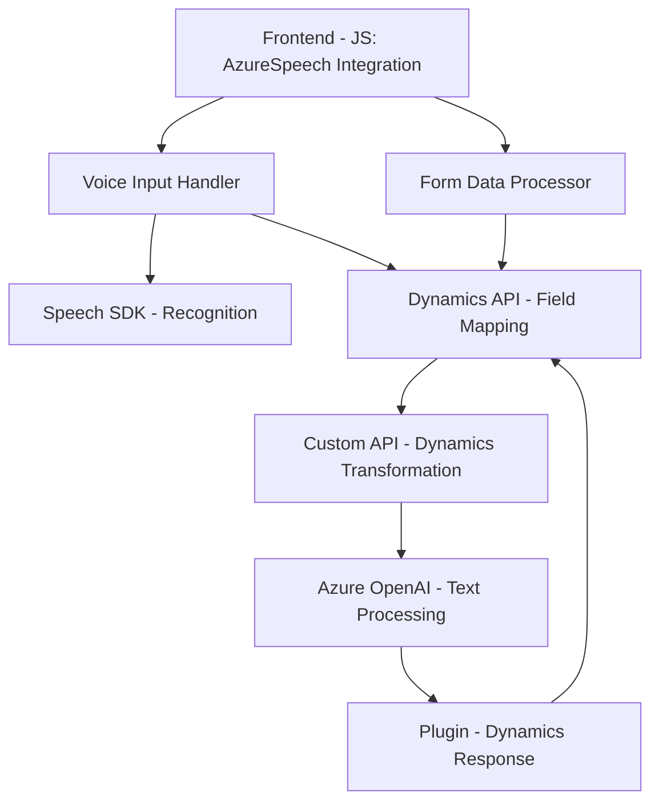

### Breve Resumen Técnico:
El repositorio analizado incluye archivos que implementan funcionalidades relacionadas con procesamiento de voz y texto mediante Azure Speech SDK, Dynamics 365 CRM y Azure OpenAI. Principalmente, la solución facilita la interacción con formularios en Dynamics 365 mediante reconocimiento de voz y síntesis de voz, junto con un plugin que integra transformación avanzada de texto usando inteligencia artificial.

---

### Descripción de Arquitectura:
La solución combina lógica de frontend y backend con un enfoque modular. Los archivos JavaScript en el directorio `FRONTEND/JS` ofrecen integración directa con formularios DOM y el API de Dynamics 365. Por otro lado, los plugins (`TransformTextWithAzureAI.cs`) expanden la funcionalidad del sistema CRM mediante la conexión con servicios de Azure OpenAI para crear transformaciones dinámicas.

Este artículo describe una arquitectura basada en **n capas**, con una clara separación entre la capa de presentación (frontend), lógica de negocio (API Dynamics CRM y plugin), y la interacción con servicios externos. La solución exhibe también rasgos de arquitectura **event-driven** y orientación a servicios gracias al uso de APIs externas (Azure Speech SDK, OpenAI).

---

### Tecnologías Usadas:
1. **Frontend:**
   - JavaScript: Usado principalmente para lógica y manejo de eventos en formularios.
   - **Azure Speech SDK**: Para reconocimiento y síntesis de voz en navegador.
   - **Dynamics 365 SDK** (`Xrm.WebApi`): Para las llamadas API al sistema CRM.

2. **Backend:**
   - **Microsoft Dynamics 365 Plugin Framework**: Implementado en `.NET`, este amplía la funcionalidad del CRM.
   - **Azure OpenAI**: Para procesamiento avanzado de texto.
   - **Microsoft.Xrm.Sdk**: SDK oficial para el desarrollo de extensiones en Dynamics CRM.

3. **General:**
   - **REST APIs**: Comunicación HTTP para servicios externos (Azure Speech y OpenAI).

---

### Dependencias o Componentes Externos:
1. **Azure Speech SDK**: Para síntesis y reconocimiento de voz.
2. **Azure OpenAI API**: Para transformar texto en base a reglas y mediante aprendizaje automático avanzado.
3. **Dynamics 365 SDK/Web API**: Integración directa con los campos y datos del CRM.
4. **System.Text.Json & Newtonsoft.Json**: Librerías para manejo de JSON en el plugin de Dynamics.
5. **HTTP Communication**: Usado para interacciones REST con APIs externas.

---

### Diagrama Mermaid:
El siguiente diagrama representa los elementos involucrados y cómo interactúan entre sí:

---

### Conclusión Final:
La solución implementada combina tecnologías modernas como Azure Speech SDK y OpenAI con Dynamics CRM. Su arquitectura basada en **n capas** facilita la separación de responsabilidades entre frontend, backend y servicios externos. Utiliza patrones como modularidad, `event-driven programming`, y orientado a servicios para garantizar la extensibilidad y eficiencia de la aplicación. Aunque este diseño cumple con su propósito, la solución depende fuertemente de múltiples APIs externas, lo que requiere una adecuada gestión de dependencias y aseguramiento de la configuración para mantener su operatividad.