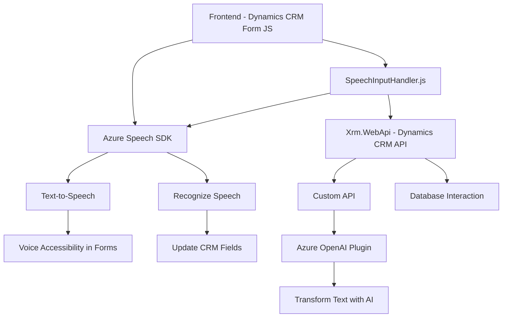

### Breve resumen técnico
El repositorio parece ser parte de una solución orientada a la integración de accesibilidad y automatización de formularios basados en Dynamics 365 CRM, utilizando tecnologías como **JavaScript**, **Azure Speech SDK**, y **Azure OpenAI API**. Su núcleo incluye funcionalidades para conversión de datos a voz, captura de comandos de voz, y un plugin para transformación avanzada de texto utilizando IA.

---

### Descripción de arquitectura
1. **Tipo de solución**: La solución combina **frontend** y **backend**.
   - Frontend: Interacción directa con los formularios del CRM y síntesis de voz para accesibilidad.
   - Backend: Plugins personalizados para procesamiento con IA y servicios de Azure.
   
2. **Arquitectura**: La solución utiliza:
   - Una **n capas** con separación precisa de responsabilidades:
     - Frontend (interfaz y lógica de interacción con usuarios).
     - Middleware (SDK de Azure Speech, entre la interfaz y las APIs externas).
     - Backend (plugin con lógica de aplicación personalizada y comunicación con servicios de Azure OpenAI).
   - Integración con **microservicios**, dado que depende de APIs externas como Azure OpenAI.

3. **Patrones utilizados**:
   - **Modularidad**: Las funcionalidades están divididas en archivos con responsabilidades claramente definidas.
   - **Adapter Pattern**: Uso de adaptadores para convertir datos entre los formularios, comandos de voz y JSON procesados.
   - **API Gateway Pattern**: Consumo de APIs externas para procesamientos específicos.
   - **Plugin Architecture**: Extensión de Dynamics CRM mediante plugins personalizados.

---

### Tecnologías usadas
1. **Frontend**:
   - Lenguaje: JavaScript.
   - SDK: **Azure Speech SDK**.
   - Contexto: Dynamics 365 CRM interface.

2. **Backend**:
   - Lenguaje: C# (.NET Framework).
   - Tecnología: **Microsoft Dynamics CRM Plugin SDK**.
   - Framework para JSON: `System.Text.Json`.

3. **Externo**:
   - **Azure OpenAI API**: Integrada para procesamiento asistido por IA.
   - **Azure Speech SDK**: Conversión de texto a voz y reconocimiento de voz.

4. **Dependencias**:
   - `Newtonsoft.Json.Linq` (aunque innecesaria).
   - `System.Net.Http`.
   - Registro en **Dynamics CRM XRM API**.

---

### Diagrama Mermaid válido para GitHub Markdown

---

### Conclusión final
La solución tiene un enfoque de **automatización avanzada y accesibilidad mediante voz e IA**, integrándose profundamente con Dynamics CRM. Utiliza una arquitectura de n capas con módulos bien definidos:
- **Frontend**: Organización de scripts específicos para accesibilidad y reconocimiento de voz.
- **Middleware**: Como adaptadores para SDKs y APIs externas.
- **Backend**: Plugins en **C#** para realizar transformación de texto y personalizar la interacción con el CRM.

Sin embargo, hay espacio para mejoras en la gestión de seguridad, como usar herramientas seguras para almacenamiento de claves API (ej. Azure Key Vault). Este sistema puede ser un excelente punto de partida para soluciones modernas que integren comandos de voz o accesibilidad en plataformas empresariales como Dynamics CRM.