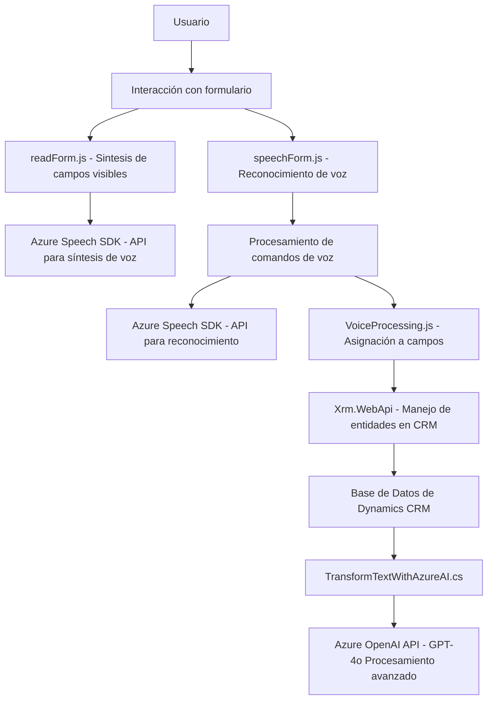

### Breve Resumen Técnico:
Este repositorio presenta una solución orientada hacia la integración de interacción por voz con formularios dinámicos en un entorno de Dynamics CRM (Customer Relationship Management). Utiliza una combinación entre frontend y backend, donde el frontend habilita síntesis y reconocimiento de voz con el Azure Speech SDK, mientras que el backend integra un plugin para usar el modelo GPT de Azure OpenAI para transformar texto según reglas específicas.

---

### Descripción de Arquitectura:
La arquitectura empleada en este proyecto se basa en el patrón **n capas**:
- **Capa de presentación:** Los archivos en `FRONTEND/JS` contienen lógica orientada al cliente para sintetizar y reconocer voz.
- **Capa de negocio:** Codificada en `Plugins`, utiliza un plugin de Dynamics CRM para integrar la funcionalidad de procesamiento avanzado de texto mediante la API de Azure OpenAI.
- **Capa de integración:** Se conectan servicios externos como Azure Speech SDK y Azure OpenAI API para manejar voz y texto en tiempo real.
- **Capa de datos (Dynamics CRM):** La aplicación interactúa directamente con la base de datos y entidades del sistema CRM.

El uso de servicios como Azure Speech y OpenAI indica un enfoque hacia arquitecturas de **SaaS** integradas con nubes externas.

---

### Tecnologías Usadas:
1. **Frontend:**
   - **JavaScript:** Para manejar la lógica de síntesis y reconocimiento de voz.
   - **Azure Speech SDK:** Biblioteca para integraciones de voz (dinámicamente cargada).
   
2. **Backend (Plugins):**
   - **C#/.NET Framework:** Para el desarrollo del plugin en Dynamics CRM.
   - **Azure OpenAI API:** Para procesamiento avanzado de texto con el modelo GPT (IA).
   - **Microsoft Dynamics CRM SDK:** Framework para manipulación de datos del sistema CRM.
   - **Newtonsoft.Json:** Librería para parseo y manejo de objetos JSON.

3. **Arquitectura y Patrones:**
   - **Patrón Cliente/Servidor:** La solución separa cliente (voz y texto) y servidor (plugin para procesamiento avanzado).
   - **Gestión dinámica de dependencias:** Uso de carga dinámica del Azure Speech SDK en el frontend.
   - **Patrón Plugin:** Extendiendo la funcionalidad del Dynamics CRM mediante la interfaz `IPlugin`.

---

### Diagrama Mermaid 100 % compatible con GitHub Markdown:

---

### Conclusión Final:
El repositorio implementa una solución robusta para formularios dinámicos que incorpora interacción avanzada por voz y procesamiento de texto con IA. La arquitectura está centrada en n capas con interacción directa a servicios externos de Azure (Speech SDK y OpenAI). Esto la convierte en una aplicación extensible y adaptable a diferentes entornos SaaS. Sin embargo, en el aspecto de seguridad, es crucial que se mantenga el manejo seguro de claves de API para evitar riesgos innecesarios.