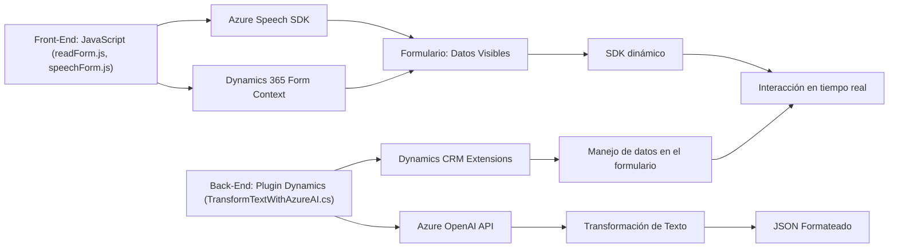

### Breve Resumen Técnico

El repositorio presenta una solución enfocada en dos dominios:
1. **Front-end (JavaScript)**: Incluye archivos que manejan formularios interactivos en un entorno Dynamics 365, integrados con reconocimiento y síntesis de voz usando el Azure Speech SDK.
2. **Back-end (C# Plugin)**: Define un plugin para Dynamics CRM que transforma textos con Azure OpenAI y proporciona contenido procesado según normas específicas.

### Descripción de Arquitectura

La arquitectura general parece híbrida y orientada a servicios. Está compuesta por:
- **Front-end Interactivo**: Interacción con formularios en Dynamics 365, utilizando APIs y SDK externos como Azure Speech SDK para procesar voz y datos.
- **Plugin Extensibilidad Dynamics CRM**: Basado en la arquitectura de plugins de Dynamics CRM, donde un componente en C# actúa como intermediario para invocar Azure OpenAI y devolver resultados procesados.

**Modelo de Arquitectura:**
- **Hexagonal** (Dominio central con servicios externos): La arquitectura se ajusta al patrón hexagonal, donde los adaptadores son los puntos de integración con APIs externas como Azure Speech SDK y Azure OpenAI, manteniendo el código base enfocado en dominios específicos como formularios y procesamiento de voz/texto.
- **N-Capas**: Las capas incluyen front-end en JavaScript para interacción, back-end en C# para procesamiento de datos y servicios externos.

### Tecnologías Usadas

1. **Front-End**:
   - **JavaScript**: Manejo de DOM, delegación dinámica (`ensureSpeechSDKLoaded`) y eventos.
   - **Azure Speech SDK**: Herramienta para síntesis de voz y grabación.
   - **Dynamics 365 API (Form Context)**: Para interacción con formularios y manipulación de atributos.
2. **Back-End**:
   - **C#**: Implementación del plugin con extensiones específicas de Dynamics CRM.
   - **Azure OpenAI**: Provisión de transformación avanzada de texto.
   - **System.Net.Http** y **System.Text.Json**: Para invocación externa y procesamiento de texto JSON.
   - **Newtonsoft.Json**: (No directamente usado en el código, podría ser externo o configurado en el proyecto).
3. **Integración**:
   - Cloud APIs (Azure Speech SDK, Azure OpenAI).

### Dependencias y Componentes Externos

1. **Azure Speech SDK**:
   - Proporciona funcionalidades de síntesis de voz y grabación en el navegador.
2. **Azure OpenAI**:
   - Transformación de texto en tiempo real.
3. **Dynamics 365 SDK**:
   - Inclusión de APIs para plugins, interacción de formularios y manipulación de datos.
4. **Servicios del navegador**:
   - APIS como `window` y `document` usadas ampliamente para cargar scripts dinámicos y manejar eventos.

---

### Diagrama Mermaid Válido para GitHub

---

### Conclusión Final

El repositorio combina una solución híbrida integrando front-end interactivo con procesamiento avanzado basado en voz, mientras utiliza un back-end extensible en forma de plugin en Dynamics CRM para transformar texto con Azure OpenAI. La arquitectura es robusta y modular, destacándose la reutilización de servicios externos como Azure Speech SDK y Azure OpenAI, junto con patrones típicos de composición modular y hexagonal.

En resumen, se trata de un sistema bien diseñado que aprovecha servicios en la nube y eventos dinámicos para mejorar la interacción entre usuarios, formularios y inteligencia artificial.