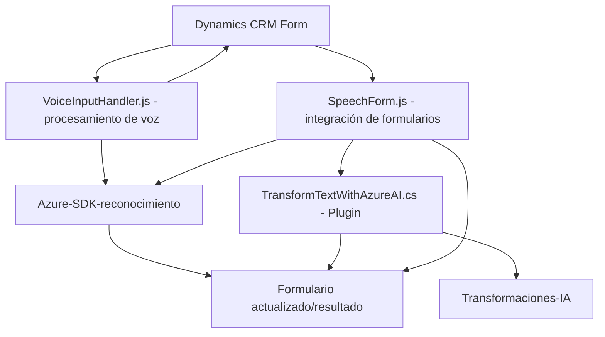

### Breve resumen técnico
El repositorio en cuestión parece proporcionar una solución integral para integrar servicios de reconocimiento y síntesis de voz en formularios de Microsoft Dynamics CRM mediante la API de Azure Speech y Azure OpenAI. Consta de tres componentes principales:
1. **Frontend JavaScript:** Procesa datos del formulario y ejecuta funcionalidades de entrada/salida de voz.
2. **C# Plugin:** Transformación de texto utilizando inteligencia artificial con Azure OpenAI.
3. **Integraciones externas:** API de Azure Speech y servicios de Azure OpenAI.

---

### Descripción de la arquitectura
Este sistema utiliza una arquitectura **n capas** con un enfoque modular:
- **Capa de presentación (Frontend):** Implementada en JavaScript, interactúa directamente con el usuario a través del formulario de Microsoft Dynamics CRM.
- **Capa de lógica de negocios:** Implementada parcialmente en JavaScript (procesamiento de datos de formularios, síntesis/discurso) y en C# (transformación avanzada de datos mediante un plugin).
- **Capa de servicios externos:** Integra servicios como Azure Speech SDK para el procesamiento de voz y Azure OpenAI para la transformación de texto.
  
Adicionalmente, el sistema utiliza patrones estándar, como **Facade**, **Service Layer**, y la arquitectura propia de plugins de Dynamics CRM. Esto crea una solución que interactúa activamente con APIs externas para enriquecer la funcionalidad del sistema CRM.

---

### Tecnologías usadas
1. **JavaScript:** Lenguaje principal para operaciones en el frontend (formularios).
   - **Azure Speech SDK:** Procesamiento de texto a voz (synthesis) y de voz a texto (recognition).
   - Manipulación de formularios de Dynamics CRM a través de SDK (`Xrm.WebApi`).
   - Asincronía con `Promise` y métodos como `fetch`.
2. **C#:** Lenguaje para el desarrollo del plugin.
   - **Microsoft Dynamics SDK:** Implementación de plugins mediante la interfaz `IPlugin`.
   - **Azure OpenAI:** Interacción directa para la transformación avanzada de texto.
   - Dependencias .NET: `System.Net.Http`, `Newtonsoft.Json.Linq`, `System.Text.Json`.
3. **Servicios de nube:**
   - **Azure Speech SDK:** Sintetizador y reconocimiento de voz de Microsoft.
   - **Azure OpenAI service:** Transformación de texto en JSON estructurado basado en normas específicas.

---

### Diagrama Mermaid válido para GitHub

---

### Conclusión final
Este repositorio representa una solución integrada para añadir capacidades avanzadas de reconocimiento y síntesis de voz a los formularios de Microsoft Dynamics CRM. Está altamente orientado a la integración de servicios y presenta una estructura de **n capas** donde cada componente maneja una responsabilidad específica. 

La arquitectura es robusta y modular, aprovechando los servicios de Azure y las capacidades del SDK de Dynamics CRM para gestionar datos y maximizar la potencialidad de la inteligencia artificial y la tecnología de voz. Esta solución tiene alta aplicabilidad en escenarios que requieren interacción vocal con formularios empresariales y procesamiento inteligente de información.