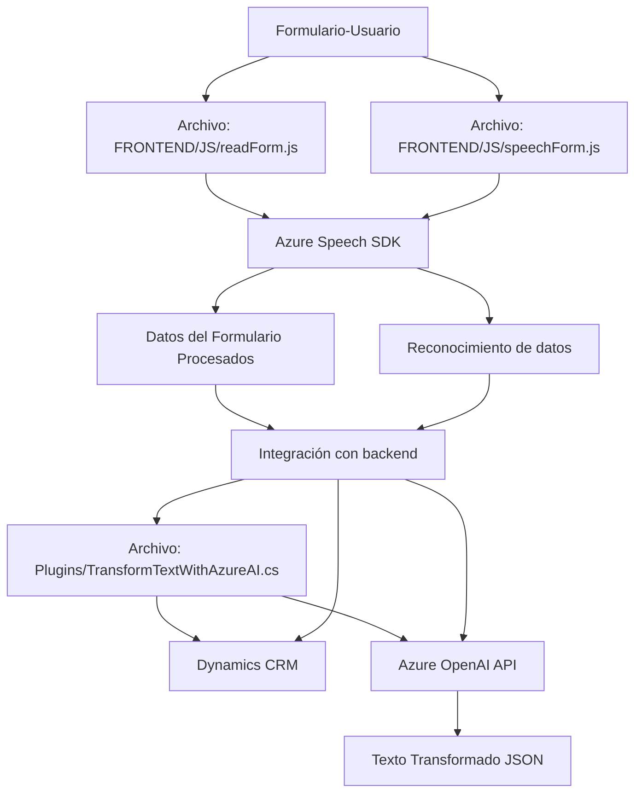

### Breve Resumen Técnico
El análisis engloba un sistema compuesto por varios archivos que implementan funcionalidades relacionadas con entrada, procesamiento, y transformación de datos asistidos por voz e inteligencia artificial mediante Azure Speech SDK y Azure OpenAI API. En conjunto, podemos inferir que el repositorio tiene elementos que se orientan tanto al **frontend** como a **plugin-based backend** para Microsoft Dynamics CRM.

---

### Descripción de Arquitectura
El sistema utiliza una **arquitectura híbrida** entre dos enfoques principales:
1. **Frontend con separación lógica**: Los scripts JavaScript implementan reconocimiento de voz y síntesis aplicada para formularios de usuario. La lógica está dividida en funciones específicas según su propósito, siguiendo patrones básicos de programación modular y ejecución basada en callbacks.
2. **Plugin-based architecture**: La clase `TransformTextWithAzureAI.cs` utiliza patrones de arquitectura de plugin de Dynamics CRM para ejecutar lógica personalizada ante eventos del sistema CRM. Este archivo opera como un componente backend basado en servicios.

A nivel global, las capas son las siguientes:
1. **Capa de interacción** (Frontend): Se encarga de la interfaz de usuario mediante integración con SDKs (Speech SDK).
2. **Capa lógica**: Scripts intermedios realizan procesamiento asincrónico invocando APIs de terceros (Azure) o internos (Dynamics).
3. **Capa de servicios** (Backend): Incluye lógica para usar la API de Azure AI en un plugin de Dynamics CRM y transformación de valores contextuales, operando como un microservicio complementario.

---

### Tecnologías Usadas
1. **Lenguajes y SDKs**:
   - **JavaScript (Frontend)**: Para manejo de voz, manipulación DOM, y lógica UI.
   - **C# (Backend)**: Para plugins personalizados en Dynamics CRM.
   - **Azure Speech SDK**: Reconocimiento/síntesis de voz y datos contextuales.
   - **Azure OpenAI API**: Procesamiento de texto con IA.
2. **Plataformas**:
   - **Microsoft Dynamics CRM**: Backend de CRM, manejado con API personalizadas y eventos del framework nativo.
   - **Azure Services**: Speech y OpenAI para funciones IA.
3. **Frameworks y librerías adicionales**:
   - **Newtonsoft.Json**: Manejo de datos JSON en C#.
   - **System.Net.Http**: Envío de peticiones HTTP.
   - **Microsoft.Xrm.SDK**: Interacción con Dynamics CRM (Clases, métodos, y extensiones específicas para el CRM).

---

### Diagrama Mermaid válido para GitHub:

---

### Conclusión Final
1. **Tipo de solución**: El repositorio combina un **frontend interactivo** (basado en JavaScript) para entrada/salida de voz, junto con un **backend plugin para Dynamics CRM** que ofrece transformaciones y API externas. Aunque no es un microservicio puro, algunas características como las conexiones asincrónicas con Azure OpenAI API hacen que esté encaminado hacia servicios verticales especializados.
2. **Características de arquitectura**: Híbrida, mezclando procesamiento asincrónico en el frontend y un plugin para backend sobre Dynamics CRM, con integración de servicios externos (Azure Speech SDK, Azure OpenAI API). Tiene elementos de separación en capas, pero no llega a ser hexagonal ni estrictamente n-capas.
3. **Resumen arquitectónico**: Es flexible para amplificar funcionalidades IA y voz en formularios de Dynamics CRM. La integración multi-nivel entre capas de interfaz, asincronía, y lógica CRM externa es clave en el diseño. Sin embargo, podría ser optimizado hacia una arquitectura más desacoplada como microservicios.

