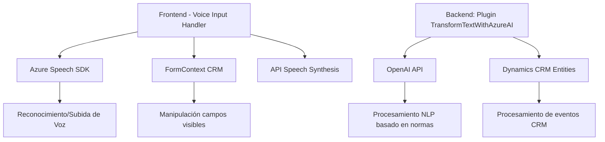

# **Análisis Técnico y Arquitectónico**

## 1. Qué tipo de solución es:
La solución está compuesta por diferentes módulos orientados a servicios dentro del contexto de un sistema CRM (Microsoft Dynamics CRM). Se clasifica como una arquitectura integrada que conecta:
- **Frontend:** Parte que utiliza archivos JavaScript para la interacción con el usuario y el DOM de los formularios del CRM.
- **Backend Plugins:** Uso de programación basada en una arquitectura de plugin para extender la lógica del CRM y conectar con servicios externos como Azure OpenAI.

## 2. Tecnologías, frameworks y patrones usados:
### Tecnologías y Frameworks:
- **Microsoft Dynamics CRM:** Plataforma principal para gestión de datos y ejecución de eventos.
- **Azure Speech SDK:** Uso en frontend para la síntesis de voz y reconocimiento de texto.
- **Azure OpenAI API:** En backend para procesamiento avanzado de lenguaje natural.
- **JavaScript:** Métodos JS en los archivos `VoiceInputHandler.js` y `speechForm.js` procesan datos del formulario CRM.
- **.NET Framework y C#:** Implementación de lógica de negocio en plugins (`IPlugin`).
- **JSON Serialization:** Uso extensivo en APIs para intercambio de datos.

### Detectados Patrones de Programación:
#### 1. **Arquitectura basada en Plugins:**
   - Extensión de funcionalidades del CRM mediante el desarrollo de plugins para integrar servicios externos como Azure OpenAI y adaptarlos a las condiciones dinámicas del sistema CRM (activador por eventos).

#### 2. **Event-Driven Architecture:**
   - Lógica activada a partir de eventos como entrada de voz o modificaciones realizadas en los datos del CRM.

#### 3. **Modularidad:**
   - Los scripts frontend están diseñados como funciones individuales para tareas específicas, como lectura de formularios, entrada de voz y comunicación con servicios externos.

#### 4. **Adaptador/Wrapper Pattern:**
   - El plugin actúa como un adaptador entre Microsoft Dynamics CRM y Azure OpenAI API.

#### 5. **Data Mapping:** 
   - Implementación de lógica que traduce etiquetas visibles del formulario en nombres de atributos internos del CRM.

---

## 3. Qué tipo de arquitectura tiene:
La arquitectura tiene componentes que se distribuyen entre **2 capas principales**, y puede describirse como un diseño **n-capas**:
- **Frontend (Presentación):** Scripts JS interactúan con el usuario, manipulan formularios y llaman servicios externos.
- **Backend (Negocio + Integración):** Los plugins extienden la funcionalidad del CRM integrando inteligencia artificial para procesamiento de lenguaje.

Adicionalmente, los servicios externos como **Azure Speech SDK** y **Azure OpenAI API** se conectan como dependencias externas mediante solicitudes HTTP (modelo cliente-servidor).

---

## 4. Dependencias o componentes externos presentes:
### Dependencias principales:
#### **Frontend:**
- **Azure Speech SDK:**
   - Biblioteca cargada dinámicamente para realizar tareas de síntesis de voz y reconocimiento de entrada por micrófono.
   - URL: `https://aka.ms/csspeech/jsbrowserpackageraw`.

- **Dynamics CRM Context (`executionContext` y `formContext`):**
   - Proporciona acceso y manipulación de los atributos del formulario CRM.

#### **Backend:**
- **Azure OpenAI API:**
   - Endpoint basado en HTTP para enviar texto y recibir transformaciones avanzadas.
   - URL base típica: `https://openai-netcore.openai.azure.com/`.

- **Microsoft Dynamics SDK:**
   - Bibliotecas necesarias para la extensión de lógica del sistema CRM, incluyendo `IPlugin`, `Query`, y API relacionadas.

#### Herramientas y bibliotecas:
- **Newtonsoft.Json:** Para manejo de objetos JSON en el backend.
- **System.Net.Http:** Realiza la comunicación con servicios externos.
- **System.Text.Json:** Serialización y deserialización JSON.

---

## 5. Diagrama **Mermaid** compatible con GitHub Markdown:

---

## **Conclusión Final**
### Resumen:
Este sistema demuestra una implementación modular y bien integrada dentro de un contexto CRM, con un enfoque en mejorar la interacción con el usuario mediante capacidades avanzadas de voz e inteligencia artificial. Se logra extender funcionalidad usando un patrón de **n-capas**, donde:
- El frontend manipula información dinámica de formularios y provee síntesis de voz mediante **Azure Speech SDK**.
- El backend realiza transformación de texto y lógica avanzada usando **Azure OpenAI API**, conectado con el CRM mediante plugins.

### Recomendación:
Si se desea expandir esta funcionalidad, se podría implementar:
1. **Mejoras de observabilidad:** Añadir un sistema de logs o métricas para errores en la integración.
2. **Pruebas unitarias:** Particularmente necesarias en el plugin para asegurar robustez en las transformaciones realizadas.
3. **Seguridad y escalabilidad:** Validar la seguridad de la comunicación con servicios externa y optimizar para sistemas con alta carga.