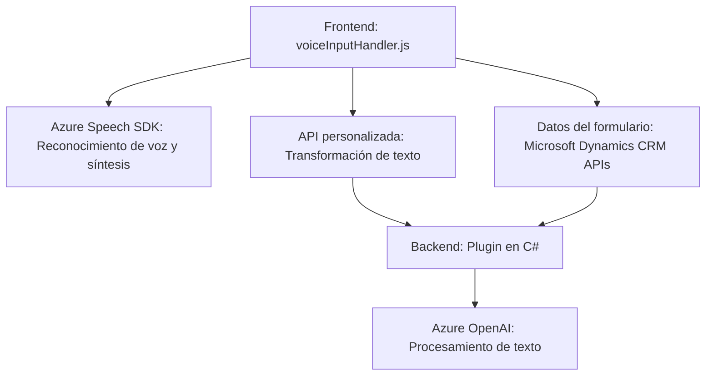

## Breve resumen técnico
El repositorio describe una solución orientada al uso de **Azure Speech SDK** y **Azure OpenAI** dentro de un sistema integrado de **Microsoft Dynamics CRM**. Las funcionalidades incluyen:
- Integraciones de voz en formularios para la lectura, modificación y síntesis.
- Uso de APIs personalizadas para el procesamiento avanzado del texto en colaboración con servicios externos como **Azure OpenAI**.

Según los archivos analizados, la solución combina lógica frontend (Javascript y SDK dinámico) con plugins backend en Dynamics CRM desarrollados en .NET.

---

## Descripción de Arquitectura
La arquitectura propuesta es una implementación **n capas** con interacción entre:
1. **Frontend dinámico**: Controla la entrada de voz, transcripción y síntesis usando Azure Speech SDK; opera en el navegador cliente.
2. **Backend basado en plugins (Dynamics CRM)**: Ejecuta lógica extendida como el procesamiento de texto mediante Azure OpenAI dentro del contexto del servidor CRM.
3. **Servicios externos**: Comunicación con Azure Speech y Azure OpenAI, utilizados para tareas específicas de síntesis y transformación de texto.

---

## Tecnologías usadas
1. **Frontend:**
   - **Javascript**: Base para la lógica de cliente.
   - **Azure Speech SDK**: Para reconocimiento y síntesis de voz.
   - **Microsoft Dynamics CRM APIs**: Para manipulación de datos en formularios.
   - **DOM API**: Manejo dinámico del HTML (e.g., carga del SDK).

2. **Backend:**
   - **Azure OpenAI API**: Para transformación y procesamiento del texto basado en reglas definidas.
   - **.NET y C#:** Implementación de plugins en Microsoft Dynamics CRM usando la interfaz `IPlugin`.

3. **Patrones Arquitectónicos**:
   - **Integración de APIs externas**: Speech SDK y OpenAI.
   - **Composición en cliente**: Uso modular de funciones para cargar SDK o manejar transcripción.
   - **Plugin Architecture**: Extensión del CRM usando la interfaz `IPlugin`, común en Dynamics.
   - **Gateway hacia servicios externos**: Plugins interactúan directamente con servicios como Azure OpenAI.

---

## Diagrama Mermaid válido para GitHub

---

## Conclusión final
La solución descrita se orienta al desarrollo de una aplicación de soporte a formularios interactivos dentro de **Microsoft Dynamics CRM**. Esta aplicación utiliza tecnologías avanzadas como **Azure Speech SDK** para reconocimiento y síntesis de voz, y **Azure OpenAI** para interpretar y transformar texto. La arquitectura **n-capas** combina una lógica avanzada entre la interfaz frontend y la lógica de negocio en backend implementada como plugins, con integraciones cruciales a servicios externos.

**Fortalezas:**
- Modelo modular y reutilizable.
- Flujo bien definido entre cliente y backend con interacción limpia con APIs externas.
- Uso de tecnologías avanzadas como OpenAI y Speech SDK.

**Consideraciones:**
- La exposición de la **API key** es peligrosa y debe ser reemplazada por un almacén seguro (como Azure Key Vault).
- La arquitectura depende de servicios de Azure, lo que puede generar costos adicionales por uso en producción.

Esta solución es adecuada para empresas que trabajan en la personalización de CRM y aplicaciones con interfaces avanzadas para facilitar tareas como el llenado de formularios dinámicos mediante inteligencia artificial y reconocimiento de voz.