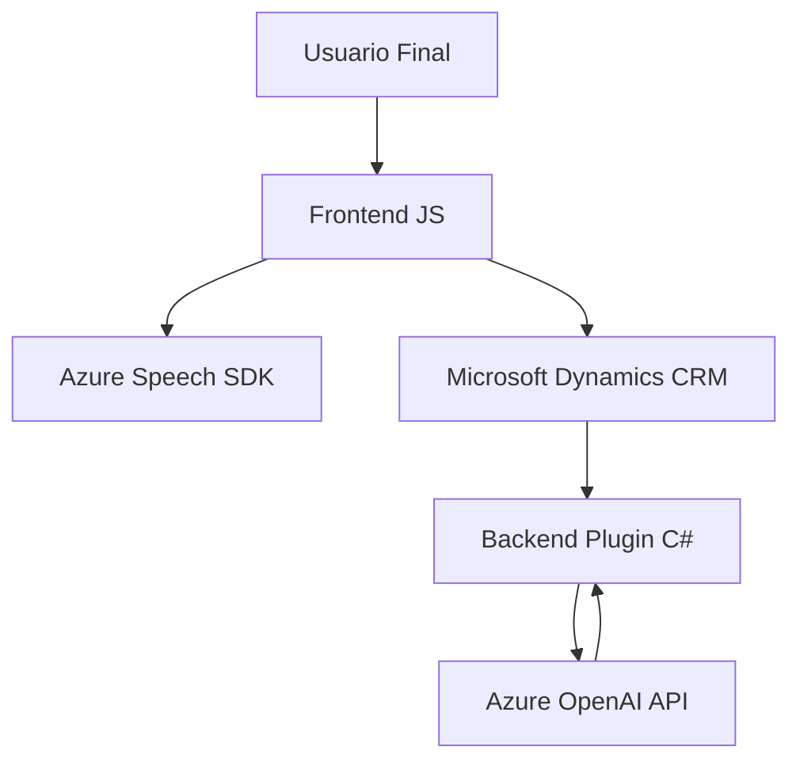

### Breve Resumen Técnico
El repositorio integra funcionalidades de reconocimiento y síntesis de voz con el SDK de Azure Speech. Además, implementa un plugin para Dynamics CRM que utiliza servicios externos de Azure OpenAI para transformar datos. Su enfoque combina integración RESTful, procesamiento de texto a voz de formularios, y la lógica propia de un sistema CRM.

### Descripción de Arquitectura
El sistema parece operar con una **arquitectura modular**, organizada en tres áreas principales:
1. **Frontend (JavaScript)**: Maneja la interacción con el usuario, reconocimiento de voz y escritura en formularios mediante integración SDK.
2. **Backend (C# Plugin)**: Encapsula la lógica de transformación de texto y forma un puente entre el CRM y Azure OpenAI.
3. **Servicios Externos**: Azure Speech SDK y Azure OpenAI actúan como componentes externos fundamentales.

La estructura global del sistema refleja una **arquitectura de capas**, distribuyendo responsabilidades entre:
- **Presentación**: Código relacionado con el formulario.
- **Lógica de negocio**: Procesamiento del reconocimiento/transcripción de voz y escritura en el CRM.
- **Acceso a servicios externos**: Integración directa con SDK y APIs de Azure.

### Tecnologías Usadas
1. **Frontend**:
   - **JavaScript**: Lenguaje principal para operaciones en el navegador.
   - **Azure Speech SDK**: Manejo de síntesis/reconocimiento de voz.
   - **DOM APIs**: Manipulación directa de elementos del formulario.
   - **Xrm.WebApi**: Para interacción con el CRM.
   
2. **Backend**:
   - **C#**: Lenguaje utilizado para escribir el plugin.
   - **Microsoft Dynamics CRM SDK**: Para ejecutar lógica personalizada asociada a eventos en CRM.
   - **Newtonsoft.Json**: Para manejo de JSON.
   - **System.Net.Http**: Para integración con APIs de Azure.

3. **Servicios Externos**:
   - **Azure Speech SDK**: Reconocimiento de voz y generación de síntesis.
   - **Azure OpenAI**: Inteligencia artificial para transformar texto.
   
### Dependencias o Componentes Externos
Los principales componentes externos son:
- **Azure Speech Service**: Para funciones de reconocimiento y síntesis.
- **Azure OpenAI (Custom API)**: Transformación avanzada de texto.
- **Microsoft Dynamics 365 CRM**: Sistema para gestionar los datos y eventos.
- **JSON Libraries**: Manejo de datos estructurados entre el frontend, plugin, y APIs.

### Diagrama Mermaid

### Conclusión Final
Este sistema tiene una **arquitectura modular de capas** con componentes funcionales que coordinan el frontend, el backend y servicios externos. Utiliza enfoques modernos de integración con servicios de IA y SDKs de Azure, mostrando una clara separación de responsabilidades:
- **Frontend** procesa la interacción del usuario y sintetiza voz.
- **Backend con plugin C#** gestiona el procesamiento de datos en el CRM y la comunicación con Azure OpenAI.
- **Servicios externos** proveen capacidades avanzadas de IA y reconocimiento/síntesis de voz.

Para optimización futura, se deberían implementar buenas prácticas de manejo de configuración (secrets management), pruebas automatizadas y refactorización de funciones críticas para simplificar la estructura.