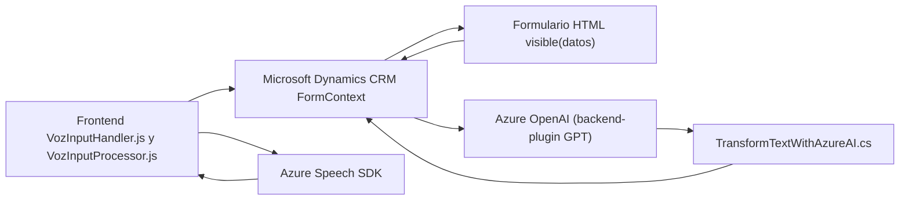

### Breve resumen técnico:
El repositorio presenta una solución diseñada para integrarse con Microsoft Dynamics CRM utilizando **funcionalidades de entrada/salida mediante voz** y **procesamiento de texto basado en IA**. Incluye módulos frontend en JavaScript y un plugin backend en C#, con enfoques orientados a servicios externos como **Azure Speech SDK** y **Azure OpenAI**.

---

### Descripción de arquitectura:
#### Tipo de arquitectura: 
- **Arquitectura modular orientada a servicios**:
  - Frontend JS utiliza módulos específicos para entrada/salida de voz y procesar datos de formularios.
  - Backend C# implementa un **plugin para Dynamics CRM** que se comunica con **Azure OpenAI**.
  
#### Patrones utilizados:
1. **Modularización**:
   - Funciones bien definidas en los módulos JS: cada una encapsula una única responsabilidad (e.g., extracción de datos visibles, síntesis de voz, reconocimiento de voz).
   - Plugin en C# sigue el mismo principio con métodos organizados para transformaciones específicas y reglas.
2. **Integración con servicios externos**:
   - Uso extensivo del SDK de Azure Speech y del servicio Azure OpenAI para la síntesis de voz, reconocimiento de voz y transformación de texto.
3. **Event-driven architecture en Dynamics Plugins**:
   - La ejecución del plugin se basa en eventos de Dynamics CRM con parámetros de entrada y salida proporcionados automáticamente.
4. **Micro-servicios funcionales** (para el Frontend y Backend):
   - Aunque el sistema no es estrictamente un "Microservicio", cada módulo es autónomo en su funcionalidad.

---

### Tecnologías usadas:
1. **Frontend**:
   - **JavaScript**
   - **Azure Speech SDK** (para entradas/salidas de voz).
   - Dynamics CRM API (`formContext`, `Xrm.WebApi`, etc.).

2. **Backend**:
   - Lenguaje: **C#**
   - Framework: **Dynamics CRM SDK**.
   - **Azure OpenAI** (modelo GPT con llamadas HTTP mediante `HttpClient`).
   - **Newtonsoft.Json** y `System.Text.Json` para manejo de JSON.

---

### Dependencias o componentes externos:
1. **Azure Speech SDK**:
   - SDK en el frontend para realizar la síntesis y reconocimiento de voz.
2. **Azure OpenAI**:
   - Modelo GPT para realizar procesamiento avanzado de texto.
3. **Dynamics CRM Web API**:
   - Para manipular datos y contextos del formulario desde el frontend y backend.
4. **HTTP Client**:
   - Facilita la comunicación entre el backend y servicios de Azure en el plugin.
5. **Newtonsoft.Json** (backend):
   - Trabaja con JSON avanzado en C# para estructurar datos de salida.

---

### Diagrama Mermaid válido para GitHub:

---

### Conclusión Final:
El repositorio combina un diseño **modular y orientado a servicios**, integrando tecnologías como **Microsoft Dynamics CRM**, **Azure Speech SDK**, y **Azure OpenAI** para ofrecer una solución avanzada con entrada/salida de voz y procesamiento de texto con IA. La arquitectura se alinea con patrones de modularidad y delegación en las diferentes capas del sistema, siendo ideal para entornos empresariales que requieran accesibilidad y automatización avanzada mediante interacción vocal e IA estructurada.