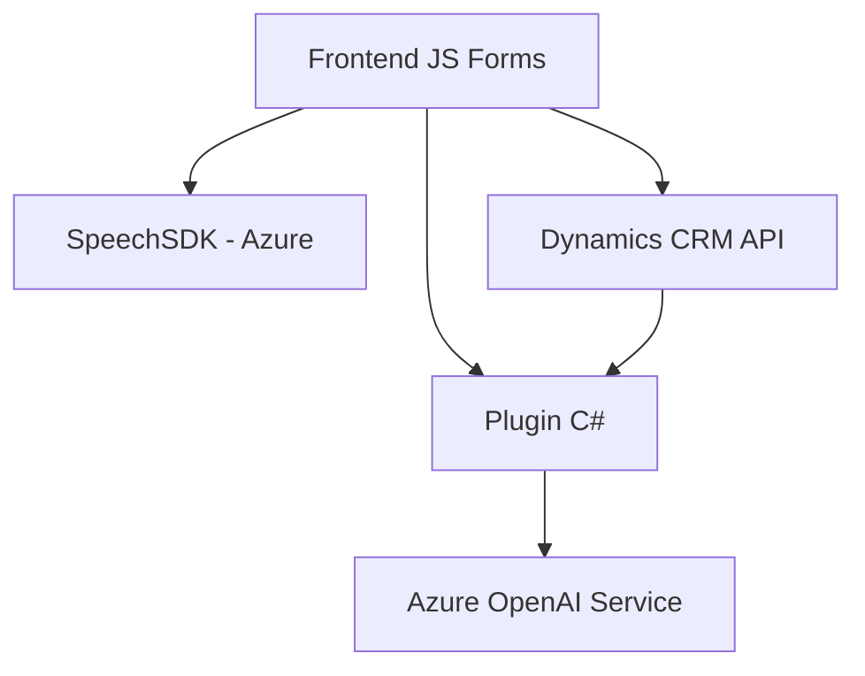

### Breve Resumen Técnico

El repositorio implementa una solución integrada de reconocimiento de voz y síntesis mediante Azure Speech SDK y procesamiento de texto con Azure OpenAI en un entorno Dynamics CRM. Está compuesto por un frontend (JavaScript) que interactúa con los formularios de Dynamics CRM y un plugin backend en C#. Ambas capas trabajan en conjunto para ofrecer funcionalidades avanzadas de entrada y salida de datos, integradas con IA.

---

### Descripción de Arquitectura

- **Tipo de solución**: Esta es una integración de diferentes componentes de software orientada principalmente a ampliar las capacidades de interacción con formularios en un sistema CRM (Dynamics 365). Incluye una combinación de frontend basado en JavaScript y backend mediante un plugin para procesamiento de texto con Azure OpenAI.
- **Arquitectura utilizada**: 
  - Principalmente una **arquitectura de integración por capas** (backend y frontend). 
  - La interacción con servicios externos (Azure AI y Azure Speech SDK) sugiere un híbrido entre arquitectura en capas y arquitectura de microservicios.

---

### Tecnologías Usadas

1. **Frontend**:
   - **JavaScript** para implementar la lógica de entrada de voz, procesamiento de datos de formularios, y síntesis de texto en voz.
   - **Azure Speech SDK** para habilitar reconocimiento y síntesis de voz en tiempo real.
   - **Manipulación del DOM**, implicando que estas funcionalidades son utilizadas en aplicaciones web.
   - **Dynamics 365 API** integrada con funciones como `Xrm.WebApi.online.execute`.

2. **Backend**:
   - **C# .NET Framework** para la implementación del plugin de Dynamics CRM.
   - **Azure OpenAI (GPT)** para la transformación y reestructuración del texto mediante un servicio RESTful API.

3. **Patrones de diseño**:
   - Uso del patrón **callback** en el frontend para controlar el flujo cuando se carga dinámicamente el SDK.
   - Modularización de funciones para el manejo por separado de los casos de uso de entrada por voz y síntesis.
   - Arquitectura de **plugins** en Dynamics CRM para integrar funcionalidades adicionales.
   - Arquitectura orientada a servicios (Azure APIs y Dynamics APIs).

---

### Dependencias Externas o Componentes

1. **Azure Speech SDK**: Para reconocimiento y síntesis de voz con capacidades avanzadas.
2. **Azure OpenAI API (GPT)**: Servicio para procesamiento inteligente de texto, retornando resultados estructurados según las normas definidas.
3. **Dynamics 365 API**: Interacción con formularios, datos y flujo de trabajo en el sistema CRM.
4. **Bibliotecas y servicios adicionales**:
   - `Microsoft.Xrm.Sdk` y `Newtonsoft.Json.Linq` en el backend (para manipulación JSON y gestión CRM).
   - **CDN dinámico para Speech SDK**.

---

### Diagrama Mermaid

A continuación se presenta un diagrama **Mermaid** que describe la interacción entre los componentes del repositorio.

---

### Conclusión Final

Este repositorio muestra una solución modular y escalable orientada a la interacción avanzada con formularios en Dynamics CRM mediante capacidades de IA (reconocimiento de voz y procesamiento avanzado de texto). La arquitectura integra servicios de terceros (Azure Speech SDK y Azure OpenAI) en un entorno de Dynamics CRM utilizando un enfoque de desarrollo por capas integrado con servicios RESTful. Es ideal para aplicaciones que buscan facilitar la interfaz de usuario (mediante la entrada y salida de voz) mientras aprovechan las ventajas de la inteligencia artificial en el backend.