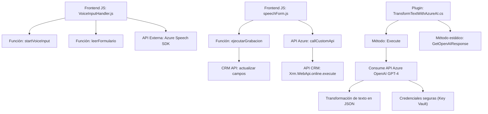

### Breve Resumen Técnico
El repositorio incluye archivos con funcionalidades específicas orientadas a la interacción con formularios CRM/Dynamics, reconocimiento de voz, síntesis de texto, y transformación basada en IA externa (Azure OpenAI). Las tecnologías incluyen Azure Speech SDK y Dynamics CRM SDK, mientras que la arquitectura utiliza un enfoque modular y cliente-servidor. Se observa un patrón de microservicios con servicios externos para procesamiento avanzado.

---

### Descripción de Arquitectura
1. **Tipo de solución:** La combinación de archivos indica que el proyecto está compuesto por:
   - **Frontend**: Archivos en JavaScript para el reconocimiento de voz y entrada/salida de formularios en un entorno CRM.
   - **Plugins Backend**: Código C# para la integración de servicios externos (como Azure AI), que transforma datos en el lado del servidor.
   - **Servicios Externos**: Uso de Azure Speech SDK para voz y Azure OpenAI para transformación avanzada de texto.

2. **Tipo de Arquitectura**: La arquitectura general se clasifica como híbrida:
   - **N-capas**: Arquitectura clásica con separación entre el cliente (JavaScript), la lógica del servidor (C#), y dependencias externas como Azure.
   - **Microservicios**: Usa servicios externos de Azure, como Speech y OpenAI.

---

### Tecnologías Usadas
1. **Frontend**:
   - **JavaScript**: Para lógica de entrada de voz y manipulación de formularios en el cliente.
   - **Azure Speech SDK**: Reconocimiento de voz y síntesis de texto.
   - **API Dynamics CRM (formContext, Xrm.WebApi)**: Integración con formularios CRM.

2. **Backend** (C#):
   - **Dynamics CRM SDK**: Extensión mediante plugins para manejar lógica server-side.
   - **Azure OpenAI GPT-4**: Transformación de texto basada en IA.
   - **HttpClient y JSON**: Para realizar solicitudes HTTP y manejar respuestas de APIs externas.

3. **Dependencias Externas**:
   - Azure Speech SDK.
   - Azure OpenAI.
   - Dynamics CRM API.

---

### Diagrama Mermaid
A continuación, se genera el diagrama para representar la arquitectura.

---

### Conclusión Final
La solución está diseñada para interactuar con formularios en un entorno CRM utilizando reconocimiento de voz, síntesis de texto, y transformación avanzada a través de IA. La arquitectura modular y basada en servicios externos como Azure optimiza la flexibilidad y capacidad de escalar. Sin embargo, podría beneficiarse de mejores prácticas de seguridad como el uso de Azure Key Vault para manejar credenciales sensibles y mayor estandarización en la estructura del código frontend.