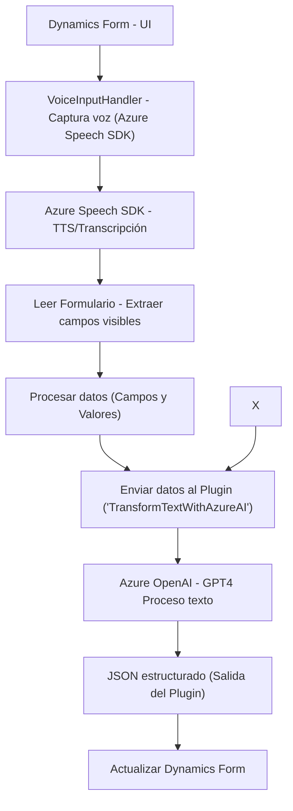

### Breve resumen técnico
El repositorio contiene tres archivos relacionados con la implementación de una solución orientada a la interacción con formularios mediante entrada de voz, síntesis de texto, y procesamiento avanzado de datos utilizando servicios de Azure. Los archivos `VoiceInputHandler.js`, `VoiceInputProcessing.js` y el plugin `TransformTextWithAzureAI.cs` apuntan a una solución basada en **Dynamics CRM**, con integración directa de servicios en la nube como **Azure Speech SDK** y **Azure OpenAI**.

---

### Descripción de la arquitectura
La solución sigue una **arquitectura modular en capas**, con elementos de integración directa de servicios externos. El diseño puede considerarse una combinación de **arquitectura en n-capas** por las claras separaciones de responsabilidades:
- **Capa de Presentación**: Implementada por los scripts JavaScript que actúan como controladores, interactuando con la UI de Dynamics CRM y proporcionando funcionalidades accesibles por eventos de usuario.
- **Capa de Servicio**: Representada por las funciones que interactúan con Azure Speech SDK y los Custom APIs en Dynamics CRM.
- **Capa de Logística/Negocio**: Implementada por el plugin que maneja procesamiento avanzado mediante Azure OpenAI, y la generación de respuestas en JSON.

Adicionalmente, se observa una extensión específica para la interacción con plataforma de Microsoft Dynamics, una arquitectura que soporta personalización mediante plugins.

---

### Tecnologías utilizadas
1. **Azure Speech SDK**:
   - Usado para síntesis de texto a voz y transcripción de voz.
   - Integrado mediante script externo y API.

2. **Dynamics CRM Framework**:
   - La interacción entre formularios y datos se realiza mediante APIs nativas de Dynamics CRM.
   - Uso de `formContext` y `Xrm.WebApi.online.execute`.

3. **Azure OpenAI Service**:
   - API de GPT-4 para manipular texto mediante machine learning dentro del plugin de Dynamics.

4. **.NET Framework y C#**:
   - Utilizado en el plugin `TransformTextWithAzureAI.cs` con bibliotecas como `Newtonsoft.Json` y `System.Net.Http`.

5. **API personalizada**:
   - Adicionalmente se interactúa con un Custom API (específica de Dynamics CRM) para lógica adicional.

6. **Patrones de diseño observados**:
   - **Facade Pattern**: Simplificación de interacción con SDKs y APIs mediante envoltorios funcionales.
   - **Event-Driven Architecture**: Utiliza callbacks y eventos dentro de los métodos JavaScript, iniciados por interacciones del usuario.
   - **Plugin Framework**: Dinamismo mediante la interfaz `IPlugin` en Dynamics CRM.
   - **Service Provider Pattern**: Obtención de servicios en el contexto de Dynamics CRM.

---

### Dependencias y componentes externos
#### Dependencias:
1. **Azure Speech SDK** para manejo de síntesis y transcripción.
2. **Dynamics CRM APIs** (Xrm.WebApi).
3. **Azure OpenAI** como servicio de procesamiento avanzado.
4. **Librerías en C#**:
   - `Newtonsoft.Json.Linq`.
   - `System.Net.Http`.
   - `Microsoft.Xrm.Sdk`.

#### Componentes externos:
1. **Servicios de Azure cognitivos** (Azure Speech y Azure OpenAI).
2. *Custom API en Dynamics CRM*: Transforma los datos que llegan desde el frontend.
3. *Scripts externos*: Para cargar Azure Speech SDK.

---

### Diagrama Mermaid 100% compatible

---

### Conclusión final
Este repositorio implementa una solución integrada con **Dynamics CRM** que habilita funcionalidades de entrada por voz, procesamiento y síntesis de texto a voz, así como procesamiento complejo mediante inteligencia artificial. La arquitectura del sistema es una combinación de **n-capas** y **extensión de plataforma CRM** con soporte para lógica externa gracias a la integración con servicios de la nube como Azure Speech SDK y Azure OpenAI Service.

Los scripts actúan como un controlador para la interacción con la capa de presentación (UI de Dynamics CRM), mientras que el plugin se posiciona en la capa de negocio y lógica avanzada realizando integración directa con servicios de inteligencia artificial. La implementación refleja un diseño limpio y funcional, con modularidad y adaptabilidad destacadas.