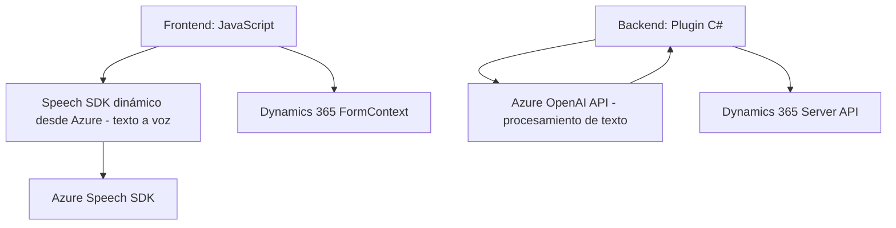

### Breve resumen técnico del repositorio
El repositorio es una solución híbrida dividida en **frontend** (JavaScript) y **backend** (C# plugin), orientada principalmente a la interacción entre formularios de Microsoft Dynamics 365 y servicios en la nube de Azure. Ofrece capacidades de **entrada de voz**, **síntesis de texto en audio** y **procesamiento inteligente de texto** mediante tecnologías avanzadas como **Azure Speech SDK** y **Azure OpenAI Service**.

---

### Descripción de la arquitectura
La arquitectura combina varios patrones:
1. **Integración de servicios externos:** Tanto la capa de frontend como el plugin backend dependen de APIs proporcionadas por Azure (Speech SDK y OpenAI Service).
2. **Modularidad:** Las funciones están muy separadas, cada una encargada de cumplir una única responsabilidad, favoreciendo el mantenimiento y extensibilidad.
3. **Capa Backend basada en Plugins:** Utiliza el patrón de desarrollo de plugins para Dynamics CRM, que forma parte de una arquitectura basada en eventos.
4. **Capa Frontend:** Interactúa directamente con el usuario (cliente) a través de JavaScript, implementando estrategias de carga dinámica de SDKs.
   
Aunque presenta una cierta separación funcional, se aproxima a una arquitectura **n-capas** con integración vertical desde el frontend hacia el backend y dependencias externas como Azure para habilitar capacidad de IA.

---

### Tecnologías usadas
#### **Backend (Plugins en C#)**
- **Frameworks:** .NET Framework/SDK de Dynamics CRM.
- **Librerías:** Microsoft.Xrm.Sdk, Newtonsoft.JSON, System.Text.Json.
- **Servicios externos:**
  - Azure OpenAI Service.
  - HTTPClient para integrar servicios REST.

#### **Frontend (JS)**
- **Tecnología principal:** JavaScript en contextos de Dynamics 365.
- **Frameworks/librerías:** Uso directo de APIs (sin frameworks adicionales como React o Angular).
- **Servicios externos:** Azure Speech SDK (carga dinámica mediante CDN).

#### **Patrones arquitectónicos**
- Factory Pattern: Creación de configuraciones con `SpeechConfig` y otras instancias específicas en Azure Speech SDK.
- Plugin Architecture: Extensión modular para Dynamics CRM.
- Dynamic Loading: Carga de SDKs externos en los componentes JavaScript del frontend.

---

### Diagrama Mermaid  
Representación de las interacciones arquitectónicas y los principales componentes en el repositorio.

---

### Conclusión final
Este repositorio implementa una solución tecnológica orientada a mejorar la interacción entre usuarios y datos en **Microsoft Dynamics 365** mediante capacidades avanzadas de reconocimiento y síntesis de voz, además de procesamiento de texto basado en IA. Conectando componentes frontend y backend con expertos servicios de Azure, permite una experiencia accesible y adaptable a escenarios complejos de entornos empresariales o CRM.

- **Puntos fuertes:** Modularidad, uso extensivo de APIs modernas, enfoque en accesibilidad y adaptabilidad.
- **Posibles mejoras:** Podría beneficiarse de una mayor encapsulación para facilitar pruebas unitarias y de integración en ambas capas (frontend/backend). También sería oportuno sustituir cualquier lógica altamente paralela en los plugins por patrones más robustos (como CQRS).