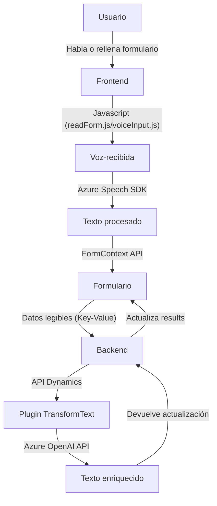

### Breve resumen técnico

El repositorio contiene principalmente dos componentes JavaScript para manejo de formularios y entrada de voz en un entorno Dynamics 365, además de un plugin en C# que interactúa con Azure OpenAI API. Se integra con los **SDK de Azure Speech y OpenAI** para síntesis de voz y procesamiento avanzado de lenguaje natural. Las implementaciones indican que el sistema maneja tanto la lectura de datos como la actualización automática y dinámica de los formularios en combinación con servicios avanzados de Cloud Computing.

---

### Descripción de arquitectura

La arquitectura es híbrida con características predominantes del diseño modular y multicapa. A nivel de frontend (JavaScript), las funciones están subdivididas para desempeñar tareas bien definidas: extracción de datos del formulario, entrada de voz, síntesis de voz y llamadas a APIs personalizadas. El backend C# sigue el patrón tradicional de Plugins en Dynamics 365 (implementación de la interfaz IPlugin), aunque introduce una integración con la API de Azure OpenAI.

#### Niveles identificados:
1. **Frontend**: Modular, con funciones organizadas para captar, procesar, y actuar con datos del formulario.
2. **Backend**: Plugin específico para transformación de texto y gestión con Azure OpenAI.
3. **Externo**: SDKs de Azure Speech y servicios REST, proporcionando capacidades como síntesis de voz y análisis avanzado de lenguaje.

---

### Tecnologías usadas

1. **Dependencias JavaScript**:
   - **Azure Speech SDK**: Síntesis de voz y reconocimiento.
   - **Dynamics 365 FormContext API**: Para la interacción con formularios.
   - **Custom APIs**: Extensiones personalizadas para D365 o servicios externos.

2. **Dependencias C#**:
   - **Azure OpenAI API**: Procesamiento de texto con modelos avanzados.
   - **Newtonsoft.Json** y **System.Text.Json**: Serialización/deserialización de respuestas en JSON.
   - **Microsoft Dynamics CRM SDK**: Interacción con el contexto del CRM.

3. **Diseños arquitectónicos**:
   - **Adapter Pattern**: Para conectar sistemas de reconocimiento de voz y procesamiento de texto con formularios dinámicos.
   - **Callback Pattern**: Gestión asincrónica de tareas (e.g. carga del SDK de Azure Speech).
   - **Event-Driven Plugin** (C#): Activación del procesamiento de texto bajo eventos de Dynamics CRM.

---

### Diagrama Mermaid válido para GitHub

---

### Conclusión final

Este repositorio implementa una solución específica para interacción avanzada con formularios en **Dynamics 365**, usando tecnologías modernas como **Azure Speech SDK** para reconocimiento de voz y síntesis, y **Azure OpenAI API** para comprender y enriquecer datos hablados/formateados. La arquitectura combina características de **n capas** en el módulo de interacción cliente (JavaScript) con un enfoque de **microservicio** hacia el lado de integración con Azure, optimizando la solución para extensibilidad futura y compatibilidad con servicios cloud. 

Aunque bien estructurado, sería recomendable implementar prácticas adicionales como la externalización de configuraciones sensibles (ej. claves de API) y el uso de clientes HTTP reutilizables para potenciar el desempeño del plugin C#. Además, adoptar principios SOLID garantizaría aún más la escalabilidad y la mantenibilidad del desarrollo.