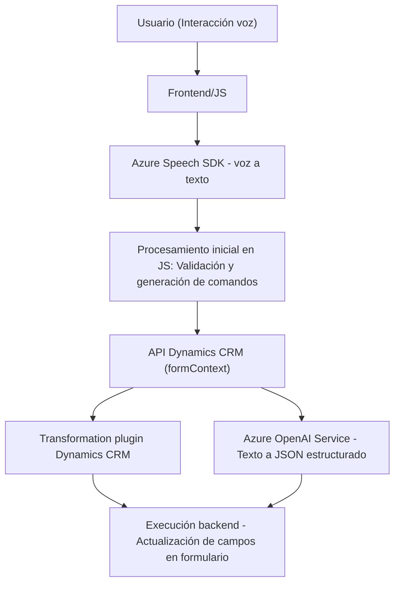

### Breve resumen técnico

Este repositorio está orientado a una solución que integra funcionalidad de interfaces web (frontend), procesamiento de voz, y extensibilidad en sistemas de Dynamics CRM. Utiliza servicios de Azure para reconocimiento de voz (Speech SDK) y procesamiento avanzado de datos con OpenAI (GPT). Está compuesto por tres partes principales: scripts frontend (interacción usuario-voz), extensión dinámica de campos en formularios y un plugin para transformación de texto con Azure AI en Dynamics CRM.

---

### Descripción de arquitectura

#### Nivel de solución
La solución combina:
1. **Frontend (JS):** Scripts que manejan funcionalidad de entrada de voz y síntesis de texto, con interacción al cliente mediante APIs como Dynamics Forms y Azure Speech.
2. **Back-office (Plugins en C#):** Extensibilidad para el procesamiento avanzado de texto en backend, conectado a Dynamics CRM y Azure OpenAI.
3. **API externa:** Invocación a servicios como Azure Speech y Azure OpenAI para operaciones avanzadas.

#### Arquitectura general  
La solución sigue una arquitectura **mixta de n capas y servicios externos**, donde:
- El frontend realiza interacción directa con usuarios y prepara los datos necesarios.
- El backend (Plugins en C#) transforma dichos datos aplicando reglas o procesamiento IA.
- Los servicios externos (Azure Speech y OpenAI) se integran para realizar tareas de alta computación.

Patrones utilizados:
- **Principios de integración por servicios externos:** Usa API REST y SDK para conectarse a Azure.
- **Encapsulación funcional:** Cada componente o etapa del flujo de datos está dividido en bloques reutilizables (frontend y backend).
- **Responsabilidad única:** Los scripts del frontend están enfocados exclusivamente en interacción usuario-voz, mientras que el plugin backend ejecuta tareas específicas de lógica empresarial y IA.

---

### Tecnologías usadas

1. **Azure Speech SDK:** Reconocimiento y síntesis de voz.
2. **Azure OpenAI API:** Procesamiento de texto estructurado mediante GPT.
3. **Dynamics 365 Framework:** Gestión de datos y lógica empresarial en el contexto del CRM.
4. **Librerías en C#:**
   - `Microsoft.Xrm.Sdk`: Funcionalidades de Dynamics CRM.
   - `Newtonsoft.Json`: Manipulación avanzada de JSON.
   - `System.Net.Http`: Llamadas a APIs externas.
5. **Frontend en JavaScript:** Scripts para hablar con APIs de Azure y gestionar datos del formulario.
6. **API REST:** Comunicación con Azure Speech y Azure OpenAI para procesamiento externo.

---

### Diagrama Mermaid válido para GitHub

---

### Conclusión final

Esta solución combina varias tecnologías para facilitar interacción dinámica entre usuarios y sistemas basados en voz, texto y datos estructurados. La arquitectura es flexible, con comunicación directa frontend-backend mediante APIs de servicios cloud (Azure) y extensibilidad en el contexto de Dynamics CRM. Está diseñada para ser modular, escalable y fácil de integrar en implementaciones empresariales que requieran inteligencia artificial y un flujo eficiente de datos entre interfaces frontend y sistemas backend.