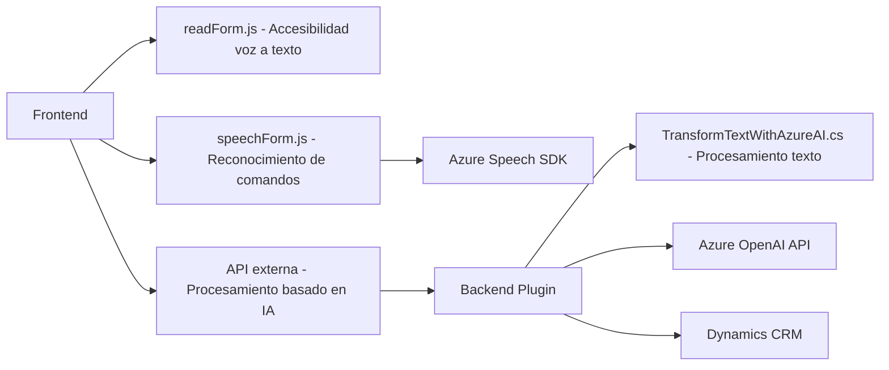

### Breve resumen técnico
Este repositorio presenta tres archivos principales:
1. **`readForm.js`**: Permite la síntesis de texto a voz para mejorar la accesibilidad.
2. **`speechForm.js`**: Maneja comandos hablados, extracción de información y actualización dinámica de formularios en una aplicación CRM mediante el Azure Speech SDK y APIs externas.
3. **`TransformTextWithAzureAI.cs`**: Define un plugin para el procesamiento automatizado de textos mediante Azure OpenAI en plataformas Dynamics CRM.

Estos archivos demuestran un enfoque centrado en la accesibilidad, procesamiento dinámico de formularios y funciones de inteligencia artificial.

---

### Descripción de arquitectura
La arquitectura general combina una **aplicación web cliente** (frontend) desarrollada en JavaScript con soporte para reconocimiento y generación de voz, comunicándose con un backend funcional formado por:
1. **Microservicio basado en ASP.NET**: Funcionalidad de plugin para Dynamics CRM, apuntando a la integración con Azure OpenAI.
2. **SDK y APIs externas**: Uso intensivo de Azure Speech SDK y Azure OpenAI API.

Aunque es principalmente una interfaz de frontend, interactúa con un backend CRM mediante APIs, estableciendo un modelo **cliente-servidor** con módulos destinados al procesamiento dinámico mediante IA.

### Arquitectura estimada
- **Tipo:** Microservicios
- **Estructura:** Modular con funcionalidades distribuidas (cada archivo define elementos específicos conectados por servicios externos o API).
- Comunicación centralizada entre el frontend (mediante SDKs) y el backend (mediante plugins y APIs).

---

### Tecnologías usadas
1. **Frontend**:
   - **JavaScript**: Para la lógica de accesibilidad y reconocimiento/síntesis de voz.
   - **Azure Speech SDK**: Herramienta clave para reconocer y sintetizar comandos de voz.
2. **Backend**:
   - **C# sobre Dynamics CRM**: Implementación extensible mediante plugins (`TransformTextWithAzureAI.cs`).
   - **Azure OpenAI API**: Procesamiento avanzado de texto.
   - **Microsoft Xrm.WebApi**: Para interacción directa con el modelo de datos CRM.
3. **Patrones usados**:
   - **Plugin Pattern**: En el backend C#.
   - **Dependency Injection**: Uso dinámico de SDKs en el frontend.
   - **Callback Pattern**: Manejando eventos asincrónicos.
   - **Layered Architecture**: Separación de responsabilidades.

---

### Dependencias o componentes externos
1. **Azure Speech SDK**: Usado en archivos de frontend para reconocimiento y síntesis de voz.
2. **Azure OpenAI API**: Utilizado en el plugin para transformar texto utilizando reglas de IA.
3. **Microsoft Dynamics CRM SDK**: Necesario para interacción con formularios y datos CRM.
4. **HTTP Requests**: En `TransformTextWithAzureAI.cs` para invocar servicios externos.

### Diagrama Mermaid compatible con GitHub Markdown

---

### Conclusión final
El repositorio combina funcionalidades frontend basadas en JavaScript y Azure Speech SDK con un backend extensible en Dynamics CRM mediante C#. La arquitectura es modular y centrada en microservicios, con comunicación entre el frontend y el backend mediante APIs. Ofrece herramientas avanzadas de accesibilidad y procesamiento de texto mediante IA, lo que lo hace ideal para entornos CRM interactivos y accesibles.