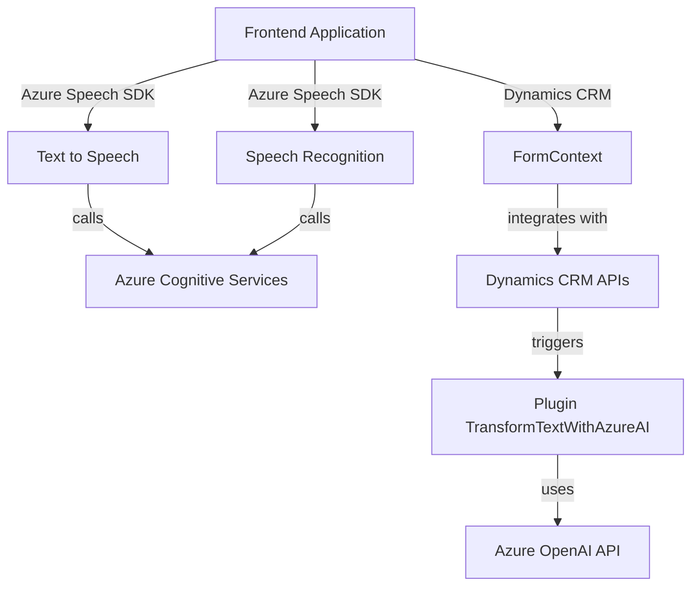

### Breve resumen técnico:
El repositorio parece estar diseñado para integrar capacidades avanzadas de reconocimiento, síntesis de voz y transformación de datos mediante el uso de servicios Azure AI y Dynamics CRM. Los archivos representan componentes que trabajan en conjunto para ofrecer una funcionalidad específica dentro de un ecosistema más grande. Es posible que esta solución sea parte de una interfaz CRM que permite la interacción con datos mediante voz, la lectura de información desde un formulario, e integración con servicios externos para manipulación de datos.

---

### Descripción de arquitectura:
1. **Tipo de solución:**  
   Esta implementación corresponde a una solución orientada tanto a APIs (Azure AI, Dynamics CRM) como a interacciones frontend con formularios y datos. Es una integración para aplicaciones CRM/Dynamics 365 que agrega capacidades de voz y procesamiento de datos utilizando servicios de terceros (Azure Speech SDK y Azure OpenAI).

2. **Arquitectura:**  
   La arquitectura se alinea con el diseño de **microservicios** y **plugin-driven architecture**, con componentes específicos dedicados a funcionalidades de síntesis/reconocimiento de voz y transformación de texto mediante la conexión a servicios externos. Internamente, las funcionalidades están organizadas modularmente, siguiendo patrones de diseño como DTO para transferencia de datos y event-driven paradigms para iniciar acciones basadas en eventos específicos.

3. **Tecnologías usadas:**  
   - **Frontend:** JavaScript con módulos que incluyen el **Azure Speech SDK** para síntesis y reconocimiento de voz, integración directa con Dynamics CRM API (`Xrm.WebApi` y `formContext`).  
   - **Backend:** C#, con la implementación de **Dynamics 365 Plugins** mediante `Microsoft.Xrm.Sdk` y uso del **Azure OpenAI Service (GPT-4)** para procesamiento avanzado de texto.  
   - **External Service APIs:** Azure Cognitive Services, Azure Speech SDK, and Azure OpenAI.  
   - **Serialization & HTTP Requests:** `System.Text.Json`, `HttpClient`, and related .NET technologies.  

4. **Dependencias y componentes externos:**  
   - **Azure Speech SDK:** Para brindar soporte de síntesis y reconocimiento de voz.  
   - **Azure OpenAI API:** Transformación y manipulación avanzada de texto mediante modelos GPT.  
   - **Dynamics CRM API (Xrm.WebApi):** Interacción con formularios y entidades CRM.  
   - **System libraries:** Serialización JSON (`System.Text.Json`), manejo de solicitudes HTTP (`System.Net.Http`), y patrones típicos de plugins de Dynamics en C#.  

5. **Diagrama Mermaid:**  
A continuación, se presenta un diagrama simplificado que muestra las interacciones entre los diferentes componentes mencionados:

---

### Conclusión final:
La solución presentada utiliza una integración sólida de servicios cloud de Microsoft (Azure Speech SDK y Azure OpenAI) y herramientas diseñadas para personalizar plataformas Dynamics CRM. Su arquitectura modular, orientada a eventos y dirigida por servicios proporciona un marco escalable, flexible y eficiente para aprovechar capacidades de inteligencia artificial como reconocimiento y síntesis de voz. Aunque el manejo de configuraciones sensibles como claves API podría mejorarse, la solución tiene un diseño bien formado y alineado con patrones modernos de desarrollo.