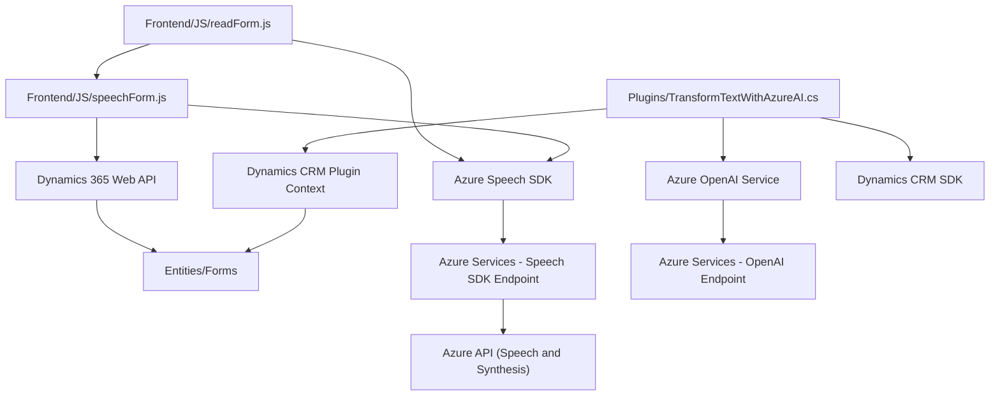

### Breve resumen técnico
El repositorio contiene archivos codificados para diversas funcionalidades: interacción con voz utilizando SDKs de Azure, reconocimiento de voz aplicado a formularios, y un plugin que ejecuta transformaciones de texto mediante Azure OpenAI en un contexto de Dynamics CRM. La solución tiene componentes tanto de frontend (JavaScript) como de backend (C# para Plugins), además de integraciones externas con Azure Speech SDK y Azure OpenAI.

---

### Descripción de arquitectura
La arquitectura general sigue un enfoque híbrido:
1. **Frontend**: Modular, con scripts para interfaces basadas en formularios en Dynamics 365 que interactúan con Azure Speech SDK (gestión de voz y palabras a texto).
2. **Backend**: Plugins construidos sobre Microsoft Dynamics CRM, con una arquitectura de extensión mediante la interfaz `IPlugin`. Las transformaciones son realizadas por Azure OpenAI, con una separación clara entre funciones de lógica empresarial y consumo de la API externa.

Los scripts de frontend plantean una arquitectura basada en patrones n-capas con "delegación de servicios" al SDK de Azure y funciones para manipulación DOM desde Dynamics. El backend emplea un patrón **request-reply** para llamadas externas a la API de AI.

---

### Tecnologías usadas
1. **Frontend (JavaScript)**:
   - **Azure Speech SDK**: Para manejo de síntesis y reconocimiento de voz.
   - **Dynamics 365**: Integración con contextos de formulario y APIs (Xrm.WebApi).
   - **ECMAScript**: Para manipulación de eventos, estructuras DOM y servicios SDK.

2. **Backend (C#)**:
   - **Microsoft Dynamics CRM SDK**: Arquitectura basada en plugins.
   - **Azure OpenAI Service**:
     - Tecnología GPT (modelo `gpt-4o`) para procesamiento de texto.
   - **System.Net.Http** y **Json** (System.Text.Json, Newtonsoft.Json): Para consumo y manipulación de respuestas JSON.
   - Regex y LINQ para procesamientos en cadenas y colecciones.

3. **Externas**:
   - **Azure Services**:
     - Speech SDK ("https://aka.ms/csspeech/jsbrowserpackageraw").
     - OpenAI API para transformación de texto ("https://openai-netcore.openai.azure.com/").

---

### Diagrama Mermaid

---

### Conclusión final
La solución combina elementos de interacción con voz, procesamientos de texto por IA, y comunicación bidireccional con formularios de Dynamics 365 CRM. Su arquitectura es híbrida, con componentes n-capas en el frontend y un diseño basado en plugins en el backend. La modularidad y separación de responsabilidades hacen que sea extensible, pero también dependiente de servicios externos (Azure Speech y Azure OpenAI). Se recomienda un cuidado especial a manejo de errores para servicios externos y pruebas con datos reales en entornos controlados para garantizar la escalabilidad en producción.