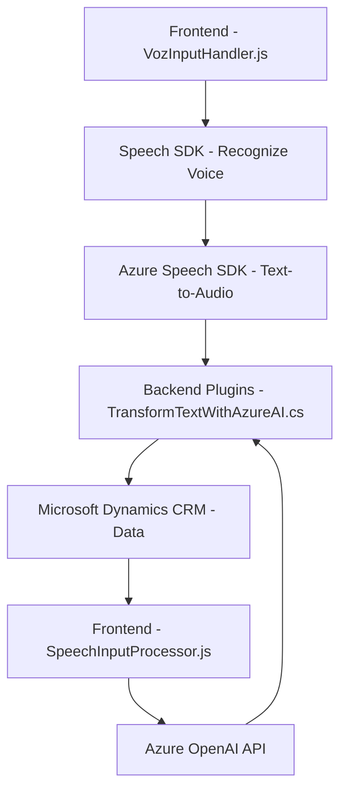

# Breve Resumen Técnico

El repositorio proporciona una integración entre un **frontend** orientado a formularios dinámicos, una **API externa de inteligencia artificial (Azure OpenAI)** y un **plugin de Microsoft Dynamics CRM**. Utiliza servicios externos como **Azure Speech SDK** para convertir texto transcrito en voz (speech-to-text y text-to-audio) y para realizar procesamientos en el backend mediante un servicio de IA (Azure OpenAI).

- **Funcionalidades clave**: lectura de datos de formularios en la interfaz, reconocimiento y síntesis de voz, mapeo de datos transcritos en formularios dinámicos de un CRM (propiedades/atributos).
- **Servicios utilizados**: Azure Speech SDK y Azure OpenAI (GPT).

---

# Descripción de Arquitectura

La solución implementa una arquitectura **orientada a servicios** (SOA) donde el frontend actúa como un cliente que interactúa con componentes externos (Azure Speech SDK, servicios CRM personalizados y Azure OpenAI). El plugin en el backend gestiona las interacciones entre los datos del CRM y el servicio de procesamiento de IA.

1. **Frontend (JavaScript)**:
    - Funcionalidad centrada en procesar formularios, sintetizar datos en voz y reconocer voz usando Azure Speech SDK.
    - Encapsula la lógica UI y la lógica de interacción con el SDK y las APIs externas.
    
2. **Backend (C#)**:
    - Plugin Dynamics CRM implementa el patrón de **responsabilidad única**, procesando datos y servicios con validaciones estrictas.
    - El **modelo de integración API** permite interactuar con Azure OpenAI para convertir texto de entrada CRM en JSON estructurado.

3. **Arquitectura General**: La solución se estructura siguiendo principios de **n capas**:
    - Capa de presentación (frontend con JavaScript).
    - Capa de negocio y procesamiento (CRM plugin con C#).
    - Capa de servicios externos (Microsoft Azure).

---

# Tecnologías Usadas

1. **Frontend**:
   - **JavaScript** para sintetizar texto en voz y procesar transcripciones.
   - **Azure Speech SDK** para reconocimiento y síntesis de voz.
   - Dependencias externas añadidas dinámicamente (como el script de Speech SDK).
  
2. **Backend**:
   - **C#** para crear el plugin en Dynamics CRM.
   - Dependencias principales: 
     - `Microsoft.Xrm.Sdk`, para interactuar con CRM.
     - `Newtonsoft.Json.Linq`, para manejar JSON.
     - `System.Net.Http`, para peticiones HTTP.
   - **Azure OpenAI** (GPT) como servicio externo de procesamiento de IA.

---

# Dependencias o Componentes Externos

1. **Azure Speech SDK**:
   - Reconocimiento de voz.
   - Síntesis de voz (text-to-audio).

2. **Azure OpenAI API**:
   - Transforma texto en JSON estructurado usando AI.
   - Endpoint específico para Azure OpenAI `https://openai-netcore.openai.azure.com/`.

3. **Dynamics CRM**:
   - Plugin integrado en el sistema CRM para gestionar formularios dinámicos y atributos personalizados.

4. **API personalizada**: Aunque no se especifica en los fragmentos, hay un posible servicio personalizado para interactuar con otro backend o mapear datos del CRM.

--- 

# Diagrama Mermaid

---

# Conclusión Final

La solución representa una implementación eficiente de servicios basados en interacción por voz y procesamiento de datos en un entorno CRM, con un fuerte énfasis en tecnologías de **Microsoft Azure**. Utiliza una arquitectura **n capas** para separar la lógica de presentación (frontend) del procesamiento (backend) y las integraciones externas (Azure APIs). 

Aunque funcional, algunos puntos pueden mejorarse:
1. **Seguridad**: Parametrizar claves y tokens de acceso al servicio de Azure para eliminar hardcoding del código fuente.
2. **Testing y observabilidad**: Implementar pruebas automáticas y trazabilidad para los módulos del frontend y backend.
3. **Mejor documentación**: Definir claramente el flujo de datos entre servicios.

En general, es un proyecto bien estructurado que se beneficia del uso de patrones y modularidad, siendo adecuado para entornos empresariales con necesidades de interacción por voz e IA.