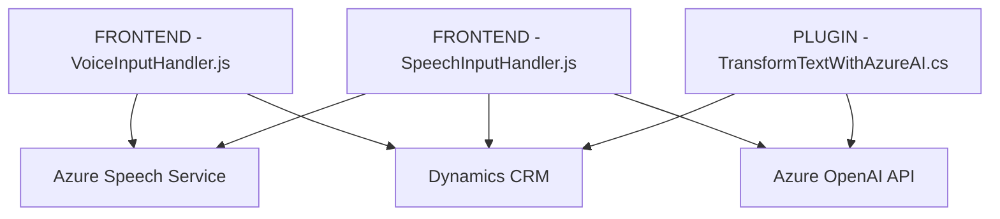

### Breve resumen técnico

El repositorio presenta una solución que integra una **captura y procesamiento de datos de formularios dinámicos en Dynamics 365 con el uso de Azure Speech SDK** y Azure OpenAI Service. Combina **sistemas frontend en JavaScript y backend en C#** para procesar formularios, convertir texto a voz, aplicar reconocimiento de voz y transformar texto con reglas avanzadas.

---

### Descripción de arquitectura

1. La solución parece seguir una **arquitectura orientada a servicios** con integración de APIs externas (Azure Speech SDK y Azure OpenAI). Aunque no es estrictamente un microservicio, se puede clasificar como una arquitectura modular que conecta componentes frontend y backends específicos mediante APIs.
2. Los archivos están organizados según una arquitectura **separada por capas**, donde:
   - La capa frontend procesa dinámicamente los formularios y maneja la interacción con SDKs externos como Azure Speech.
   - La capa backend maneja extensiones de lógica comercial en Dynamics CRM y transforma datos vía la API de OpenAI.
3. **Patrones observados**:
   - Modularización: Cada archivo encapsula funciones y responsabilidades específicas.
   - Service-Oriented Integration: Fuertes dependencias con servicios externos de Azure.

---

### Tecnologías, frameworks y patrones usados

1. **Frontend**:
   - **JavaScript**: Lenguaje principal para la captura y procesamiento de formularios dinámicos.
   - **Azure Speech SDK**: Manejo de voz a texto y síntesis de audio.
   - **Dynamics 365/XRM Web API**: Para interactuar con formularios en entornos CRM.

2. **Backend**:
   - **C# con Dynamics CRM SDK**: Implementación de plugins en Microsoft Dynamics CRM.
   - **Azure OpenAI Service API**: Transformación de texto basado en inteligencia artificial.
   - **System.Net.Http / System.Text.Json**: Manejo de solicitudes HTTP y manipulación de JSON para comunicación externa.

3. **Patrones**:
   - **Decoupled Integration**: Separación de la lógica de negocio y los servicios externos.
   - **Plugin-based Architecture**: Extensión de Dynamics CRM mediante implementaciones de la interfaz `IPlugin`.
   - **Single Responsibility Principle**: Fragmentación adecuada de funcionalidad en métodos claros y específicos.

---

### Diagrama Mermaid válido para GitHub

---

### Conclusión final

La solución combina **tecnologías frontend y backend** para proporcionar una experiencia mejorada de interacción con formularios dinámicos en Dynamics 365. La integración de **Azure Speech SDK** permite sintetizar voz y convertir voz a texto para una interacción más intuitiva, mientras que el **plugin backend en C#** usa la **API de Azure OpenAI** para transformar datos dinámicos según reglas predefinidas.

La arquitectura del proyecto puede considerarse como **modular orientada a servicios**, favoreciendo componentes desacoplados y múltiples integraciones con servicios en la nube. El diseño podría escalar hacia un entorno más distribuido (microservicios) si las funcionalidades fueran expandidas significativamente.