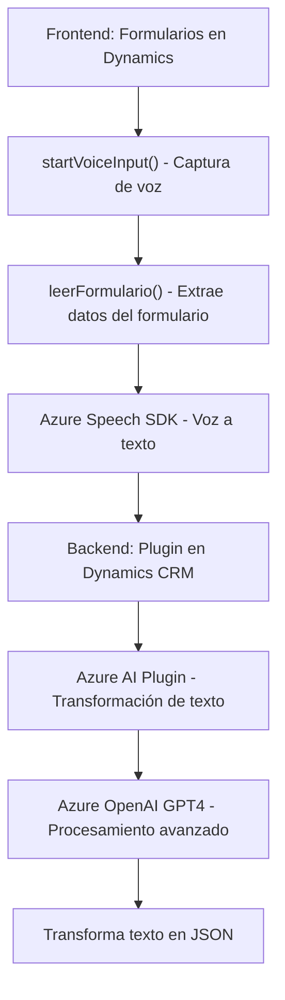

### Breve resumen técnico
El sistema descrito en los archivos parece ser una solución multifacética que integra:
- Un **frontend** en JavaScript para interactuar con formularios y servicios externos (Azure Speech SDK y Dynamics).
- Plugins para **Microsoft Dynamics CRM** escritos en C#, que utilizan servicios de **Azure OpenAI** para el procesamiento avanzado de texto.
Estos componentes están conectados para transformar voz en texto, manejar formularios y aplicar inteligencia artificial mediante servicios de Azure.

---

### Descripción de arquitectura
La arquitectura sigue un enfoque **orientado a servicios**:
1. **Frontend**: 
   - Gestiona interacción del usuario mediante un navegador. Usa JavaScript modular para la lectura de datos en formularios y procesamiento voz-texto mediante el SDK de Azure Speech.
   - Es un componente independiente altamente modular que realiza tareas específicas y delega procesamientos complejos al backend.
2. **Backend (Dynamics Plugins)**: 
   - Se encarga de lógica empresarial avanzada, transformaciones e integración con APIs externas como Azure OpenAI.
   - Implementa una arquitectura basada en plugins que se ejecutan como extensiones en la plataforma Dynamics.

Por lo tanto, podemos clasificar esta solución como una **arquitectura híbrida** basada en:
- **N-capas**: 1 capa de presentación en el frontend y 1 capa de lógica empresarial en el backend.
- **SOA (Service-Oriented Architecture)**: Uso claro de servicios externos para realizar tareas especializadas, como síntesis y procesamiento de texto.

---

### Tecnologías usadas
**Frontend (JavaScript):**
- **Azure Speech SDK**: Para procesamiento de voz a texto y texto a voz.
- **DOM API**: Para manipulación altamente dinámica de elementos y carga de scripts externos.
- **Microsoft Dynamics SDK** (`Xrm.WebApi`): Para interacción directa con registros en libreta de CRM.

**Backend (C#):**
- **Microsoft Dynamics SDK**: Ejecuta lógica empresarial mediante Plugins.
- **Azure OpenAI GPT Services**: Procesa texto para generar JSON estructurado mediante solicitudes HTTP con reglas específicas.
- **HttpClient**: Para las llamadas REST a APIs.

**Patrones de diseño y arquitectura:**
- **Facade**: Simplifica la interacción entre módulos de Dynamics y servicios externos (Speech SDK y OpenAI).
- **Plugin-based programming**: En el backend, los plugins extienden la funcionalidad estándar de Dynamics.
- **Event-driven programming**: Uso de eventos y ejecuciones condicionadas en toda la solución (ej.: las llamadas al SDK tras capturar datos en formularios).

---

### Diagrama Mermaid válido para GitHub

---

### Conclusión final
La solución integra servicios de primera línea como Microsoft Dynamics CRM, Azure Speech SDK, y Azure OpenAI para crear un sistema inteligente que:
- **Captura voz, extrae datos visibles de formularios, y los sintetiza como texto.**
- **Procesa texto desde múltiples fuentes para generar estructuras JSON que facilitan integración empresarial.**

La arquitectura es modular y sigue principios claros de desacoplamiento, carga dinámica de SDKs y uso de APIs externas. Sin embargo, presenta **riesgos de seguridad** al exponer claves y configuraciones en el código fuente, lo que debería manejarse mediante sistemas de configuración seguros (ej.: Azure Key Vault). Además, la solución puede beneficiarse de una refactorización para desacoplar la lógica estática del frontend y mejorar la configuración de servicios en el backend.