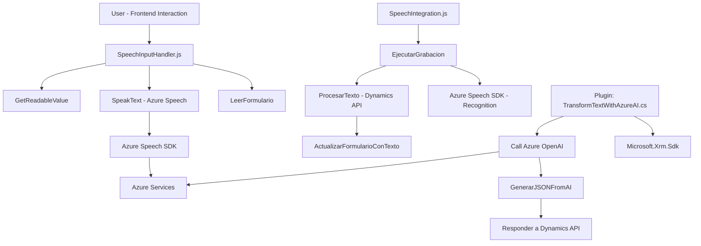

### Breve resumen técnico

Este repositorio parece contener una solución que integra funcionalidades de voz, texto y API mediante tecnologías Azure, dirigida principalmente a la automatización de formularios en un entorno como Microsoft Dynamics CRM. Los archivos están bien organizados y estructurados, segmentando claramente las responsabilidades entre frontend (integración con Azure Speech y Dynamics) y backend (plugins para procesamiento de texto).

---

### Descripción de arquitectura

La arquitectura del sistema se divide en las siguientes capas:
1. **Capa Frontend:**
   - Incluye scripts JavaScript que operan en el navegador.
   - Se encargan de la extracción, reconocimiento de voz, procesamiento y actualización de formularios en Dynamics CRM.
   - Usa patrones basados en eventos y modularidad con funciones especializadas para cumplir tareas.

2. **Capa Backend:**
   - Implica un plugin desarrollado para Dynamics CRM (`TransformTextWithAzureAI.cs`).
   - Este plugin interactúa con Azure OpenAI para procesar texto según reglas de trabajo y devolver respuestas estructuradas como JSON.
   - Utiliza patrones como SOA y Plugin Pattern.

3. **Integración con Servicios Externos:**
   - Azure Speech SDK para reconocimiento de voz y síntesis de voz.
   - Azure OpenAI para procesamiento de texto.

La arquitectura general podría considerarse como **n capas** basadas en servicios, aunque presenta integración directa con microservicios de Azure.

---

### Tecnologías usadas

1. **Frontend:**
   - **JavaScript.**
   - **Azure Speech SDK:** Para voz a texto y síntesis de voz (`https://aka.ms/csspeech/jsbrowserpackageraw`).
   - **Dynamics Web API:** Para integración con formularios de Dynamics CRM.

2. **Backend:**
   - **C#:** Desarrollo de plugins para Microsoft Dynamics.
   - **Microsoft Dynamics SDK (`Microsoft.Xrm.Sdk`).**
   - **Azure OpenAI API:** Procesamiento de texto usando AI.
   - **HttpClient (REST Calls).**
   - **System.Text.Json & Newtonsoft.Json:** Manejo de JSON.

3. **Patrones de diseño:**
   - Modularidad y separación de responsabilidades.
   - Patrones asíncronos/eventos para el manejo del SDK en frontend.
   - Plugin Pattern en Dynamics.
   - Encapsulación de lógica en funciones y métodos específicos.

---

### Diagrama Mermaid  

---

### Conclusión final

Esta solución es híbrida, combinando un frontend web con un plugin backend para Microsoft Dynamics CRM y servicios Azure externos. La arquitectura es eficiente para manejar operaciones de reconocimiento y síntesis de voz, así como integración con Dynamics CRM para la automatización de formularios y el procesamiento de datos mediante inteligencia artificial.

### Características clave:
1. **Modularidad:** Los archivos están claramente divididos entre frontend y backend con responsabilidades bien delimitadas.
2. **Tecnología avanzada:** Uso de Azure Speech SDK y Azure OpenAI para reconocimiento de voz y procesamiento de texto estructurado, además de integración nativa con Dynamics CRM.
3. **Dependencias externas:** Fuerte dependencia de servicios de Azure, lo que puede implicar problemas en caso de interrupción del servicio.

Esta solución tiene un diseño robusto orientado a la integración de capacidades de Azure con Microsoft Dynamics, facilitando la creación de sistemas automatizados para la gestión de formularios. La estructura y los patrones vistos son adecuados, aunque pueden optimizarse para mejorar la gestión de errores y la seguridad de las configuraciones (como claves de API).