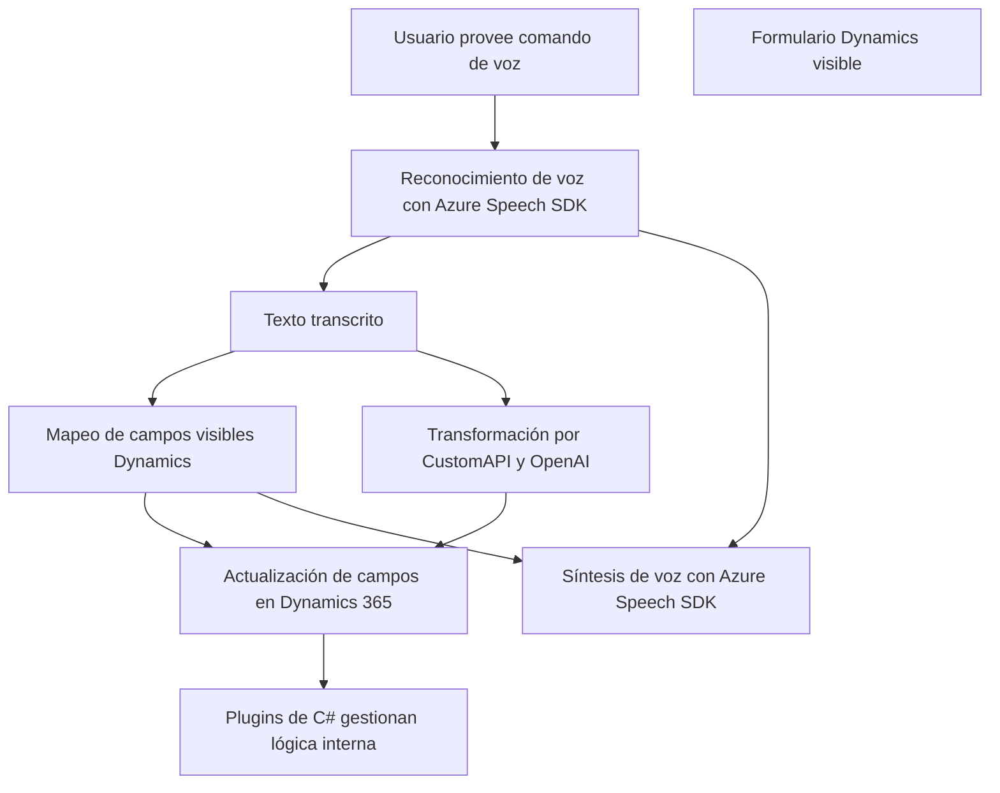

## **Análisis del Repositorio**

### **1. Breve resumen técnico**
Este repositorio define una solución interactiva que utiliza el reconocimiento de voz, síntesis de voz, y automatización mediante IA. Está diseñado para trabajar con **Microsoft Dynamics 365** y **Azure Speech SDK**, procesando datos de formularios e interactuando con APIs externas de Azure OpenAI. Los principales objetivos son:
- Reconocimiento de voz y actualización de campos de formularios.
- Generación y transformación de texto mediante IA.
- Síntesis de voz para proporcionar interfaces accesibles y enriquecidas.

---

### **2. Descripción de arquitectura**
La solución está diseñada como un sistema integrado de **n-capas**, donde cada capa cumple un rol específico:
- **Frontend en JavaScript (presentation layer):**
  - Se encarga de interactuar con el usuario (síntesis de voz y reconocimiento de voz).
  - Procesa datos desde formularios visibles en Dynamics 365.
- **Backend en C# (business logic layer):**
  - Implementa lógica de transformación de datos mediante plugins utilizando Azure OpenAI.
- **Servicios externos:**
  - Servicios de Azure, como Speech SDK y OpenAI, se integran a través de APIs para reconocer voz, transformar texto y realizar síntesis.

#### **Patrones observados**:
- **Event-driven architecture (EDA):** Los métodos del frontend están diseñados para dispararse en respuesta a eventos específicos del usuario o del contexto.
- **Service-Oriented Architecture (SOA):** La integración con Azure Speech y OpenAI refleja un enfoque orientado a servicios.
- **Plugin Pattern:** Los plugins en C# usan el diseño de extensibilidad nativo de Dynamics CRM.
- **Modular design:** Cada función y archivo tiene un objetivo bien definido, manteniendo bajo acoplamiento.

---

### **3. Tecnologías usadas**
- **Frontend**:
  - **JavaScript**: Implementación de funcionalidades del cliente.
  - **Azure Speech SDK**: Reconocimiento y síntesis de voz.
  - **Dynamics 365 WebAPI**: Acceso a datos y actualización de formularios.

- **Backend**:
  - **C#**: Plugins para Dynamics CRM.
  - **Azure OpenAI**: Transformación de texto con IA.
  - **Microsoft.Xrm.Sdk**: Interacción directa con el CRM.
  - **Newtonsoft.Json** y **System.Text.Json**: Manejadores de JSON.

- **Servicios Externos**:
  - Azure Speech Services.
  - Azure OpenAI for GPT-4.

---

### **4. Dependencias o componentes externos**
El sistema interactúa principalmente con:
- **Azure Speech SDK**: Reconocimiento y síntesis de voz.
- **Azure OpenAI API**: Procesamiento y transformación del texto según normas definidas.
- **Dynamics 365 WebAPI**: Para manipular las entidades del CRM.
- **JSON parsing libraries**:
  - `Newtonsoft.Json` (C#).
  - Browser APIs for JSON in JavaScript.

Estas dependencias son claves para las funcionalidades avanzadas de la solución.

---

### **5. Diagrama Mermaid**

---

### **6. Conclusión Final**
Este repositorio implementa una arquitectura **orientada a servicios (SOA)** combinada con la extensibilidad nativa de **Dynamics 365** mediante plugins. La infraestructura interactúa activamente con servicios externos (Azure Speech SDK, Azure OpenAI) para enriquecer la automatización y accesibilidad. Su diseño modular, junto con el uso de servicios desacoplados, sugiere que la solución puede adaptarse o ampliarse fácilmente, por ejemplo, añadiendo soporte para más idiomas o ajustándose a flujos empresariales más complejos.

Es una solución avanzada que aprovecha tecnologías modernas para garantizar una experiencia mejorada al usuario, enfocándose en **automatización mediante IA** y **interacción mediante voz**.