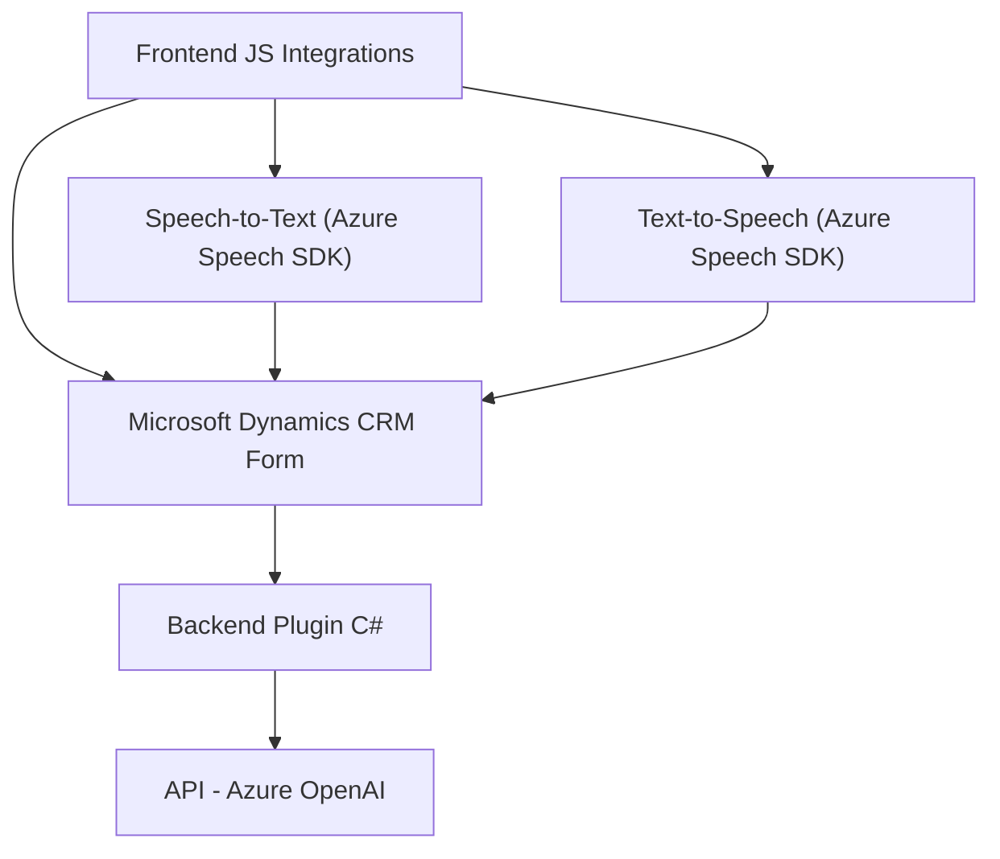

# Análisis Técnico y Arquitectónico del Repositorio

### Breve Resumen Técnico
El repositorio contiene varios archivos que implementan funcionalidades relacionadas con integración de voz, transcripción, y transformación de texto mediante AI. Está orientado a una solución para formularios en Microsoft Dynamics CRM, utilizando SDKs y APIs de Azure (Speech y OpenAI).  

Los archivos principales presentan:
1. **Front-end (JS)**: Integraciones de Text-to-Speech (tts) y Speech-to-Text (stt) mediante Azure Speech SDK, interactuando localmente con formularios de Dynamics CRM.
2. **Plugin (C#)**: Un plugin que convierte textos ingresados en Dynamics CRM a estructuras JSON utilizando Azure OpenAI.

---

### Descripción de Arquitectura
La aplicación parece seguir una arquitectura **híbrida basada en n capas**, con las siguientes características:
1. **Integración de servicios:** Uso del SDK de Azure Speech y OpenAI para la interacción con servicios de voz y procesamiento lingüístico.
2. **Cliente enriquecido (Frontend)**: Proporciona operación directa sobre formularios de Dynamics dentro de un navegador.
3. **Plugins en la capa de negocio:** Extienden la funcionalidad de Dynamics CRM, encapsulando lógica personalizada mediante el patrón de plugin.
4. **Asincronía:** Interacciones con servicios externos mediante promesas o callbacks en el Frontend y el uso de APIs REST en el plugin.

---

### Tecnologías, Frameworks y Patrones Usados
1. **Frontend (JavaScript)**:
   - **Frameworks**: Azure Speech SDK.
   - **APIs**: Dynamics 365 CRM Form API (`Xrm.WebApi`, `formContext`).
   - **Patrones**: Modularización funcional, integración asincrónica de SDK dinámicamente, cliente enriquecido.

2. **Backend (C#)**:
   - **Framework**: Dynamics CRM SDK (`IPlugin`).
   - **Bibliotecas**: `System.Text.Json`, `System.Net.Http`.
   - **Servicios Externos**: Interacción con Azure OpenAI API.
   - **Patrones**: Plugin pattern, Facade/Abstraction para simplificar APIs.

3. **Servicios externos**:
   - **Azure Speech SDK**: Text-to-Speech y Speech-to-Text.
   - **Azure OpenAI API**: Transformación de texto en JSON estructurado.

---

### Dependencias o Componentes Externos
- **Azure Speech SDK**
  - Dynamically loaded via `https://aka.ms/csspeech/jsbrowserpackageraw`.
  - Handling text-to-speech and speech-to-text functionalities.
  
- **Microsoft Dynamics CRM API**
  - Utilizado en Frontend para manipular datos del formulario.
  - Usado en el Plugin para extender sus funcionalidades.

- **Azure OpenAI API**:
  - Operaciones de transformación de texto en el backend.

- **System Libraries (C#)**:
  - `System.Net.Http` para llamadas HTTP.
  - `System.Text.Json` para manejo de JSON.

---

### Diagrama Mermaid

---

### Conclusión Final
Este repositorio correspondería a una **integración especializada para Microsoft Dynamics CRM** con características a nivel frontend y backend. La solución utiliza servicios de Azure Speech y OpenAI para integrar funcionalidades avanzadas como síntesis de voz, reconocimiento de voz y procesamiento avanzado de texto. La arquitectura destaca por ser modular y enriquecida, cumpliendo con patrones de diseño adecuados para el desarrollo tanto de extensiones CRM como procesamientos asincrónicos.

Su arquitectura híbrida tiene las siguientes fortalezas:
- Capacidad de extender dinámicamente funcionalidades de formularios en Dynamics CRM.
- Modularización lógica en componentes Frontend y Backend.
- Uso de dependencias externalizadas como SDK de Azure, optimizando la integrabilidad con servicios IA.