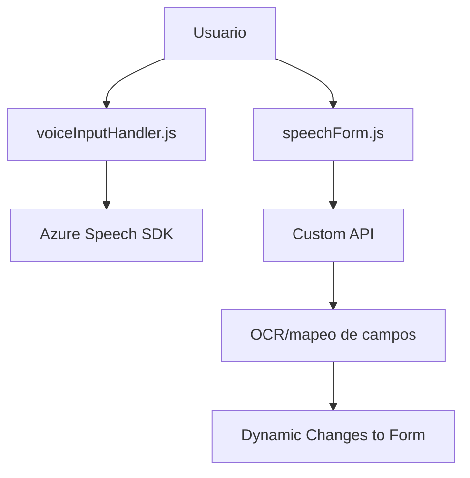
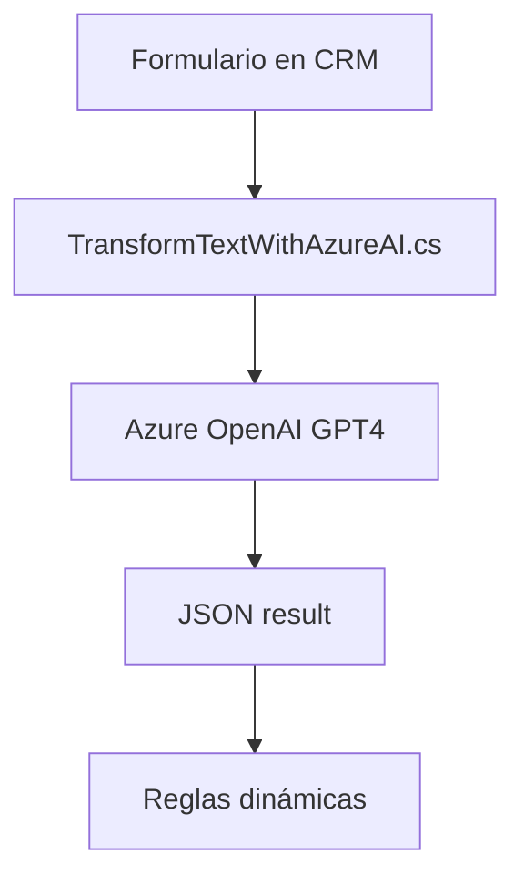

### Resumen Técnico Global
Este repositorio implementa una solución diseñada para integrar funcionalidades de reconocimiento de voz y procesamiento de texto con formularios web (probablemente usados en un CRM como Dynamics 365). Además, se extiende con un plugin en C# que conecta directamente Azure OpenAI para transformaciones avanzadas de textos mediante inteligencia artificial.

---

### Descripción de Arquitectura
La arquitectura sigue el patrón **n-capas** con integración de servicios externos:
1. **Capa de Presentación:** Compuesta por scripts en JavaScript (`readForm.js`, `speechForm.js`) que interactúan con el DOM y los datos de los formularios.
2. **Capa de Lógica (Negocio):**
   - Funciones en JavaScript encargadas de procesar datos (mapear a campos de formularios) y enviar al backend vía APIs personalizadas.
   - Plugin en C# que realiza conexión con APIs externas (Azure OpenAI API).
3. **Capa de Datos:** Basada en servicios de Dynamics CRM (`Microsoft.Xrm.Sdk`) que gestionan datos organizacionales y formularios.
4. **Externa:** Uso de SDK propio de Azure Speech y APIs RESTful (Azure OpenAI) para extensión de capacidades en voz e inteligencia artificial.

---

### Tecnologías Usadas
#### **Frontend**
- **Lenguaje:** JavaScript.
- **SDK**: Azure Speech SDK (dinámicamente enlazado).
- **Plataforma**: APIs de navegador (DOM, alertas).
- **Framework:** No se hace referencia directa a frameworks como React o Angular, lo que sugiere un enfoque basado en funcionalidades específicas y no un frontend moderno.

#### **Backend/Extensión**
- **Lenguaje:** C#.
- **Framework:** Microsoft Dynamics CRM Plugin Framework (`IPlugin`).
- **API consumida:** Azure OpenAI (GPT-4o) mediante `HttpClient` y JSON.

#### **Otros aspectos técnicos**
- Uso del manejo de dependencias y modularización.
- Patrones como separación de responsabilidades y procesamiento condicional.

---

### Diagramas **Mermaid** para GitHub Markdown

#### Visión General del Sistema
```mermaid
graph TD
    A["Frontend Forms"])
    B["Speech Recognition using Azure Speech SDK"]
    C["Text Processing"]
    D["Custom API for AI"]
    E["Dynamics CRM"]
    F["Plugin TransformTextWithAzureAI"]
    
    A --> B
    B --> C
    C --> D
    D --> E
    E --> F
```

#### Diagrama del flujo de interacción de frontend (forms y voiceInput)


#### Diagrama de interacción de plugin en backend


---

### Conclusión Final
Este repositorio combina **tecnologías modernas de inteligencia artificial** (Azure OpenAI y Speech SDK), interacción directa con servicios de **Dynamics CRM** y procesamiento de voz/escritura orientados al usuario. Por ende, puede clasificarse como una **solución CRM extendida**. Su infraestructura aprovecha un **patrón n-capas con enfoque modular** y extensiones condicionales. Si bien está diseñado primordialmente para captar información a través de voz (usuario-interfaz) y ajustar formularios dinámicos, su soporte de inteligencia artificial y mapeos personalizados le otorgan flexibilidad para una amplia gama de aplicaciones orientadas a datos.