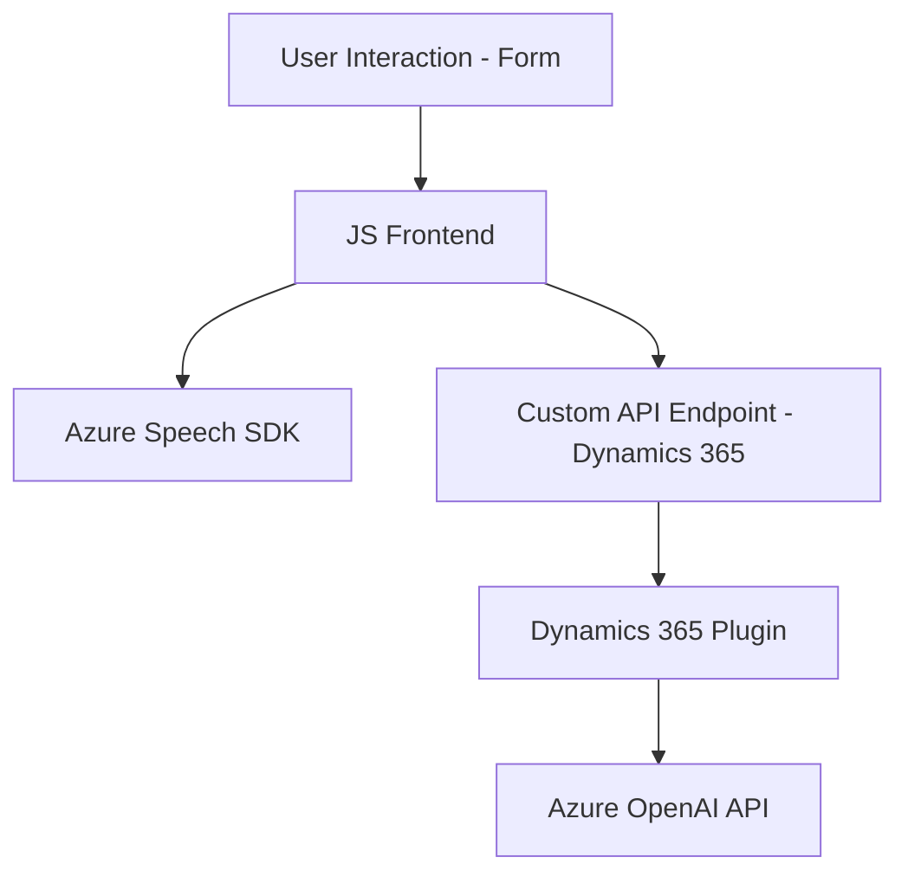

### Breve Resumen Técnico
El repositorio define una solución integrada para una *aplicación empresarial* conectada a Microsoft Dynamics 365. Incluye funcionalidades distribuidas entre un **frontend web**, un **servicio de reconocimiento de voz con Azure Speech SDK** y un **plugin backend** para Dynamics CRM que interactúa con Azure OpenAI.

### Descripción de Arquitectura
La arquitectura sigue un modelo **basado en capas** que interactúan entre frontend, middleware y backend de Dynamics CRM, siendo cada parte responsable de una tarea específica:
1. **Frontend**: Implementa interacción del usuario con formularios HTML, captura datos visibles y los procesa con el SDK de Azure Speech para entrada y síntesis de voz.
2. **Middleware**: Facilita acciones asincrónicas vía API (como procesamiento de voz y datos) con librerías como Azure Speech SDK y servicios de backend (Azure OpenAI).
3. **Backend - Plugin de Dynamics CRM**: Aumenta las capacidades de Dynamics mediante la integración de servicios externos como Azure OpenAI para realizar transformaciones avanzadas de datos.

El diseño combina patrones como **event-driven**, **plugin-based architecture** y **adapter integration**.

### Tecnologías Usadas
1. **Frontend**:
    - JavaScript para lógica de procesamiento y DOM manipulation.
    - Azure Speech SDK para reconocimiento y síntesis de voz.
    - Dynamics 365 API (`Xrm.WebApi`) para integración con formularios.
    - Custom APIs para datos personalizados.

2. **Backend**:
    - Microsoft Dynamics SDK para ejecución de plugins (`Microsoft.Xrm.Sdk`).
    - Azure OpenAI API para procesamiento de texto avanzado.
    - `Newtonsoft.Json` y `System.Text.Json` para manipulación de datos JSON.
    - `System.Net.Http` para solicitudes HTTP.

3. **Patterns**:
    - Modular/Separation of Concerns.
    - Extensibilidad mediante implementación de plugins.
    - Event-driven design en el frontend y middleware.

### Diagrama Mermaid (100% compatible con GitHub Markdown)

### Conclusión Final
La solución implementada en el repositorio es un ejemplo claro de integración entre sistemas mediante capas especializadas, donde cada segmento comunica y transforma datos utilizando APIs externas. **Azure Speech SDK** y **Azure OpenAI** forman el núcleo de los servicios cognitivos, mientras que el plugin permite extender las capacidades de Dynamics CRM con lógica personalizada. La solución puede ser mejorada y escalada según sea necesario, permitiendo una estructura más robusta si se desea migrar hacia microservicios en el futuro.