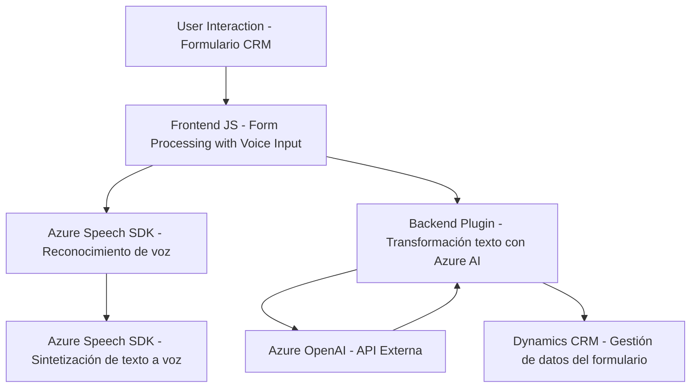

### Breve Resumen Técnico
El repositorio representa una solución integral asociada a Microsoft Dynamics CRM que combina elementos de un **frontend** (para la interacción usuario-sistema) y **backend plugins/API** (para lógica empresarial y servicios externos como **Azure Speech SDK** y **Azure OpenAI API**).

---

### Descripción de Arquitectura
La arquitectura de la solución se caracteriza por un enfoque basado en **microservicios** junto a integración modular:

1. **Frontend (FRONTEND/JS)**:
   - Este módulo gestiona la interacción directa con formularios dinámicos en un navegador web, habilitando la lectura y procesamiento de datos con reconocimiento de voz y síntesis de texto a audio vía **Azure Speech SDK**.
   - Utiliza JavaScript como lenguaje principal.
   - Programación modular y orientada a eventos.
   
2. **Plugin para Dynamics CRM (Plugins/TransformTextWithAzureAI.cs)**:
   - Este módulo extiende la funcionalidad de Dynamics CRM mediante un plugin que actúa como un microservicio. Interactúa con Dynamics SDK, procesa datos con Azure OpenAI API y transforma información en JSON estructurado.
   - Lenguaje de programación: C#. Configuración basada en el uso de servicios externos, definiciones explícitas y un patrón de construcción para el payload HTTP.

En términos generales, la solución configura un flujo de trabajo que combina **frontend dinámico** con **capacidad de procesamiento avanzado mediante APIs externas** (Azure Speech, Azure OpenAI) y plugins como microservicios especializados para una arquitectura modular y flexible.

---

### Tecnologías Usadas
1. **Frontend**:
   - **JavaScript**: Para la lógica de interacción y procesamiento de formularios.
   - **Azure Speech SDK**: Para síntesis de voz y reconocimiento de voz.
   - **Event-driven programming**: Control del flujo de trabajo a través de eventos como interacción de usuario y carga de SDK.

2. **Backend plugin**:
   - **C# (.Net)**: Implementación de plugins para Microsoft Dynamics CRM.
   - **Microsoft Dynamics CRM SDK**: Extensión para interactuar con la plataforma CRM.
   - **Azure OpenAI API**: Servicio externo de IA para transformación de texto.
   - **Pattern Builder**: Configuración de solicitudes para la API REST sobre HTTP POST.

---

### Diagram Mermaid (Compatible con GitHub)
El siguiente diagrama muestra las principales interacciones y flujo de datos:

---

### Conclusión Final
1. **Tipo de Solución**: La solución es una integración modular orientada a aplicaciones empresariales en **Microsoft Dynamics CRM**, que utiliza un frontend para procesamiento de formularios dinámicos con entradas de voz y un backend para servicios avanzados de IA mediante APIs externas.
2. **Arquitectura**: Modular con enfoque en **microservicios** y extensiones de CRM. El frontend utiliza programación basada en eventos, y el backend opera como microservicio mediante plugins especializados.
3. **Tecnologías Principales**: JavaScript, C#, Azure Speech SDK, Azure OpenAI API, y Microsoft Dynamics CRM SDK.
4. La solución presenta potencial para escenarios de interacción basado en IA y automatización empresarial, pero requiere una mejora en la seguridad de configuraciones sensibles (API keys).

El diagrama mermaid refleja claramente el flujo operacional e interacciones entre componentes frontend, backend y externos.