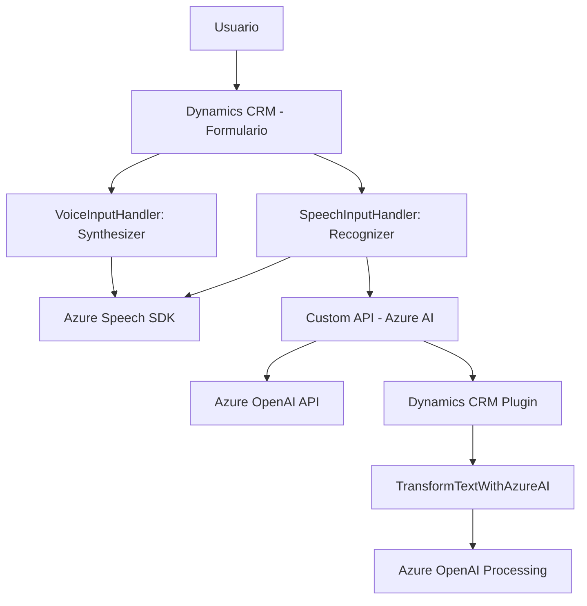

### Breve resumen técnico
Este repositorio contiene tres componentes interrelacionados: 
1. **Frontend/Javascript (VoiceInputHandler.js y SpeechInputHandler.js):** Scripts que habilitan funcionalidades de entrada y síntesis de voz en formularios Dynamics CRM, utilizando el Azure Speech SDK y una API externa para procesamiento de datos.
2. **Backend/Dynamics CRM Plugin (TransformTextWithAzureAI.cs):** Plugin que integra Azure OpenAI Service con Dynamics CRM para transformar texto según normas configurables.

### Descripción de arquitectura
La arquitectura sigue un enfoque modular y distribuye responsabilidades entre el frontend, backend, y servicios externos:
- **Frontend:** Implementa lógica de interacción con el usuario y funciones específicas de manipulación de datos del formulario y conversión de voz en texto mediante Azure Speech SDK. Este componente utiliza una **event-driven architecture** para responder a acciones del usuario.
- **Backend Plugin:** Se utiliza un **plugin-based architecture** común en Dynamics CRM para expandir funcionalidad. El backend es responsable de interactuar con la API de Azure OpenAI y procesar resultados para regresarlos al Dynamics CRM en formato JSON.
- **Patrón de integración:** Los tres componentes dependen de SDK y servicios externos (Azure Speech SDK y Azure OpenAI), lo que refuerza el enfoque en arquitectura distribuida. Sin embargo, la solución no aparece como completamente descentralizada (como en microservicios).

### Tecnologías usadas
- **Frontend (JavaScript):**
  - Azure Speech SDK
  - Microsoft Dynamics CRM APIs
- **Backend Plugin (.NET / C#):**
  - Microsoft Xrm SDK (Dynamics CRM SDK).
  - Azure OpenAI API.
  - Newtonsoft.Json para manejo de datos JSON.
  - System.Net.Http para consumo de APIs REST.
  - System.Text.Json para serialización.
- **Servicios externales:**
  - Azure Speech SDK para síntesis y reconocimiento de voz.
  - Azure OpenAI Service para transformar texto.

### Diagrama Mermaid válido para GitHub

### Conclusión final
Esta solución consta de un sistema híbrido con frontend, backend, y servicios externos. Mientras el frontend maneja la interacción con formularios en Dynamics CRM, el backend plugin integra funcionalidades avanzadas de procesamiento de datos mediante el Azure OpenAI Service. La arquitectura sigue principios de diseño modular y patrones event-driven típicos de integraciones con Dynamics CRM.

El sistema no es estrictamente microservicios ni hexagonal, y se integra como una solución de arquitectura multinivel con dependencias externas relevantes. Aunque segura y bien estructurada en general, el manejo de credenciales de API podría mejorarse para alinearse con mejores prácticas en la gestión de secretos.