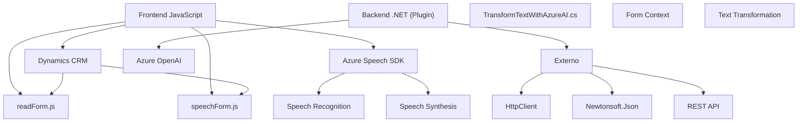

### Breve resumen técnico

El repositorio abarca componentes relacionados con la integración de voz (Azure Speech SDK) y procesamiento de texto mediante IA (Azure OpenAI), ambos diseñados para interactuar con formularios dinámicos en un sistema CRM como Dynamics 365. Los archivos presentan soluciones para accesibilidad por voz, manipulación dinámica de atributos en formularios, y transformación avanzada de texto. Tecnologías como JavaScript, .NET y Azure conforman una arquitectura modular con múltiples dependencias externas.

---

### Descripción de arquitectura

1. **Tipo de solución**:
   - Principalmente una **API extendida con capacidades de frontend y backend**:
     - **Frontend**: Componente en JavaScript que interactúa con formularios para reconocimiento y síntesis de voz.
     - **Backend**: Plugin en .NET que sirve como microservicio para IA utilizando Azure OpenAI API.

2. **Modelo arquitectónico**:
   - Segmentación en diferentes capas:
     - **Frontend (speechForm.js y readForm.js)**: Actúan como una capa de presentación para el consumo de las capacidades de reconocimiento de voz y manipulación de formularios.
     - **Backend (TransformTextWithAzureAI.cs)**: Microservicio/plugin que ejecuta lógica avanzada de procesamiento.
     - **Externo**: Dependencias hacia APIs de terceros como Azure Speech SDK y Azure OpenAI.

3. **Patrón estructural principal**:
   - **Modular** en el frontend (JavaScript) con responsabilidades específicas como síntesis de voz, entrada de texto, y manipulación de datos.
   - **Integración orientada a eventos en backend**, típico de Dynamics CRM, para realizar tareas en el contexto de la organización.

---

### Tecnologías usadas

1. **Frontend**:
   - **JavaScript** para lógica dinámica en interacción con formularios.
   - Dependencia de **Azure Speech SDK**, cargado dinámicamente para síntesis y reconocimiento de voz.
   - Plataforma CRM (Dynamics 365), inferida por el uso de `formContext` y atributos dinámicos.

2. **Backend**:
   - **.NET Framework** para el desarrollo del plugin incluyendo:
     - `Microsoft.Xrm.Sdk` para interacción con datos de Dynamics CRM.
     - `HttpClient` para llamadas HTTP hacia Azure.
     - `Newtonsoft.Json` y `System.Text.Json` para manejo JSON.
   - Azure OpenAI para procesamiento avanzado de texto.

3. **Externo**:
   - Arquitecturas REST mediante `HttpClient` en backend.
   - Azure Speech y OpenAI como servicios externos.

---

### Diagrama Mermaid válido para GitHub

---

### Conclusión final

La solución integra varios componentes tecnológicos para interacción con un sistema CRM, habilitando accesibilidad por voz y procesamiento avanzado de texto mediante IA. A nivel arquitectónico, utiliza patrones como modularidad y eventos (en backend), mostrando separación clara entre responsabilidades del frontend y backend. Los componentes externos (Azure Speech, OpenAI) consolidan una estrategia en la nube y potencian las funcionalidades. Finalmente, el diseño es flexible, orientado a entornos dinámicos, y capaz de escalarse según las necesidades del usuario.