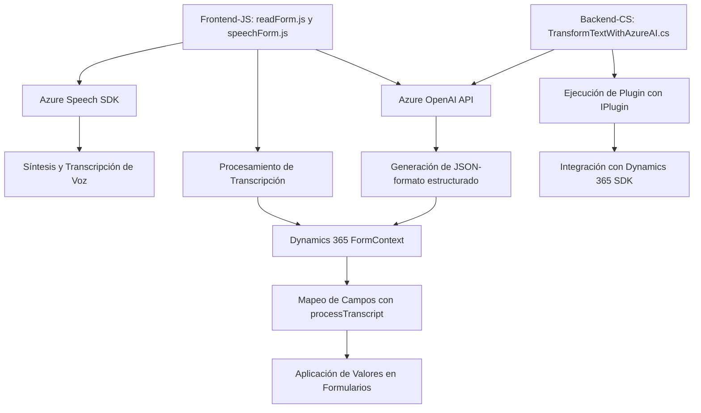

### Resumen Técnico

Este repositorio implementa una solución híbrida orientada a la integración entre la interfaz de usuario (frontend en Dynamics CRM) y servicios externos como **Azure Speech SDK** y **Azure OpenAI Service**. Utiliza funciones JavaScript en el frontend para sintetizar texto a voz, reconocer comandos vocales y vincular datos procesados a formularios. También incluye un plugin en C# que realiza transformaciones de texto basado en reglas y usa asistencia de IA para regresar información estructurada.

---

### Descripción de la Arquitectura

La arquitectura general sigue un esquema **multicapa**. Se observa una separación explícita entre las capas:
1. **Interface Layer**: Frontend en JavaScript que interactúa con Dynamics CRM para la edición visual en formularios.
2. **Business Logic Layer**: Procesamiento de transcripciones, mapeo de datos en campos y transformación del texto mediante el plugin.
3. **Integration Layer**: Interfaces hacia servicios externos como **Azure Speech SDK** y **Azure OpenAI API**, incorporando reglas personalizadas para generar respuestas inteligentes.

Las funciones JavaScript implementan una arquitectura orientada a servicios (**Service Layer**), en la que cada función maneja una tarea específica (por ejemplo, procesamiento de texto, reconocimiento de voz, carga dinámica de SDK, etc.).

---

### Tecnologías, Frameworks, y Patrones Utilizados

1. **Tecnologías y servicios**:
   - **Microsoft Dynamics 365**: Gestión de formularios y datos empresariales como contexto.
   - **Azure Speech SDK**: Síntesis y transcripción de voz, integrada con JavaScript.
   - **Azure OpenAI Service (API)**: Procesamiento de datos con IA para transformación a formato JSON estructurado.
   - **JavaScript (Vanilla)**: Uso directo de funciones, sin librerías adicionales.
   - **C# (.NET)**: Implementación de plugins para Dynamics 365 CRM.
   - **Dynamics SDK (Microsoft.Xrm.Sdk)**: Para operaciones con formularios y plugins en Dynamics.

2. **Patrones**:
   - **Service Layer**: Modularización de funciones para la interacción con APIs.
   - **Dynamic Module Loading**: Carga del SDK de Speech en tiempo de ejecución utilizando `ensureSpeechSDKLoaded`.
   - **Plugin Design Pattern**: Uso de `IPlugin` en C# para la ejecución automática de lógica al activar eventos en Dynamics CRM.
   - **Dependency Injection**: Utilización de `IServiceProvider` en plugins para acceder a servicios internos como `IPluginExecutionContext`.

---

### Dependencias o Componentes Externos

1. **Azure Speech SDK**:
   - Sintetización de texto a audio y transcripción de grabaciones utilizando el endpoint `https://aka.ms/csspeech/jsbrowserpackageraw`.
   - Dependencia configurada dinámicamente.

2. **Azure OpenAI API**:
   - Realiza transformaciones basadas en IA. La comunicación se realiza mediante solicitudes HTTP.

3. **Dynamics 365 SDK**:
   - Inyección de dependencias (e.g., `IOrganizationService`) para acceder y modificar datos en formularios y entidades.

4. **JSON Management Libraries**:
   - Uso de `System.Text.Json` y `Newtonsoft.Json.Linq` para manejar datos JSON en el backend.

5. **HTTP Client**:
   - Integración con servicios externos mediante llamadas API REST (`System.Net.Http`).

---

### Diagrama Mermaid

Diagrama que representa la interacción entre los diferentes componentes de la solución:

---

### Conclusión Final

Este proyecto integra tecnologías de Microsoft, Azure y Dynamics para resolver el problema de interactuar con formularios a través de voz y transformar entradas textuales según reglas personalizadas mediante IA. La arquitectura es predominantemente multicapa, dividiendo la interfaz, lógica de negocio y servicios externos. La alta modularidad asegura escalabilidad y adherencia a principios de diseño como Service Layer y Plugin Design Patterns. Adecuado para sistemas empresariales con necesidades avanzadas de interacción y procesamiento de datos en tiempo real con soporte externo como Azure.