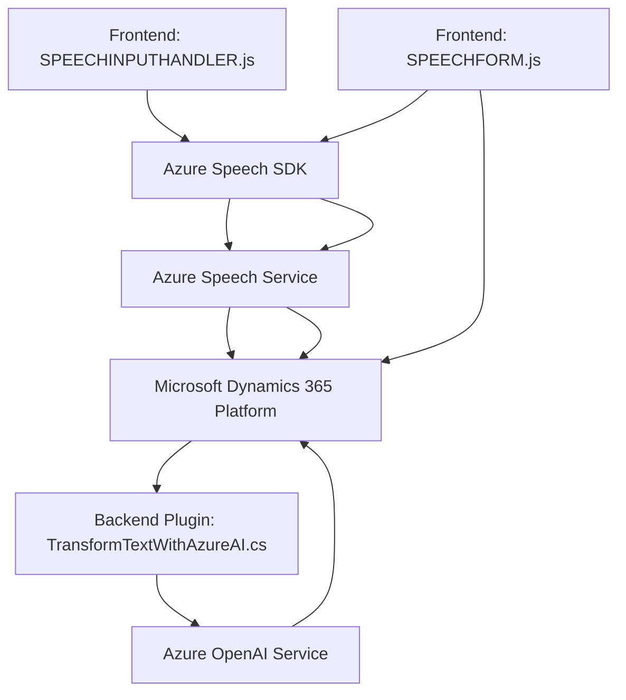

### Breve resumen técnico

El repositorio contiene código relevante para interactuar con Microsoft Dynamics 365 formulado en dos áreas principales: un **frontend** en JavaScript y un **plugin** en C#. El proyecto utiliza servicios en la nube como Azure Speech SDK y Azure OpenAI para implementar funciones de síntesis y reconocimiento de voz, además de transformación de texto mediante IA. El frontend parece estar orientado a facilitar la interacción entre un usuario y formularios en Dynamics 365 mediante comandos de voz. Por otro lado, el plugin se encarga de procesar texto con Azure OpenAI en el backend del sistema.

---

### Descripción de arquitectura

La arquitectura de la solución sigue un enfoque **n-capas**, con separación clara entre frontend, backend (plugins), y los servicios externos de Azure. Adicionalmente, el patrón **service-oriented architecture (SOA)** se hace evidente debido a la integración con los servicios externos de Azure. El diseño del plugin utiliza una **arquitectura basada en plugins**, común en Microsoft Dynamics CRM. El frontend está orientado hacia un estilo de integración directa, actuando como cliente del Azure Speech SDK y API relacionadas.

---

### Tecnologías usadas

1. **Frontend (readForm.js y speechForm.js)**:
   - **Azure Speech SDK**: Para síntesis y reconocimiento de voz.
   - **Microsoft Dynamics 365 web resources**: Contexto del formulario para actualizar datos mediante JavaScript.
   - **Vanilla JavaScript**: Lógica de interacción y ejecución del SDK.

2. **Backend (TransformTextWithAzureAI.cs)**:
   - **C#/.NET Framework**: Para la implementación del plugin.
   - **Microsoft.Xrm.Sdk**: Permite la interacción con objetos y lógica de Dynamics CRM.
   - **Newtonsoft.Json**: Procesamiento de datos JSON.
   - **Azure OpenAI Service**: Procesamiento de texto mediante modelos AI como GPT.

---

### Diagrama Mermaid válido para GitHub

---

### Conclusión final

La solución está diseñada para innovar en la interacción entre el usuario y la plataforma Microsoft Dynamics 365, utilizando tecnologías avanzadas como reconocimiento de voz (Azure Speech SDK) y procesamiento de lenguaje natural (Azure OpenAI). La arquitectura combina un frontend utilitario basado en JavaScript con funcionalidades asociadas a formularios, y un backend extendido mediante un plugin en C# para ejecutar procesos de texto avanzado con IA. 

La integración con servicios en la nube, como Azure, solidifica el enfoque **service-oriented architecture**, pero podría beneficiarse de mejoras en la gestión de configuraciones externas para mayor seguridad y flexibilidad en la aplicación.