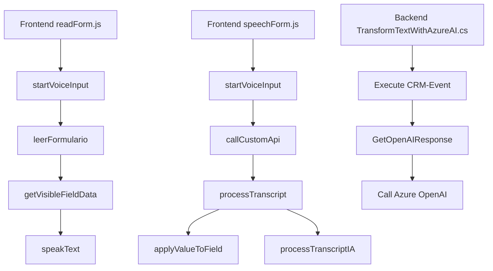

### Breve resumen técnico
El repositorio analizado contiene soluciones para manejo de datos y generación de funcionalidades relacionadas con la interacción usuario-formulario en Dynamics 365. Está compuesto por archivos destinados al frontend (JavaScript) y un backend que utiliza plugins en C#. Las funciones clave incluyen síntesis y reconocimiento de voz mediante el Azure Speech SDK y transformación de texto con Azure OpenAI (GPT-4). Estas funcionalidades están diseñadas para automatizar procesos e integrar servicios de Microsoft Azure.

---

### Descripción de arquitectura
La solución tiene una arquitectura **híbrida orientada a servicios**. En el frontend, las operaciones suelen seguir una estructura modular y orientada a eventos, integrando servicios externos (Azure Speech SDK). En el backend, los plugins implementan un modelo basado en eventos (Dynamics CRM `IPlugin`) con lógica integrada para Transformers y manejo de datos en tiempo real. Esto refleja un enfoque de estilo **MVC orientado a servicio externo**.

---

### Tecnologías usadas
1. **Frontend:**
   - **Azure Speech SDK:** Para reconocimiento y síntesis de voz.
   - **JavaScript (ES6+):** Lenguaje primario usado para lógica de interacción frontend en Dynamics 365.
   - Funciones avanzadas para manipular datos (e.g., transcripción del habla, asignación dinámica de campos).

2. **Backend:**
   - **Microsoft Dynamics 365 SDK:** Para el desarrollo de plugins personalizados que gestionan datos en tiempo real.
   - **Azure OpenAI GPT-4:** Servicio para procesamiento avanzado de lenguaje natural.
   - **C#:** Lenguaje utilizado para el desarrollo de plugins en .NET Framework.
   - **HTTPClient:** Librerías usadas para comunicación con servicios externos.

3. **Patrones de diseño:**
   - **Carga dinámica de dependencias:** `ensureSpeechSDKLoaded`.
   - **Encapsulación modular:** Cada funcionalidad está segregada y claramente implementada.
   - **Callback de servicios externos:** Llamadas asíncronas para procesamiento en Azure.

---

### Diagrama Mermaid válido para GitHub

---

### Conclusión final
Este repositorio defines a hybrid, modular architecture that seamlessly integrates cloud services (Azure Speech SDK for frontend operations and Azure OpenAI for backend processing) with Dynamics 365, enhancing voice-based and AI-driven functionalities for interacting with user data. Its modular approach and use of callback-based asynchronous workflows make it scalable and adaptable for similar automation solutions involving external APIs and services.