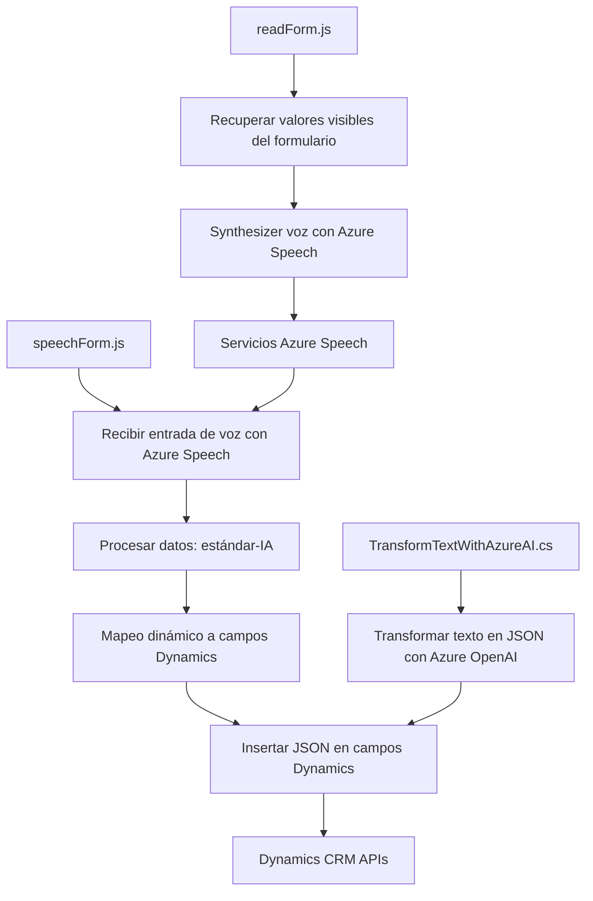

### Breve Resumen Técnico

Este repositorio contiene tres tipos de archivos destinados al desarrollo de soluciones basadas en Microsoft Dynamics CRM y Azure. Cada archivo está especializado para gestionar funcionalidades específicas relacionadas con formularios web, interacción por voz y síntesis de texto mediante inteligencia artificial.

1. **FRONTEND/JS/readForm.js** y **FRONTEND/JS/speechForm.js**: Implementan funciones JavaScript enfocadas en recopilar y manipular datos visibles en formularios, además de integración avanzada con el servicio Azure Speech SDK para entrada y salida por voz.
2. **Plugins/TransformTextWithAzureAI.cs**: Define un plugin de Microsoft Dynamics CRM que transforma texto a JSON estructurado utilizando Azure OpenAI.

---

### Descripción de Arquitectura

- **Niveles Lógicos:**
  - **Frontend:** Comprende los archivos `readForm.js` y `speechForm.js`, que incorporan funciones JavaScript para operar sobre formularios web y conectar servicios externos (Azure Speech). 
  - **Backend/Plugins:** Incluye el archivo `TransformTextWithAzureAI.cs`, que actúa como plugin bajo el modelo extensible de Dynamics CRM.
  - **Servicios Externos:** Interacción directa con servicios externos de Azure (OpenAI y Speech SDK) para síntesis de texto y procesamiento avanzado de datos.

- **Arquitectura predominante:**  
  Este sistema utiliza una **arquitectura de capas (n capas)** en combinación con una **arquitectura orientada a servicios (SOA)**:
  - El frontend conecta con APIs externas para voz y manipulación de datos.
  - Los plugins están diseñados para integrarse como extensiones de Dynamics CRM.
  - Servicios de Azure proporcionan lógica de negocio y procesamiento externo.

---

### Tecnologías Usadas

1. **Frontend:** 
   - **JavaScript ES6:** Lenguaje principal para funciones del cliente.
   - **Azure Speech SDK:** Conexión de sintetización del texto visible y transcripción por voz.
   
2. **Backend/Plugins:**
   - **Microsoft Dynamics CRM (SDK):** Para la extensión de funcionalidad dentro del ecosistema de CRM.
   - **Azure OpenAI Service:** Procesamiento avanzado de texto con inteligencia artificial.
   - **Newtonsoft.Json y System.Text.Json:** Manejo de JSON estructurado.
   - **System.Net.Http:** Comunicación con servicios externos de Azure.

3. **Patrones Arquitectónicos:**
   - **Modularización:** Uso de funciones desacopladas para facilitar el entendimiento y la escalabilidad.
   - **Service-Oriented Architecture (SOA):** Integración intensiva con Azure y Dynamics como servicios externos.

---

### Diagrama Mermaid

---

### Conclusión Final

Este repositorio implementa una solución altamente especializada que integra Microsoft Dynamics CRM con servicios avanzados de Azure (Speech y OpenAI). La arquitectura se basa en una combinación de capas y orientación a servicios (SOA), facilitando la extensibilidad y escalabilidad en distintos contextos empresariales. 

- **Puntos Fuertes:**
  - Uso efectivo de SDK y APIs para automatización avanzada.
  - Modularidad que permite fácil mantenimiento y despliegue incremental.

- **Áreas de Mejora:**
  - Recomendación de externalizar las configuraciones sensibles, como claves API, a variables de entorno para reforzar la seguridad.
  - Posibilidad de optimizar el manejo de errores en conectividad externa.