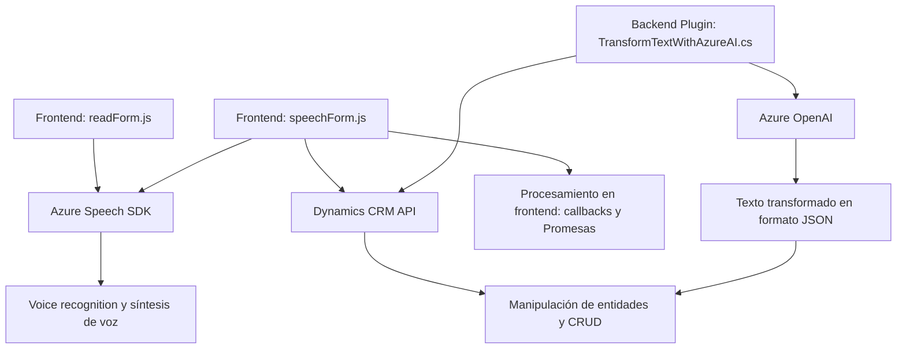

# Análisis técnico y arquitectura del repositorio

## Breve resumen técnico

Este repositorio abarca tres componentes principales que trabajan conjuntamente para habilitar la interacción entre un sistema CRM (Dynamics 365), módulos frontend para la gestión de formularios, y servicios basados en inteligencia artificial (Azure Speech SDK y Azure OpenAI). Se centra en permitir la entrada por voz, conversión de texto y procesamiento de comandos hablados hacia datos estructurados con integración profunda en Dynamics.

---

## Descripción de arquitectura

La solución tiene características de una arquitectura **híbrida de n capas** y **servicios externos**, ya que los componentes interactúan mediante llamadas directas a APIs externas (Azure Speech SDK, Dynamics CRM y Azure OpenAI). Los módulos están organizados como sigue:

1. **Frontend**:
   - Módulos en JavaScript (`readForm.js`, `speechForm.js`) para gestionar la interacción directa del usuario.
   - Permite procesos como convertir comandos hablados en valores del formulario, sintetizar voz para generar información hablada desde campos, y enviar solicitudes procesadas por IA.
   
2. **Backend/Plugins**:
   - Plugin (`TransformTextWithAzureAI.cs`) que conecta Dynamics CRM con Azure OpenAI para manipular texto proporcionado y retornarlo como JSON estructurado.
   - Usa patrones típicos de extensibilidad de Dynamics para integrarse de forma directa al flujo del sistema.

3. **APIs externas**:
   - Azure Speech SDK para reconocimiento y síntesis de voz.
   - Azure OpenAI para transformaciones avanzadas de texto.

Los módulos están organizados de forma modular y se comunican mediante APIs y servicios externos.

---

## Tecnologías usadas

### En el frontend
1. **Frameworks y bibliotecas**:
   - **Azure Speech SDK**: Para reconocimiento de voz y síntesis de texto a voz.
   - **Dynamics API**: `Xrm.WebApi` para manipulación de datos dentro del contexto de Dynamics 365.

2. **Lenguaje**:
   - JavaScript para la implementación del código del frontend.

3. **Patrones de diseño**:
   - Modularización (funciones separadas por propósito).
   - Facade: Manejo unificado de operaciones (llamadas SDK, procesamiento de datos).
   - Callback y Promises: Para controlar procesos asíncronos (SDK dinámico, respuestas de APIs).

### En el backend/plugin
1. **Frameworks y servicios**:
   - **Dynamics CRM SDK**: Interacción con entidades CRM (`IPlugin`, `Microsoft.Xrm.Sdk`).
   - **Azure OpenAI**: Procesamiento avanzado de texto mediante servicios de GPT.
   - **System.Net.Http** y **System.Text.Json** para solicitudes HTTP y manejo de JSON.

2. **Lenguaje**:
   - C# utilizado para la implementación del plugin.

3. **Patrones de diseño**:
   - Plugin Design Pattern (integración directa en Dynamics).
   - Uso de microservicio externo (Azure OpenAI).

---

## Dependencias o componentes externos

1. **Azure Speech SDK**:
   - Para la integración de reconocimiento y síntesis de voz vía CDN (`https://aka.ms/csspeech/jsbrowserpackageraw`).

2. **Dynamics CRM**:
   - Acceso mediante la API `Xrm.WebApi` para formularios y entidades personalizadas.

3. **Azure OpenAI**:
   - Como un servicio encargado de analizar y transformar el texto en estructuras JSON.

4. **Librerías del plugin**:
   - `System.Net.Http`, `System.Text.Json`, y otras para solicitudes HTTP y manejo de JSON.

---

## Diagrama Mermaid válido para GitHub Markdown

---

## Conclusión final

La solución está basada en principios de modularidad y comunicación entre servicios. Presenta una arquitectura **híbrida de n capas** con integración a servicios externos (Azure Speech SDK y OpenAI). Ofrece una experiencia fluida de interacción entre frontend y backend mediante la entrada por voz, procesamiento de datos y transformación con inteligencia artificial. Es eficaz para un entorno como Dynamics CRM, pero debe prestar atención a la seguridad de las credenciales y manejo de dependencias externas en producción.