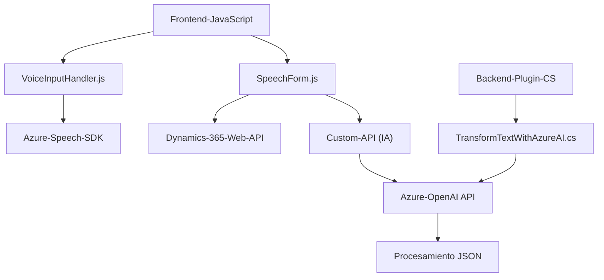

### Breve resumen técnico
El repositorio representa una solución mixta que implementa funcionalidades extendidas en Microsoft Dynamics 365 mediante el uso de reconocimiento de voz y procesamiento de texto, incluyendo la integración con servicios de Azure (Azure Speech SDK y Azure OpenAI). Utiliza componentes frontend en JavaScript y backend basados en plugins para Dynamics CRM (C#).

---

### Descripción de arquitectura
La arquitectura general es **modular** y se organiza en capas:
1. **Frontend (JavaScript):**
   - Procesa datos de formularios de Dynamics 365.
   - Implementa reconocimiento de voz vía Azure Speech SDK.
   - Convierte texto hablado en información estructurada o ejecuta acciones en formularios dinámicamente.
   - Utiliza APIs externas (Azure Speech SDK y Custom APIs) para procesamiento y síntesis de voz.
   - Presenta modularidad y separación de responsabilidades en cada función.

2. **Backend (C# Plugin):**
   - Implementa integración directa con Microsoft Dynamics CRM.
   - Utiliza arquitectura de **plugins**, lo que permite ejecutar código personalizado en respuesta a eventos CRM.
   - Consume el servicio Azure OpenAI mediante HTTP REST para transformar texto en objetos JSON personalizados.

En conjunto, la solución puede considerarse como un **arquitectura híbrida de microservicios con capas**, dado que:
- La interacción con datos y eventos de Dynamics CRM sigue un enfoque basado en capas.
- Los servicios como Azure Speech y OpenAI se integran mediante llamadas separadas, actuando efectivamente como interfaces de microservicios.

---

### Tecnologías usadas
1. **Frontend (JavaScript):**
   - **Azure Speech SDK**: Responsabilidad de reconocimiento de voz y síntesis.
   - **Dynamics 365 Web API**: Manipulación de datos en formularios.

2. **Backend (C#):**
   - **Microsoft Dynamics SDK**: Para interacción con la plataforma CRM.
   - **System.Net.Http:** Comunicaciones HTTP (solicitudes REST hacia Azure OpenAI).
   - **System.Text.Json y Newtonsoft.Json.Linq**: Para el manejo de objetos JSON.

3. **Servicios externos:**
   - **Azure Speech SDK:** Reconocimiento y síntesis de voz.
   - **Azure OpenAI API:** Transformación de texto mediante inteligencia artificial.

---

### Diagrama Mermaid
El siguiente diagrama representa la relación entre los componentes en el repositorio:

---

### Conclusión final
Este repositorio implementa una solución avanzada para Microsoft Dynamics 365 que utiliza reconocimiento de voz y procesamiento del lenguaje natural. Está diseñada con un enfoque modular que separa claramente las tareas de la interfaz de usuario (JavaScript para el frontend) y las operaciones en el backend (C# para plugins). La arquitectura se basa en patrones como capas y servicios externos, integrando SaaS como Azure Speech y OpenAI para proporcionar una experiencia dinámica e inteligente en aplicaciones CRM.