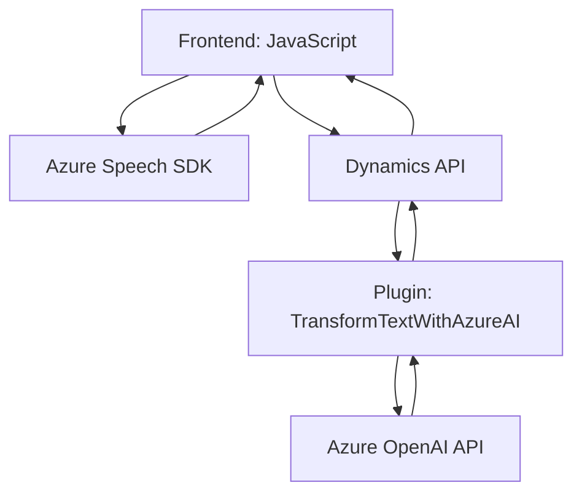

### Breve Resumen Técnico
El repositorio está orientado a soluciones para **Microsoft Dynamics CRM**, donde se integran funcionalidades relacionadas con la síntesis de voz, reconocimiento de voz y procesamiento avanzado de datos mediante inteligencia artificial, utilizando servicios de **Azure Speech** y **Azure OpenAI**. Incluye componentes para el frontend (funcionalidades en JavaScript para interacción con formularios), un plugin en C# para Dynamics CRM, y lógica extensiva de cliente-servidor.

---

### Descripción de Arquitectura
La arquitectura de este repositorio es híbrida, combinando un patrón de **n capas** para la interacción entre frontend y backend con algunos elementos del patrón **hexagonal** para la integración de servicios externos (Azure). El plugin en C# funciona como un componente extensible dentro de Dynamics CRM bajo el patrón de **Plugin**. Del lado del frontend, los archivos de JavaScript operan en una arquitectura modular para manipular directamente formularios de usuario y consumir servicios de reconocimiento de voz.

---

### Tecnologías Usadas
1. **Frontend**:
   - **JavaScript**: Manejo de lógica de cliente para formularios interactivos (Dynamics CRM).
   - **Azure Speech SDK**: Reconocimiento y síntesis de voz.
   - **APIs de Dynamics CRM**: Manipulación de datos y atribuciones de formulario.

2. **Backend/Plugins**:
   - **C#**: Desarrollo de plugins para Dynamics CRM.
   - **Azure OpenAI API**: Procesamiento avanzado de texto mediante inteligencia artificial.
   - **Newtonsoft.Json & System.Text.Json**: Manipulación de datos JSON.
   - **Microsoft.Xrm.Sdk**: Framework para extender funcionalidades dentro de Dynamics.

3. **Patrones de Diseño**:
   - **Cliente/Servidor**: Procesos de frontend interactúan con APIs (servidores externos) para síntesis y procesamiento de datos.
   - **Adaptador**: Adapta las entradas (voz/texto) al formato necesario para CCM y APIs.
   - **Modularidad**: Componentes desacoplados para facilitar integraciones.

---

### Diagrama Mermaid
Aquí se describe el flujo de integración de todos los componentes, enlazando frontend, backend y servicios externos de Azure:

---

### Conclusión Final
Este repositorio implementa una solución orientada a extender las funcionalidades de Microsoft Dynamics CRM. Su arquitectura es adecuada para el tipo de problema que desea resolver, dado que usa componentes modulares en el frontend para interactuar con usuarios (formularios) y pasa datos al backend mediante las APIs de Dynamics. La integración con servicios de Azure Speech y OpenAI permite una experiencia enriquecida que combina reconocimiento/síntesis de voz y procesamiento avanzado de texto mediante IA. La arquitectura de **n capas** y la integración de servicios externos refuerzan la extensión del producto base (Dynamics CRM) utilizando patrones modernos y bien organizados.