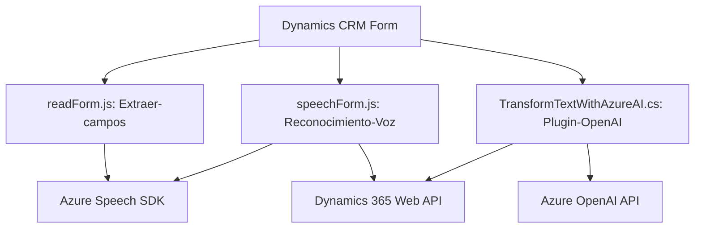

### Breve resumen técnico
Este repositorio está orientado a la interacción entre formularios basados en Dynamics 365 y servicios externos como Azure Speech SDK y Azure OpenAI. Contiene elementos que procesan datos mediante reconocimiento y síntesis de voz, transforman textos usando inteligencia artificial y manejan una estructura modular compatible con Dynamics CRM.

---

### Descripción de arquitectura
La solución tiene las siguientes características arquitectónicas:
1. **Modularidad**: Cada archivo aborda objetivos específicos (procesamiento de voz, integración con IA, manipulación de atributos en formularios).
2. **Arquitectura desacoplada**:
   - Uso de SDK externos (Azure Speech y OpenAI), cargados dinámicamente en tiempo de ejecución.
   - Integración con APIs de Dynamics 365 utilizando eventos y contexto del sistema.
3. **Patrón de capas y microservicios**:
   - [Frontend]: Funcionalidades organizadas en capas de presentación y lógica de negocio (procesamiento de formularios).
   - [Backend]: Integración con Dynamics CRM mediante un plugin, que opera con eventos de entrada.
4. **Servicios basados en la nube**: Procesamiento de voz y texto delegados a Azure.

---

### Tecnologías usadas
1. **Frontend (`readForm.js` y `speechForm.js`)**:
   - **Azure Speech SDK**: Para reconocimiento y síntesis de voz.
   - **JavaScript**, con enfoque modular y dinámico.
2. **Backend (`TransformTextWithAzureAI.cs`)**:
   - **Microsoft Dynamics CRM SDK** (`IPlugin` interface): Gestión de eventos.
   - **Azure OpenAI API**: Reconocimiento de texto y generación supervisada de respuestas.
   - **JSON Libraries (Newtonsoft.Json.Linq, System.Text.Json)**: Manipulación y procesamiento de estructuras JSON.
3. **Web API de Dynamics 365**: Para lectura/escritura en formularios dinámicos.
4. **Pattern Design**:
   - Desacoplamiento (SDK cargados dinámicamente en el frontend, servicios remotos en el backend).
   - Uso de mapas (en frontend) para gestionar atributos del formulario.
   - Microservicio AI para implementar reglas predefinidas.

---

### Diagrama **Mermaid**

---

### Conclusión final
La solución utiliza una arquitectura híbrida entre **n capas** y **microservicios**, con componentes desacoplados que integran servicios de Dynamics 365 y Azure. Ofrece un diseño modular con funciones específicas para manipular formularios y procesar datos con tecnologías en la nube. Esto asegura escalabilidad, mejor mantenimiento del código y alta disponibilidad en entornos empresariales.