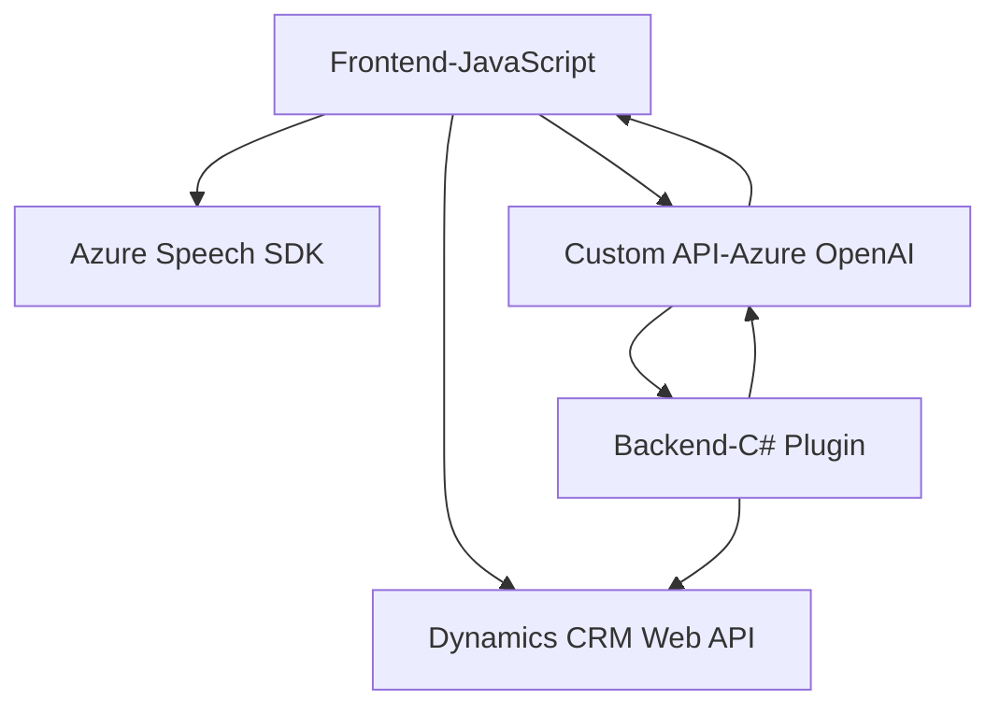

### Breve resumen técnico:
La solución presentada consiste en una integración entre funcionalidades de interfaz web (frontend en JavaScript) y backend (plugin en C#) con el objetivo de interactuar con formularios en Microsoft Dynamics CRM utilizando procesamiento de voz (Azure Speech SDK) y transformación de texto mediante la API de Azure OpenAI. Es una implementación modular que combina integraciones con SDKs y servicios externos.

---

### Descripción de arquitectura:
Se observa una **arquitectura orientada a servicios**, concretamente un sistema que sigue principios de **n capas**, donde:
1. **Frontend**: Implementa lógica para captura de datos de formularios y sintetización/transcripción de voz mediante el SDK de Azure Speech.
2. **Backend (Plugins)**: Integra lógica extendida de Microsoft Dynamics CRM para transformar texto y comunicar servicios de Azure AI a nivel empresarial.
3. Comunicación entre capas mediante APIs de Azure (Speech, OpenAI) y Dynamics Web API.

**Patrones utilizados**:
- **Modular Design**: Cada archivo se organiza de manera que encapsule una funcionalidad específica (reutilizable y de propósito único).
- **SDK Integration**: Uso del Azure Speech SDK y llamada al Azure OpenAI API para tareas especializadas.
- **Plugin Architecture**: Extensión del CRM mediante el uso de plugins que se integran a través de la interfaz `IPlugin`.
- **Carga dinámica**: Las librerías y SDK se cargan únicamente cuando son necesarios, optimizando la eficiencia.

---

### Tecnologías usadas:
1. **Frontend**
   - Lenguaje: **JavaScript**.
   - Frameworks/SDKs: **Azure Speech SDK** (voz y transcripción).
   - Sistema de formularios: **Dynamics CRM** (formContext).
   - Consumo de servicios externos vía API (Azure OpenAI).

2. **Backend**
   - Lenguaje: **C#**.
   - Framework: **Microsoft Dynamics SDK** (plugin development).
   - APIs externas: **Azure OpenAI Service (GPT-4o)**.
   - Librerías de manejo de JSON: **System.Text.Json** y **Newtonsoft.Json.LINQ**.

3. **Infraestructura**
   - Dependencias en servicios en la nube de Azure: Speech SDK y OpenAI API.

---

### Diagrama Mermaid válido para GitHub:

---

### Conclusión Final:
Este sistema representa una solución orientada a integrar tecnologías avanzadas de reconocimiento y síntesis de voz (Azure Speech SDK) con procesamiento de inteligencia artificial (Azure OpenAI API) en el contexto de herramientas empresariales como Dynamics CRM. La arquitectura sigue una estructura de **n capas**, donde los módulos interactúan entre el frontend, backend, y servicios externos. El diseño modular y el uso intensivo de APIs facilitan la extensibilidad y el mantenimiento del sistema.